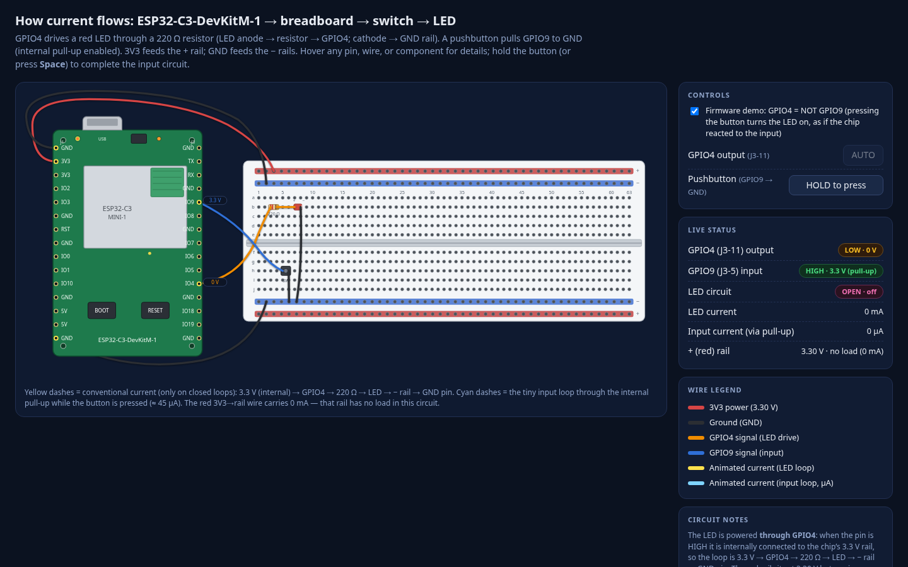
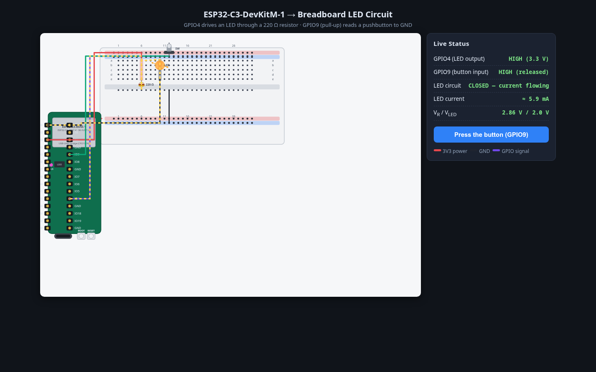
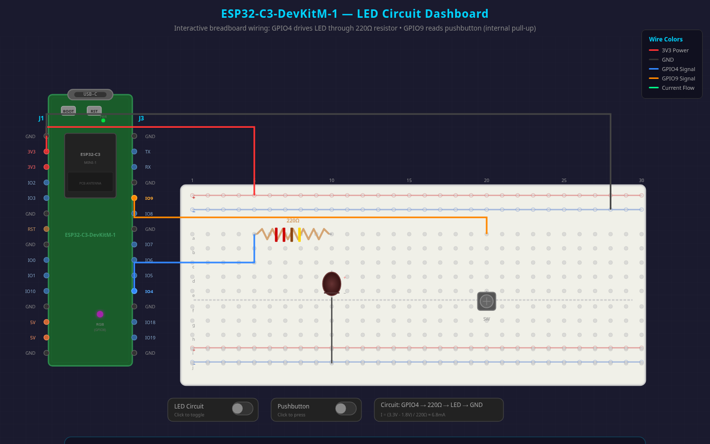
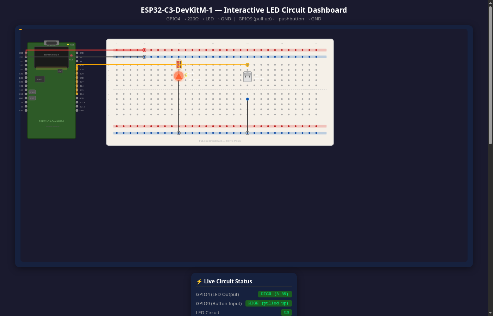

# ESP32-C3 LED Circuit Dashboard — local model comparison

Four runs of the same prompt ([prompt.txt](prompt.txt), from
[andrisgauracs' gist](https://gist.github.com/andrisgauracs/90613bfae85b3b976c189b491ced06b2))
on two Qwen 27B models served by llama.cpp, with thinking on (`default`) and off (`nothink`),
plus one rerun after a configuration fix (see "Rerun note" below).
Task: build a single self-contained HTML file with an accurate, interactive SVG dashboard of an
ESP32-C3-DevKitM-1 wired to a breadboard, pushbutton, and LED (GPIO4 → 220Ω → LED → GND,
GPIO9 button with internal pull-up).

Each directory contains the produced artifact, the llama.cpp config used (`preset.ini`), a
rendered preview (`preview.png`), and a full session excerpt (`session-excerpt.md` / `.html` /
`.jsonl` from the initial prompt through the final "done" turn; screenshots in `images/` taken
by the agent itself during the run).

## Results

Wall-clock spans the initial prompt to the final assistant turn (research + build + verification).
Token counts are as reported by llama.cpp; note it reports zero reasoning tokens, so the two
thinking runs understate actual generation (visible thinking text: ~137 KB for qwen3.8,
~359 KB for qwen3.6).

| Run | Generation time | Tokens in / out | Tool calls | Output | Impression |
|---|---|---|---|---|---|
| [qwen3.8-27b-default](qwen3.8-27b-default/session-excerpt.md) | 18m 19s | 71,540 / 63,767 | 16 | [index.html](qwen3.8-27b-default/index.html) — 28.7 KB, 449 lines | Clean, tidy code; careful multi-pass verification (DOM dumps, screenshots). Polished dark UI with sidebar controls, wire legend, live voltages/currents (even the ~45 µA input loop). Weakest on geometry: the breadboard is a generic 63-column wide grid, not the required 830-tie-point / 30-column layout. |
| [qwen3.8-27b-nothink](qwen3.8-27b-nothink/session-excerpt.md) | 6m 34s | 25,473 / 26,970 | 34 | [index.html](qwen3.8-27b-nothink/index.html) — 24.5 KB, 456 lines | Fastest run; compensated with many small verify steps (screenshots after most edits). Most realistic breadboard: 30 columns, a–j rows split by the center gap, red/blue rails both sides, LED polarity + banded resistor, ~5.9 mA live readout, marching-dash current animation. Dev-board labels cramped and a large dead canvas area below the scene. |
| [qwen3.6-27b-default](qwen3.6-27b-default/session-excerpt.md) | 28m 27s | 71,077 / 47,927 | 23 | [dashboard.html](qwen3.6-27b-default/dashboard.html) — 42.7 KB, 973 lines | Longest run, dominated by extended thinking; methodical pin-by-pin self-audit against Espressif docs. Clean dark layout with real component symbols (resistor color bands, LED dome, pushbutton), labeled J1/J3 headers, toggle switches, and current calculated inline (6.8 mA, assumed V_F 1.8 V). Breadboard holes are sparser than a real board (fewer holes per row group). |
| [qwen3.6-27b-nothink](qwen3.6-27b-nothink-fixed/session-excerpt.md) (fixed run) | 16m 37s | 44,587 / 65,939 | 34 | [index.html](qwen3.6-27b-nothink-fixed/index.html) — 54.4 KB, 752 lines | Re-verify-heavy run (no screenshots this time, code grep + DOM checks instead). Realistic full-size breadboard: 30 columns, a–j rows split at the center gap, red/blue rails top and bottom, banded resistor, pushbutton, lit LED with glow; per-function wire colors held throughout and live status panel reads GPIO4 HIGH · 3.3 V / GPIO9 pulled up / circuit ON. Weaknesses: a large empty canvas margin below the scene, tiny board pin labels, and small inaccuracies in the final summary prose (claims a Micro-USB connector and UART bridge chip — the real DevKitM-1 has native USB-C and no bridge chip; the artifact itself only says "USB"). |

### Rerun note: qwen3.6-27b-nothink

The original [qwen3.6-27b-nothink](qwen3.6-27b-nothink/session-excerpt.md) run
([dashboard.html](qwen3.6-27b-nothink/dashboard.html), 50.9 KB / 841 lines, 10m 56s,
59,790 in / 44,814 out, 20 tool calls) was produced with a broken preset: the
provider-recommended `presence-penalty = 1.5` (present in the qwen3.8-nothink preset) was
accidentally omitted. It is kept here as evidence of how much a single sampling knob matters:
adding the penalty raised generation output from ~44.8k to ~65.9k tokens with verification
stepping up from 20 to 34 tool calls, and produced a stricter, more conventionally laid out
artifact (compare the impression above with the original: sweeping overlapping wire arcs,
status panel squeezed low, dotted current overlay on every energized path).

## Previews

| qwen3.8-27b-default | qwen3.8-27b-nothink |
|---|---|
|  |  |
| **qwen3.6-27b-default** | **qwen3.6-27b-nothink** |
|  |  |

## Configuration

`default` = sampling per preset with model thinking enabled; `nothink` = same weights with
`chat-template-kwargs = {"enable_thinking": false}` and lower temperature (0.7) + top-p (0.80).
Full llama.cpp settings: [qwen3.8-default](qwen3.8-27b-default/preset.ini)
· [qwen3.8-nothink](qwen3.8-27b-nothink/preset.ini)
· [qwen3.6-default](qwen3.6-27b-default/preset.ini)
· [qwen3.6-nothink (fixed)](qwen3.6-27b-nothink-fixed/preset.ini)
· [qwen3.6-nothink (original, broken)](qwen3.6-27b-nothink/preset.ini).

Fixed vs. original nothink preset diff: `+presence-penalty = 1.5` (the only change).

Source agent sessions live in
`~/.pi/agent/sessions/--home-jlb-dev-tmp-andrisgauracs--/` (IDs are in each excerpt's header).
