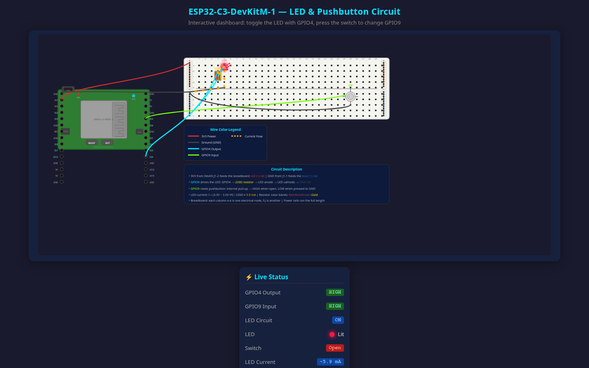

# Qwen3.8-27B Esp32 Circuit Prompt Case Study

*NOTE: This is a short case study based on a single prompt. Not a comprehensive comparison.*

For this comparison, the 27B models of Qwen 3.8 and Qwen 3.6 were given the same [prompt](prompt.txt) in both default and non-thinking modes. The prompt used is from a [Better Stack video](https://www.youtube.com/watch?v=mzQC9UK9n84), originally from [andrisgauracs' gist](https://gist.github.com/andrisgauracs/90613bfae85b3b976c189b491ced06b2), and it asks the agent to build an interactive ESP32 breadboard circuit. The prompt is very detailed but also contains errors, which helps to highlight some behavioral differences between the versions.

## Summary

In general Qwen3.8 was faster. It generated code that was more maintainable and compact than Qwen3.6.

In its thinking-mode run, it was also more complete and correct. 3.8 thinking was the only run to call out mistakes in the prompt.

## Test conditions

All runs were served by **llama.cpp on the same 96GB RTX 6000 Pro** on an otherwise quiet system using `unsloth/Qwen3.8-27B-GGUF:UD-Q8_K_XL`  for the 3.8 runs and `unsloth/Qwen3.6-27B-MTP-GGUF:UD-Q8_K_XL` for the 3.6 runs.

Here are links to the presets:

  * [qwen3.8-27b default](qwen3.8-27b-default/preset.ini)
  * [qwen3.8-27b nothink](qwen3.8-27b-nothink/preset.ini)
  * [qwen3.6-27b default](qwen3.6-27b-default/preset.ini)
  * [qwen3.6-27b nothink (fixed)](qwen3.6-27b-nothink-fixed/preset.ini)*
  * [qwen3.6-27b nothink (orig)](qwen3.6-27b-nothink/preset.ini)

*\*The original `qwen3.6-27b nothink` run omitted the provider-recommended `presence-penalty = 1.5` for non-thinking mode*

Models were pre-warmed before the prompt was given.

## Results

"Time" is the total time from prompt to done.

| Variant | Thinking | Time | Tokens in | Tokens out | Thinking chars | Output Size |
|---|---|---:|---:|---:|---:|---:|
| 3.8 | on | 18m 19s | 71,540 | 63,767 | 135,027 | 28 KB |
| 3.8 | off | 6m 34s | 25,473 | 26,970 | 0 | 24 KB |
| 3.6 | on | 28m 27s | 71,077 | 47,927 | 358,940 | 42 KB |
| 3.6 *fixed*| off | 16m 37s | 44,587 | 65,939 | 0 | 53 KB |
| 3.6 *orig* | off | 10m 56s | 59,790 | 44,814 | 0 | 50 KB |

---
### qwen3.8-27b default (thinking on) — [index.html](qwen3.8-27b-default/index.html)

**Code:** 3.8 generated code that was more readable and less repetitive than 3.6. It used a data-driven approach to generating markup for all the pins and tooltips which is more maintainable than the explicit markup from 3.6.

**Correctness:** It rendered a realistic 830 board layout and called out the prompt for specifying only 30 columns when a real 830 has 63.

It put "micro-USB" in a tooltip for the USB port, which matches the actual board.  It calls this out as a mistake in the prompt, which asked for USB-C.

It produced the only solution that showed the separate route to ground through the pushbutton when pressed. This is implied in the prompt, sort of, but you really have to understand the underlying circuit to get this.

**Visual Appeal:** By far the most visually appealing solution.

**Speed:** ~35% faster than 3.6 thinking

---
### qwen3.8-27b nothink — [index.html](qwen3.8-27b-nothink/index.html)

**Code:** Similar compact, readable style as the thinking run, although not as well-factored.

**Correctness:** It used the wrong multiplier color band on the resistor, although it it did label the value correctly.

**Visual Appeal:** Had the most visual problems of any of the runs: the two boards overlap, the resistor is shrunken (so you can't actually see the color band mistake mentioned above), and it uses a bright white background in the middle of a dark page.

**Speed:** Fastest run of the set.

---
### qwen3.6-27b default (thinking on) — [dashboard.html](qwen3.6-27b-default/dashboard.html)

**Code:** 3.6 wrote more code than 3.8 to do less.  The extra size is mostly
hand-authored SVG markup and a second animation system: it animates the current *two*
ways (CSS keyframes *and* a `requestAnimationFrame`).

**Correctness:** It chose to follow the 30-column part of the prompt instead of using an 830 board and didn't call it out. It stuck to the prompt with USB-C apparently not noticing the USB port on the actual board.

**Visual Appeal:** Better than any of the non-thinking models but the resistor is clunky-looking and not any more legible for how big it is.

**Speed:** ~55% slower than 3.8 thinking and less functionality.

---
### qwen3.6-27b nothink — original & fixed

Fixed:

Original:

**Code:** Generated repetitive code in a hand-authored SVG style. The original suffered from leftover
iterative patching cruft but the fixed version generated clean code.

**Correctness:** Also followed the 30-column part of the prompt and
didn't call out inconsistency with the 830 board or the dev kit USB
connector. The animations in the fixed version are better but still seem not quite right.

**Visual Appeal:** The original run produced nice curved wires that were legible while the fixed one has straight wire runs that cover themselves and run through many pins.  The animation in the fixed run looks more correct, but it's confusing because of the straight wire runs.  Both versions stack the pin labels to the wrong height compared to the board graphic and they leave too much blank space around the diagram.

**Speed:** The fixed version took ~50% longer than the original and both were much slower than 3.8 nothink.
