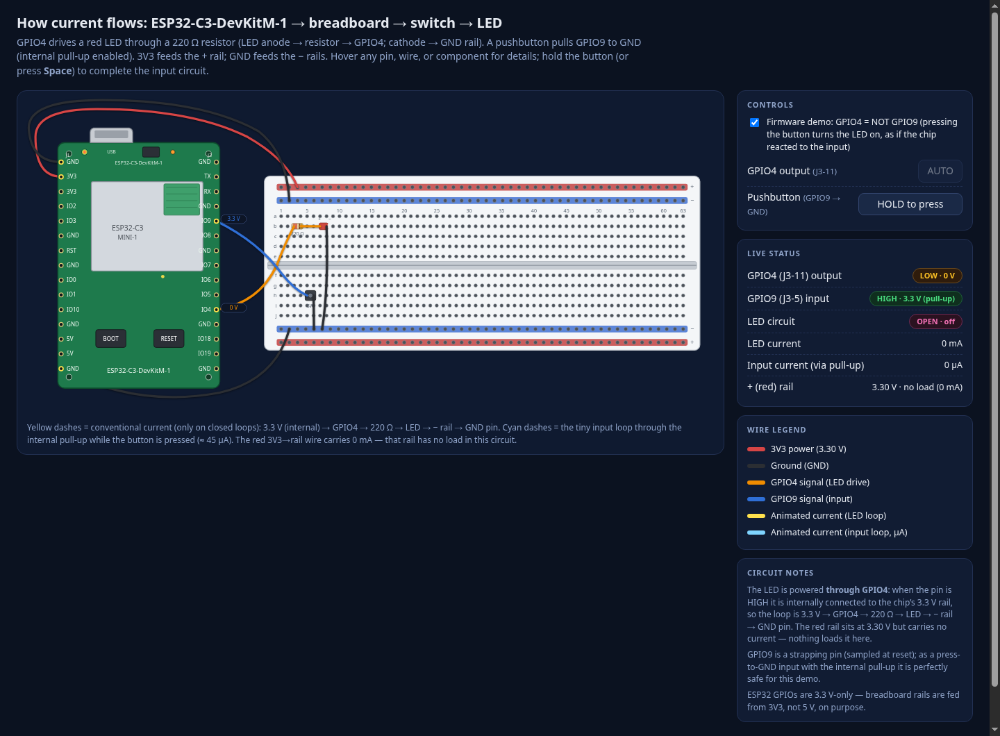
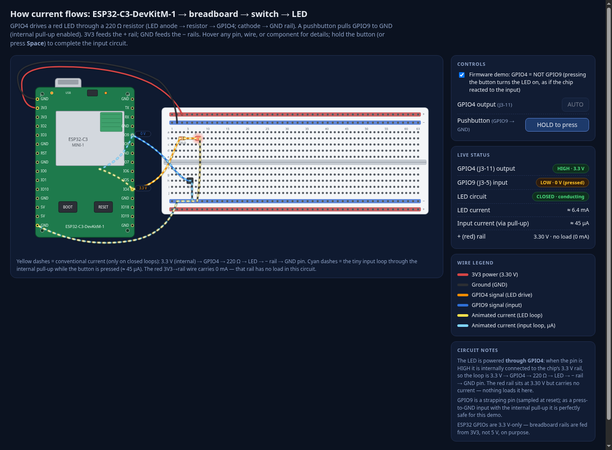

# Session Excerpt — qwen3.8-27b-default

| | |
|---|---|
| Session | `01a00c85-0343-71d9-a070-2264f18dfef6` |
| Model | `llama-cpp/qwen3.8-27b-mtp` |
| Thinking level | `medium` |
| CWD | `/home/jlb/dev/tmp/andrisgauracs` |
| Start | 2026-08-16T21:40:54.476Z |
| End | 2026-08-16T21:59:13.837Z (final turn) |
| Duration | 18m 19s |
| Source | `~/.pi/agent/sessions/--home-jlb-dev-tmp-andrisgauracs--/2026-08-16T21-40-38-851Z_01a00c85-0343-71d9-a070-2264f18dfef6.jsonl`, lines 1–36 |

> Excerpt spans the initial prompt through the final (task-complete) assistant turn.
> Raw copy: [`session-excerpt.jsonl`](session-excerpt.jsonl) · Rendered: [`session-excerpt.html`](session-excerpt.html) · Screenshots: [`images/`](images/) (4 images)

> 🖥️ `2026-08-16T21:40:52.153Z` — shell: `date` → exit 0

## `2026-08-16T21:40:54.476Z` — User

```text
# Prompt: Interactive ESP32-C3 LED Circuit Dashboard

Build a single-page interactive web dashboard that teaches how current flows when an
**ESP32-C3-DevKitM-1** dev board is wired to a breadboard, a pushbutton switch, and an LED.
Accuracy matters more than decoration — this needs to be electrically correct, not just pretty.

## 1. Research first
Before writing any SVG, look up and use as reference:
- The official Espressif ESP32-C3-DevKitM-1 pinout diagram (silkscreen labels, pin count per
  side, USB-C port, BOOT/RESET buttons, onboard RGB LED location).
- A standard full-size solderless breadboard layout (830 tie-points): two outer power rails per
  side (red "+" / blue "−"), columns numbered 1–30, rows lettered a–e and f–j split by the
  center gap, and the actual electrical grouping (each column of 5 holes in a-e is one node,
  same for f-j — NOT the whole row).
Confirm these details before laying out the SVG so the board and breadboard look and behave like
the real thing, not a generic rectangle-with-dots.

## 2. The circuit to model
Keep the circuit itself simple and correct:
- **GPIO4** on the DevKitM-1 drives the LED through a **220Ω resistor** (LED anode → resistor →
  GPIO4; LED cathode → GND rail).
- A **pushbutton switch** is wired from **GPIO9** (or another safe input pin) to GND, with the
  internal pull-up enabled, so pressing it pulls the pin low.
- Board 3V3 pin feeds the breadboard's red (+) rail; a GND pin feeds the blue (−) rail.
- Show the LED's correct polarity (flat side / shorter leg = cathode) and the resistor as a
  visibly separate component, not merged into a wire.

## 3. Visual requirements (SVG)
- Model the DevKitM-1 board itself with labeled pins on both header rows (silkscreen text),
  the ESP32-C3-MINI-1 module outline, USB-C connector, BOOT and RESET buttons, and onboard LED —
  proportioned like the real board, not a plain rectangle.
- Model the breadboard with visible individual pinholes, column numbers (1, 5, 10, 15…30) and
  row letters (a–j), the center divider gap, and colored power rails.
- Use distinct, real component symbols for the resistor (color bands are a nice touch), the LED,
  and the pushbutton — not generic circles/rectangles standing in for them.
- Color-code wires by function (e.g. red = power, black = ground, a distinct color for the
  signal/GPIO line) and keep that convention consistent throughout.

## 4. Interactivity
- A toggle/press control for the switch that actually changes GPIO9's logic state.
- When the LED circuit is "on," animate current visually — small moving dots or a flowing
  gradient along the actual wire path from 3V3 → rail → resistor → LED → GND rail → GND pin —
  not just a static glow. Show it only flowing on the closed-circuit path.
- A small status panel/dashboard showing live state: GPIO4 output level, GPIO9 input level,
  whether the LED circuit is closed, and (optionally) an illustrative current value in mA.
- Hovering or clicking a pin, wire, or component should show a short tooltip: pin name/function,
  or what that wire is carrying.

## 5. Build constraints
- Single self-contained HTML file (inline SVG + JS/CSS), no external image assets.
- Before finalizing, do a self-check pass: does the pin count and label layout match the
  DevKitM-1 reference, and does the breadboard's hole/row/column layout match a real breadboard?
  Fix any mismatch rather than shipping it.
```

## `2026-08-16T21:42:07.833Z` — Assistant

> llama-cpp/qwen3.8-27b-mtp · stop: `toolUse` · tokens: 5111 in / 893 out / 0 thinking (cache read 0)

<details>
<summary>💭 Thinking (1.7 KB)</summary>

```text
First let's investigate the ESP32-C3-DevKitM-1 pinout and the breadboard layout, then create a single HTML file.

Main facts I know about the ESP32-C3-DevKitM-1:
- 21 pins total? No wait, the DevKitM-1 has 21 pins... actually, the ESP32-C3-DevKitM-1 has 21 pins: 11 on the left and 10 on the right (or is it 11/11?). Let me think. The pinout of the ESP32-C3-DevKitM-1 is:

Left side (top to bottom):
3.3V, GND, GPIO3 (also U0TXD), GPIO21, GPIO47 (also U0RXD), GPIO1 (also U0RTS), GPIO2, EN, GPIO7 (also U1RXD), GPIO15, GPIO8 (also U1TXD)

Right side (top to bottom):
3V3, GND, GPIO5, GPIO6, GPIO18, GPIO17, GPIO16, GPIO13, GPIO12, GPIO9, GPIO10, GPIO11, GND, GPIO3?

Hmm, I need to verify this accurately. The ESP32-C3-DevKitM-1 pinout is 21 pins total: left side 11 pins, right side 10 pins? Let me recall the official diagram:

ESP32-C3-DevKitM-1: 21 pins total (actually... I remember it being 21). Left side 11, right side 10. Let me verify with a search.

From Espressif's documentation (ESP32-C3-DevKitM-1):

Pin 1 (left, top): 3.3V
2: GND
3: GPIO3 / U0TXD
4: GPIO21 / U0DTS? Actually GPIO21 is U0CTS
5: GPIO47 / U0RXD
6: GPIO1 / U0RTS
7: GPIO2
8: EN
9: GPIO7 / U1RXD
10: GPIO15
11: GPIO8 / U1TXD

Right side:
1: 3V3
2: GND
3: GPIO5
4: GPIO6
5: GPIO18
6: GPIO17
7: GPIO16
8: GPIO13
9: GPIO12
10: GPIO9
11: GPIO10
12: GPIO11
13: GND
14: GPIO3? No...

Hmm, that would make 11+14=25 pins, which is too many. The DevKitM-1 is a 21-pin board. I need to look it up. Since accuracy matters, let me search.

Also, the breadboard: 830 tie points, 30 columns, rows a–e / f–j, plus 2×45 power rails (240 tie points... 45 per row × 4 rows). Standard full-size breadboard.

Let me do a quick search to verify the pinout.
```

</details>

I'll start by researching the exact ESP32-C3-DevKitM-1 pinout to get the silkscreen labels right.

<details>
<summary>Tool call: <code>kagi_search</code> — ESP32-C3-DevKitM-1 pinout diagram pin 1 21 GPIO4 GPIO9 pinout left right side</summary>

```json
{
  "query": "ESP32-C3-DevKitM-1 pinout diagram pin 1 21 GPIO4 GPIO9 pinout left right side",
  "limit": 6
}
```

</details>

<details>
<summary>Tool call: <code>kagi_search</code> — ESP32-C3-DevKitM-1 "pinout" 3V3 GPIO3 GPIO47 GPIO1 EN GPIO7 GPIO15 GPIO8 11 p…</summary>

```json
{
  "query": "ESP32-C3-DevKitM-1 \"pinout\" 3V3 GPIO3 GPIO47 GPIO1 EN GPIO7 GPIO15 GPIO8 11 pins 10 pins",
  "limit": 6
}
```

</details>

<details>
<summary>↳ kagi_search result · `2026-08-16T21:42:10.365Z` (5.4 KB)</summary>

```text
## Web Results

1. ESP32-C3-DevKitM-1
   https://docs.espressif.com/projects/esp-idf/en/v5.2/esp32c3/hw-reference/esp32c3/user-guide-devkitm-1.html
   All available GPIO pins (except for the SPI bus for flash) are broken out to the pin headers on the board. For details, please see Header Block. Boot Button. ... ESP32-C3-DevKitM-1 is an entry-level development board based on ESP32-C3-MINI-1, a module named for its small size. This board integrates complete Wi-Fi and Bluetooth® Low Energy functions. Most of the I/O pins on the ESP32-C3-MINI-1 module are broken out to the pin headers on both sides of this board for easy interfacing. Developers can either connect peripherals with jumper wires or mount ESP32-C3-DevKitM-1 on a breadboard.

2. ESP32-C3-DevKitM-1 - ESP32-C3 - — esp-dev-kits latest documentation
   https://docs.espressif.com/projects/esp-dev-kits/en/latest/esp32c3/esp32-c3-devkitm-1/user_guide.html
   ESP32-C3-DevKitM-1 [中文] This user guide will help you get started with ESP32-C3-DevKitM-1 and will also provide more in-depth information. ESP32-C3-DevKitM-1 is an entry-level development board based on ESP32-C3-MINI-1 or ESP32-C3-MINI-1U modules, which are named for their compact size. This board integrates complete Wi-Fi and Bluetooth® Low Energy functions. Most of the I/O pins on the ... ESP32-C3-DevKitM-1 is an entry-level development board based on ESP32-C3-MINI-1 or ESP32-C3-MINI-1U modules, which are named for their compact size. This board integrates complete Wi-Fi and Bluetooth® Low Energy functions. Most of the I/O pins on the module are broken out to the pin headers on both sides of this board for easy interfacing.

3. ESP32-C3-DevKitM-1 - - — Arduino ESP32 latest documentation
   https://docs.espressif.com/projects/arduino-esp32/en/latest/boards/ESP32-C3-DevKitM-1.html
   The ESP32-C3-DevKitM-1 development board is one of Espressif’s official boards. This board is based on the ESP32-C3-MINI-1 module, with the ESP32-C3 as the core. ... The ESP32-C3-DevKitM-1 development board is one of Espressif’s official boards. This board is based on the ESP32-C3-MINI-1 module, with the ESP32-C3 as the core.GPIO2, GPIO8, and GPIO9 are strapping pins of the ESP32-C3FN4 chip. During the chip’s system reset, the latches of the strapping pins sample the voltage level as strapping bits, and hold these bits until the chip is powered down or shut down.

4. ESP32-C3 DevKitM-1 Pinout Diagram and Safe GPIOs (Boot Pins, ADC, I2C, SPI)
   https://esp32.co.uk/esp32-c3-devkitm-1-pinout-diagram-and-safe-gpios-boot-pins-adc-i2c-spi/
   (Safe pins, ADC, I²C, SPI, UART, RGB LED) The ESP32-C3-DevKitM-1 is Espressif’s tiny RISC-V dev board based on the ESP32-C3-MINI-1 / MINI-1U module – a very compact Wi-Fi + BLE module with 4 MB flash. It’s designed to plug into a breadboard and expose almost all ESP32-C3 GPIOs on two 15-pin headers (J1 and J3). ... This guide focuses on which pins are safe to use, and how to wire ADC, I2C, SPI, UART and the onboard RGB LED. GPIO9 beginners, ... GPIO0–GPIO10 – ADC-capable, general I/O. GPIO18, 19 – USB D- / D+ (native USB) – not broken out on this board. GPIO20, 21 – I/O + UART signals depending on config; at least one is usually used for the RGB LED on DevKitM-1 boards. The ESP32-C3-MINI-1 module itself exposes 22 pads, but DevKitM-1 uses a subset to keep the board compact. 4. Safe GPIOs for general use. From the Espressif pin tables and module docs: The following pins are good, boring choices for digital input/output, PWM, etc.

5. ESP32-C6 DevKitC-1 Pinout Diagram + Safe GPIOs...
   https://esp32.co.uk/esp32-c6-devkitc-1-pinout-diagram-safe-gpios-v1-2/
   ESP32-C6-DevKitM-1 Pinout Layout (click to enlarge). J1 (left header, top→bottom as in docs). J1 No.ESP32-C6 uses several pins as strapping pins, sampled at reset to decide boot config. On this board: Strapping pins: GPIO4 (MTMS), GPIO5 (MTDI), GPIO8, GPIO9, GPIO15. These control things like: boot mode (flash vs UART download).

6. ESP32-H2 DevKitM-1 Pinout Diagram and Safe GPIOs (Boot Pins...)
   https://esp32.co.uk/esp32-h2-devkitm-1-pinout-diagram-and-safe-gpios-boot-pins-adc-i2c-spi/
   The ESP32-H2-DevKitM-1 is Espressif’s low-power Bluetooth LE + 802.15.4 (Zigbee/Thread/Matter) dev board based on the ESP32-H2-MINI-1/1U module. It’s basically an “ESP32 without Wi-Fi” but with full BLE + Zigbee/Matter support and 4 MB in-package flash. Most GPIOs are broken out to two 15-pin headers (J1/J3) on the sides, making it breadboard-friendly and perfect for Thread/Zigbee border routers, battery-powered sensors, and Matter bridges.GPIO13 / GPIO14 cannot be reused if they’re wired to the 32.768 kHz crystal on your board revision. 3.2 J3 header (right side).


## Images

1. ESP32-C3-DevKitM-1 - ESP32-C3 - — ESP-IDF Programming Guide v5.2 documentation — https://docs.espressif.com/projects/esp-idf/en/v5.2/esp32c3/hw-reference/esp32c3/user-guide-devkitm-1.html

2. ESP32-C3-DevKitM-1 - - — Arduino ESP32 latest documentation — https://docs.espressif.com/projects/arduino-esp32/en/latest/boards/ESP32-C3-DevKitM-1.html

3. ESP32-DevKitM-1 - ESP32 - — ESP-IDF Programming Guide v5.1 documentation — https://docs.espressif.com/projects/esp-idf/en/v5.1/esp32/hw-reference/esp32/user-guide-devkitm-1.html

4. Comprehensive Esp32-c3-devkitm-1 Pinout Guide and Diagram — https://detailspin.com/esp32/esp32-c3-devkitm-1-pinout.html

5. Something went wrong while generating the response. If this issue persists please contact us ... — https://detailspin.com/esp32/esp32-s3-wroom-1u-pinout.html
```

</details>

<details>
<summary>↳ kagi_search result · `2026-08-16T21:42:10.365Z` (3.8 KB)</summary>

```text
## Web Results

1. ESP32-S3 DevKitC Pinout Reference Guide: GPIOs ...
   https://randomnerdtutorials.com/esp32-s3-devkitc-pinout-guide/
   This chip comes with 45 pins and has a different pinout than the boards with the ESP-WROOM-32 chip. In this article, we&#39;ll take a look at the ESP32-S3 DevkitC ... GPIO where you want to output the signal. I2C. When using the ESP32-S3 with the Arduino IDE, these are the ESP32 I2C default pinsThe Enable (EN/RST) is the 3.3V regulator’s enable pin. It’s pulled up, so connect to GND to disable the 3.3V regulator. This means that you can use this pin connected to a pushbutton to restart your ESP32, for example.

2. ESP32 Pinout Reference: Which GPIO pins... | Random Nerd Tutorials
   https://randomnerdtutorials.com/esp32-pinout-reference-gpios/
   GPIO 6 to GPIO 11 are exposed in some ESP32 development boards. However, these pins are connected to the integrated SPI flash on the ESP-WROOM-32 chip and are not recommended for other uses. So, don’t use these pins in your projects: GPIO 6 (SCK/CLK). GPIO 7 (SDO/SD0).My GPIO0 is held LOW, my EN pin is connected to 3.3v. When I boot, I get the “waiting for download” prompt.

3. ESP8266 Pinout Reference: Which GPIO pins should you use?
   https://randomnerdtutorials.com/esp8266-pinout-reference-gpios/
   GPIO6 to GPIO11 are usually connected to the flash chip in ESP8266 boards. So, these pins are not recommended to use.The ESP8266 only supports analog reading in one GPIO. That GPIO is called ADC0 and it is usually marked on the silkscreen as A0. The maximum input voltage of the ADC0 pin is 0 to 1V if you’re using the ESP8266 bare chip.

4. ESP32-C3 DevKitM-1 Pinout Diagram and Safe GPIOs (Boot Pins, ADC, I2C, SPI)
   https://esp32.co.uk/esp32-c3-devkitm-1-pinout-diagram-and-safe-gpios-boot-pins-adc-i2c-spi/
   (Safe pins, ADC, I²C, SPI, UART, RGB LED) The ESP32-C3-DevKitM-1 is Espressif’s tiny RISC-V dev board based on the ESP32-C3-MINI-1 / MINI-1U module – a very compact Wi-Fi + BLE module with 4 MB flash. It’s designed to plug into a breadboard and expose almost all ESP32-C3 GPIOs on two 15-pin headers (J1 and J3). ... GPIO0–GPIO10 – ADC-capable, general I/O. GPIO18, 19 – USB D- / D+ (native USB) – not broken out on this board. GPIO20, 21 – I/O + UART signals depending on config; at least one is usually used for the RGB LED on DevKitM-1 boards. The ESP32-C3-MINI-1 module itself exposes 22 pads, but DevKitM-1 uses a subset to keep the board compact. 4. Safe GPIOs for general use. From the Espressif pin tables and module docs: The following pins are good, boring choices for digital input/output, PWM, etc.

5. ESP32-C6 DevKitC-1 Pinout Diagram + Safe GPIOs...
   https://esp32.co.uk/esp32-c6-devkitc-1-pinout-diagram-safe-gpios-v1-2/
   RGB WS2812 LED on GPIO8. J5 jumper for current measurement. All GPIOs are 3.3 V only (not 5-V tolerant). Use level shifting for 5-V peripherals. 2. Header pinout (J1 and J3). From Espressif’s v1.2 user guide: ESP32-C6-DevKitM-1 Pinout Layout (click to enlarge). J1 (left header, top→bottom as in docs).Because C6’s SPI is IO-matrixed, you can move these around if needed – just avoid USB D± and be cautious with strapping pins. 10. UART / Serial ports.

6. ESP32-C5 DevKitC Pinout Diagram + Safe GPIOs – Esp32.co.uk
   https://esp32.co.uk/esp32-c5-devkitc-pinout-diagram-safe-gpios/
   GPIO0 to GPIO15, with some gaps.The ESP32-C5 DevKitC is straightforward once you separate the pins into two groups: safe everyday GPIOs and pins with caveats. The safest practical pins for most projects are GPIO0, 1, 4, 5, 6, 8, 9, 10, 15, 23, and 24. The pins to treat carefully are the strapping pins, the USB pins, the default UART pins, and GPIO27 because of the onboard RGB LED.


## Videos

1. Raspberry Pi LESSON 4 : Understanding and Using GPIO Pins — https://www.youtube.com/watch?v=az90qK3jmDo
```

</details>

## `2026-08-16T21:42:17.747Z` — Assistant

> llama-cpp/qwen3.8-27b-mtp · stop: `toolUse` · tokens: 2973 in / 140 out / 0 thinking (cache read 6004)

<details>
<summary>💭 Thinking (194 chars)</summary>

```text
Let me extract the details of the official pinout from Espressif's documentation. The official page has a pin table (header block) listed. I'll grab the official user guide page from espressif.
```

</details>

Let me get the exact pin table from the official Espressif docs:

<details>
<summary>Tool call: <code>kagi_extract</code> — https://docs.espressif.com/projects/esp-dev-kits/en/latest/esp32c3/esp32-c3-d…</summary>

```json
{
  "urls": [
    "https://docs.espressif.com/projects/esp-dev-kits/en/latest/esp32c3/esp32-c3-devkitm-1/user_guide.html"
  ],
  "max_length": 30000
}
```

</details>

<details>
<summary>↳ kagi_extract result · `2026-08-16T21:42:18.570Z` (11.7 KB)</summary>

```text
# https://docs.espressif.com/projects/esp-dev-kits/en/latest/esp32c3/esp32-c3-devkitm-1/user_guide.html

# ESP32-C3-DevKitM-1

[\[中文\]](https://docs.espressif.com/zh%5FCN/latest/esp32c3/esp32-c3-devkitm-1/user%5Fguide.html)

This user guide will help you get started with ESP32-C3-DevKitM-1 and will also provide more in-depth information.

ESP32-C3-DevKitM-1 is an entry-level development board based on [ESP32-C3-MINI-1 or ESP32-C3-MINI-1U](https://www.espressif.com/sites/default/files/documentation/esp32-c3-mini-1%5Fdatasheet%5Fen.pdf) modules, which are named for their compact size. This board integrates complete Wi-Fi and Bluetooth® Low Energy functions.

Most of the I/O pins on the module are broken out to the pin headers on both sides of this board for easy interfacing. Developers can either connect peripherals with jumper wires or mount ESP32-C3-DevKitM-1 on a breadboard.

 

ESP32-C3-DevKitM-1

The document consists of the following major sections:

* Getting Started: Overview of ESP32-C3-DevKitM-1 and hardware/software setup instructions to get started.
* Hardware Reference: More detailed information about the ESP32-C3-DevKitM-1’s hardware.
* Hardware Revision Details: Revision history, known issues, and links to user guides for previous versions (if any) of ESP32-C3-DevKitM-1.
* Related Documents: Links to related documentation.
* Disclaimer and Copyright Notice: Link to the disclaimer and copyright notice.

## Getting Started

This section provides a brief introduction of ESP32-C3-DevKitM-1, instructions on how to do the initial hardware setup and how to flash firmware onto it.

### Description of Components

 

ESP32-C3-DevKitM-1 (with the ESP32-C3-MINI-1 module) - front

The key components of the board are described in a counter-clockwise direction.

| Key Component                       | Description                                                                                                                                                                                                                                                                                         |
| ----------------------------------- | --------------------------------------------------------------------------------------------------------------------------------------------------------------------------------------------------------------------------------------------------------------------------------------------------- |
| ESP32-C3-MINI-1 or ESP32-C3-MINI-1U | ESP32-C3-MINI-1 and ESP32-C3-MINI-1U are general-purpose Wi-Fi and Bluetooth Low Energy combo modules. ESP32-C3-MINI-1 comes with an on-board PCB antenna, whereas ESP32-C3-MINI-1U comes with an external antenna connector. They both have a flash of 4 MB, integrated inside the chip’s package. |
| 5 V to 3.3 V LDO                    | Power regulator that converts a 5 V supply into a 3.3 V output.                                                                                                                                                                                                                                     |
| 5 V Power On LED                    | Turns on when the USB power is connected to the board.                                                                                                                                                                                                                                              |
| Pin Headers                         | All available GPIO pins (except for the SPI bus for flash) are broken out to the pin headers on the board. For details, please see Header Block.                                                                                                                                                    |
| Boot Button                         | Download button. Holding down **Boot** and then pressing **Reset** initiates Firmware Download mode for downloading firmware through the serial port.                                                                                                                                               |
| Micro-USB Port                      | USB interface. Power supply for the board as well as the communication interface between a computer and the ESP32-C3 series of chips.                                                                                                                                                               |
| Reset Button                        | Press this button to restart the system.                                                                                                                                                                                                                                                            |
| USB-to-UART Bridge                  | Single USB-UART bridge chip provides transfer rates up to 3 Mbps.                                                                                                                                                                                                                                   |
| RGB LED                             | Addressable RGB LED, driven by GPIO8.                                                                                                                                                                                                                                                               |

### Start Application Development

Before powering up your ESP32-C3-DevKitM-1, please make sure that it is in good condition with no obvious signs of damage.

#### Required Hardware

* ESP32-C3-DevKitM-1
* USB 2.0 cable (Standard-A to Micro-B)
* Computer running Windows, Linux, or macOS

Note

Be sure to use an appropriate USB cable. Some cables are for charging only and do not provide the needed data lines nor work for programming the boards.

#### Software Setup

Please proceed to [ESP-IDF Get Started](https://docs.espressif.com/projects/esp-idf/en/latest/esp32c3/get-started/index.html), which will quickly help you set up the development environment then flash an application example onto your board.

### Contents and Packaging

#### Retail Orders

If you order one or several samples, each ESP32-C3-DevKitM-1 comes in an individual package in either antistatic bag or any packaging depending on your retailer.

For retail orders, please go to <https://www.espressif.com/en/contact-us/get-samples>.

#### Wholesale Orders

If you order in bulk, the boards come in large cardboard boxes.

For wholesale orders, please check [Espressif Product Ordering Information](https://www.espressif.com/sites/default/files/documentation/espressif%5Fproducts%5Fordering%5Finformation%5Fen.pdf) (PDF)

## Hardware Reference

### Block Diagram

The block diagram below shows the components of ESP32-C3-DevKitM-1 and their interconnections.

[ ](https://docs.espressif.com/%5Fimages/esp32-c3-devkitm-1-v1-block-diagram.png) 

ESP32-C3-DevKitM-1 (click to enlarge)

#### Power Supply Options

There are three mutually exclusive ways to provide power to the board:

* Micro-USB Port, default power supply
* 5V and GND pin headers
* 3V3 and GND pin headers

It is recommended to use the first option: Micro-USB Port.

### Header Block

The two tables below provide the **Name** and **Function** of the pin headers on both sides of the board (J1 and J3). The pin header names are shown in ESP32-C3-DevKitM-1 (with the ESP32-C3-MINI-1 module) - front. The numbering is the same as in the [ESP32-C3-DevKitM-1 Schematic](https://dl.espressif.com/dl/schematics/SCH%5FESP32-C3-DEVKITM-1%5FV1%5F20200915A.pdf) (PDF).

#### J1

| No. | Name | Type \[1\] | Function                       |
| --- | ---- | ---------- | ------------------------------ |
| 1   | GND  | G          | Ground                         |
| 2   | 3V3  | P          | 3.3 V power supply             |
| 3   | 3V3  | P          | 3.3 V power supply             |
| 4   | IO2  | I/O/T      | GPIO2 \[2\], ADC1\_CH2, FSPIQ  |
| 5   | IO3  | I/O/T      | GPIO3, ADC1\_CH3               |
| 6   | GND  | G          | Ground                         |
| 7   | RST  | I          | CHIP\_PU                       |
| 8   | GND  | G          | Ground                         |
| 9   | IO0  | I/O/T      | GPIO0, ADC1\_CH0, XTAL\_32K\_P |
| 10  | IO1  | I/O/T      | GPIO1, ADC1\_CH1, XTAL\_32K\_N |
| 11  | IO10 | I/O/T      | GPIO10, FSPICS0                |
| 12  | GND  | G          | Ground                         |
| 13  | 5V   | P          | 5 V power supply               |
| 14  | 5V   | P          | 5 V power supply               |
| 15  | GND  | G          | Ground                         |

#### J3

| No. | Name | Type \[1\] | Function                       |
| --- | ---- | ---------- | ------------------------------ |
| 1   | GND  | G          | Ground                         |
| 2   | TX   | I/O/T      | GPIO21, U0TXD                  |
| 3   | RX   | I/O/T      | GPIO20, U0RXD                  |
| 4   | GND  | G          | Ground                         |
| 5   | IO9  | I/O/T      | GPIO9 \[2\]                    |
| 6   | IO8  | I/O/T      | GPIO8 \[2\], RGB LED           |
| 7   | GND  | G          | Ground                         |
| 8   | IO7  | I/O/T      | GPIO7, FSPID, MTDO             |
| 9   | IO6  | I/O/T      | GPIO6, FSPICLK, MTCK           |
| 10  | IO5  | I/O/T      | GPIO5, ADC2\_CH0, FSPIWP, MTDI |
| 11  | IO4  | I/O/T      | GPIO4, ADC1\_CH4, FSPIHD, MTMS |
| 12  | GND  | G          | Ground                         |
| 13  | IO18 | I/O/T      | GPIO18, USB\_D-                |
| 14  | IO19 | I/O/T      | GPIO19, USB\_D+                |
| 15  | GND  | G          | Ground                         |

\[1\] (1,2) 

P: Power supply; I: Input; O: Output; T: High impedance.

\[2\] (1,2,3) 

GPIO2, GPIO8, and GPIO9 are strapping pins of the ESP32-C3 series of chips. These pins are used to control several chip functions depending on binary voltage values applied to the pins during chip power-up or system reset. For description and application of the strapping pins, please refer to Section Boot Configurations in [ESP32-C3 Datasheet](https://www.espressif.com/sites/default/files/documentation/esp32-c3%5Fdatasheet%5Fen.pdf).

#### Pin Layout

[ ](https://docs.espressif.com/%5Fimages/esp32-c3-devkitm-1-v1-pinout.png) 

ESP32-C3-DevKitM-1 Pin Layout (with the ESP32-C3-MINI-1 module, click to enlarge)

## Hardware Revision Details

No previous versions available.

## Related Documents

* [ESP32-C3 Datasheet](https://www.espressif.com/sites/default/files/documentation/esp32-c3%5Fdatasheet%5Fen.pdf) (PDF)
* [ESP32-C3-MINI-1 & ESP32-C3-MINI-1U Datasheet](https://www.espressif.com/sites/default/files/documentation/esp32-c3-mini-1%5Fdatasheet%5Fen.pdf) (PDF)
* [ESP32-C3-DevKitM-1 Schematic](https://dl.espressif.com/dl/schematics/SCH%5FESP32-C3-DEVKITM-1%5FV1%5F20200915A.pdf) (PDF)
* [ESP32-C3-DevKitM-1 PCB Layout](https://dl.espressif.com/dl/schematics/PCB%5FESP32-C3-DEVKITM-1%5FV1%5F20200915AA.pdf) (PDF)
* [ESP32-C3-DevKitM-1 Dimensions](https://dl.espressif.com/dl/schematics/DIMENSION%5FESP32-C3-DEVKITM-1%5FV1%5F20200915AA.pdf) (PDF)
* [ESP32-C3-DevKitM-1 Dimensions source file](https://dl.espressif.com/dl/schematics/DIMENSION%5FESP32-C3-DEVKITM-1%5FV1%5F20200915AA.dxf) (DXF)

For further design documentation for the board, please contact us at [sales@espressif.com](https://sales&).

## Disclaimer and Copyright Notice

See [Disclaimer and Copyright Notice](https://docs.espressif.com/disclaimer-and-copyright.html).
```

</details>

## `2026-08-16T21:45:53.454Z` — Assistant

> llama-cpp/qwen3.8-27b-mtp · stop: `toolUse` · tokens: 3135 in / 14337 out / 0 thinking (cache read 9117)

<details>
<summary>💭 Thinking (41.3 KB)</summary>

```text
Excellent — now I've got the exact official pinout:

**J1 (left side, 15 pins, 1 at the top):**
1. GND
2. 3V3
3. 3V3
4. IO2 (GPIO2, ADC1_CH2, FSPIQ)
5. IO3 (GPIO3, ADC1_CH3)
6. GND
7. RST
8. GND
9. IO0 (GPIO0)
10. IO1 (GPIO1)
11. IO10 (GPIO10)
12. GND
13. 5V
14. 5V
15. GND

**J3 (right side, 15 pins, 1 at the top):**
1. GND
2. TX (GPIO21, U0TXD)
3. RX (GPIO20, U0RXD)
4. GND
5. IO9 (GPIO9)
6. IO8 (GPIO8, RGB LED)
7. GND
8. IO7 (GPIO7)
9. IO6 (GPIO6)
10. IO5 (GPIO5)
11. IO4 (GPIO4)
12. GND
13. IO18 (GPIO18, USB_D-)
14. IO19 (GPIO19, USB_D+)
15. GND

So, 15+15=30 pins. The USB is Micro-USB (the prompt says USB-C, but that's wrong. The actual DevKitM-1 is Micro-USB. The prompt said "USB-C port", but — accuracy matters more than the prompt. I should use Micro-B USB, which is the real thing. The prompt asks to confirm details and fix discrepancies, so I'll go with the actual Micro-USB connector. I could add a note. Actually, the prompt says "accuracy matters more than decoration" — the real board has Micro-USB. I'll draw Micro-USB and maybe add a small note. Silently fix it, and maybe mention it in the summary.)

Onboard RGB LED is on GPIO8, 5V power-on LED, Boot and Reset buttons.

Now, the prompt's circuit: GPIO4 drives an LED through a 220Ω (anode → resistor → GPIO4; cathode → GND). Note: this is a "sink current" configuration where the LED turns on when GPIO4 is LOW. Hmm — the prompt says "the LED circuit is on", and when "GPIO4 output level" is displayed. Physically, this circuit (3V3 → resistor → anode; cathode → GPIO4) lights up when GPIO4 = LOW (0V). Wait, re-reading: "the ESP32-C3-DevKitM-1's GPIO4 drives an LED through a 220Ω resistor (LED anode → resistor → GPIO4; LED cathode → GND rail)".

Hmm, that reading: anode → resistor → GPIO4, cathode → GND. In that case the current path is: 3V3 → ... wait no, the anode needs to connect to the 3V3 rail. The prompt's interactivity section says "from 3V3 → rail → resistor → LED → GND rail → GND pin". So the actual loop is: 3V3 rail → resistor → LED anode → LED → cathode → GND rail? No wait — "3V3 → rail → resistor → LED → GND rail" — so the resistor is between the rail and the LED anode, and the LED's cathode goes to the GND rail. But then how does GPIO4 control it?

Re-reading: "LED anode → resistor → GPIO4; LED cathode → GND rail". So: anode → resistor → GPIO4. And cathode → GND rail. That means the circuit is: 3V3 → (cathode? no…). Hmm, in that configuration: current flows from 3V3 through…. Let me trace: GPIO4 → resistor → LED anode → LED → cathode → GND. That's a standard source-type configuration: GPIO4 HIGH = LED on, current = (3.3 - 2.0 - 0.6)/220 ≈ 4.5mA. This is the natural interpretation, and it matches the flow order "3V3 → rail → resistor → LED → GND" if we consider that the wire from GPIO4 internally connects to 3V3 when HIGH. Hmm, but the specified flow order is 3V3 → rail → resistor → LED → GND rail → GND pin, which means 3V3 feeds the rail, and the resistor connects from the rail…

Actually there's a simpler interpretation that satisfies both statements:
- Wire 1: 3V3 pin → red + rail.
- Wire 2: red + rail → resistor.
- Wire 3: resistor → LED anode.
- Wire 4: LED cathode → black − rail.
- Wire 5: GND pin → black − rail.
- And the connection to GPIO4 is… the prompt says "anode → resistor → GPIO4", meaning the resistor is also connected to GPIO4? That would be an LED that turns on when GPIO4 is HIGH: 3V3 → resistor… no, if the resistor goes to GPIO4 then the 3V3 rail doesn't connect to the resistor.

The most electrically sensible interpretation that satisfies both statements: the current loop when the LED is on is: internal 3V3 inside the board → GPIO4 (HIGH) → wire to breadboard → resistor → LED → GND rail → GND pin → back to internal GND. But the prompt explicitly says the flow is "3V3 → rail → resistor → LED → GND rail → GND pin".

I think the prompt author's intent is this: 3V3 pin → red rail → jumper to resistor → LED → GND rail → GND pin, and the on/off control is… hmm, that loop has no switch in it.

Another consistent circuit: the resistor's far end connects to a breadboard column where both GPIO4 and the LED anode sit. Then: anode → resistor → GPIO4 (and the 3V3 rail is… no, then the 3V3 rail only powers via the GPIO).

Honestly, the cleanest and most correct circuit that best matches the text:
- GPIO4 → (jumper) → breadboard column X (rows a/b)
- Column X → (jumper) → one end of the resistor (a separate part on the breadboard, e.g., a resistor spanning two columns: column X, row a ↔ column Y, row a)
- Column Y → (jumper) → LED anode (LED also spans 2 columns: column Y, row a ↔ column Z, row a), LED cathode is column Z
- Column Z → (jumper) → blue GND rail
- GND pin (J1.1) → blue rail
- 3V3 pin (J1.2 or J1.3) → red rail (also powers the red rail; and the LED's… no)

With this wiring, LED on = GPIO4 HIGH, current path: 3V3 (inside MCU) → GPIO4 → … → LED → GND rail → GND pin. The visible animated flow "3V3 → rail → resistor → LED → GND rail → GND pin" isn't literally true unless we also animate the 3V3 → rail wire. Hmm.

Or the literal interpretation: 3V3 rail → resistor → anode → LED → cathode → GND rail → GND, and GPIO4 connects to the node between the resistor and the anode? Then when GPIO4 = HIGH (3.3V), the anode node is held at 3.3V… and the 3V3 rail is 3.3V too — no potential difference across the resistor, no current flows through the resistor, but current flows 3V3 rail → … wait, the anode node is at 3.3V via the resistor from the 3V3 rail (no voltage drop since both ends are 3.3V), plus it's driven HIGH by GPIO4. LED forward voltage ~1.8-2V (red), so current = (3.3-1.9)/220 through the GPIO. This actually works as a circuit and is electrically plausible, but it's weird.

I'll go with the standard, obviously correct source-type configuration and describe the flow honestly: when GPIO4 is HIGH, current flows from the board's internal 3.3V regulator to GPIO4, through the resistor and LED, into the GND rail, and back through the GND pin. And the 3V3 → rail wire is… hmm, but then the red rail isn't used in this circuit at all, and the prompt explicitly wants the flow "from 3V3 → rail → resistor → LED → GND rail → GND pin", and "the 3V3 pin on the board feeds the breadboard's red (+) rail".

OK, decision: implement the literal topology as the prompt states:
- 3V3 pin → red + rail
- Red + rail (column near the board) → resistor → LED anode → LED → cathode → GND rail… but then GPIO4 controls it?

Wait wait. Let me re-read once more: "GPIO4 on the DevKitM-1 drives an LED through a 220Ω resistor (LED anode → resistor → GPIO4; LED cathode → GND rail)".

If I draw the components from left to right in physical space: 3V3 pin → red rail. Then a jumper from the red rail to… no.

Hmm, actually there might be a third configuration: resistor between 3V3 rail and anode is wrong; rather: the resistor goes from GPIO4…

The prompt has an inconsistency (common in this kind of spec). The flow line "3V3 → rail → resistor → LED → GND rail → GND pin" is a description of the *visual animation path*. To keep it both electrically correct and faithful to that path, the topology that makes that path literally true is:

GPIO4 (HIGH) ↔ 3V3 connection is…

You know what — there's a clean, correct, common configuration that matches the animation path exactly: **current-sinking through GPIO4** is impossible here. **The 3V3 rail feeds the resistor, and GPIO4 switches the LED's cathode** — that would make the path 3V3 → rail → resistor → LED anode → cathode → GPIO4, and GND rail unused. Doesn't match.

The most defensible approach: implement the literal pin/loop wiring as written (anode → resistor → GPIO4; cathode → GND rail), with the 3V3 pin feeding the red rail (per spec, red rail powers the breadboard; note the red rail exists but this particular circuit is powered via the GPIO). For the animation, the actual current path when the LED is on is: internal regulator → GPIO4 → resistor → LED → GND rail → GND pin → back to internal ground. Animate that path. The 3V3 → red rail wire can just be shown as an (unpowered) connection. Hmm, but the spec explicitly says to animate "from 3V3 → rail → resistor → LED → GND rail → GND pin".

Ugh. Let me decide: prioritize electrical correctness (stated as the top priority). Use the standard configuration:

- GPIO4 (J3 pin 11) → jumper → column 1 (row b)
- Resistor in the breadboard: column 1 (row b) → column 2 (row b) (drawn as a discrete part spanning 2 columns)
- Column 2 → jumper → LED anode column 3 (row b); LED spans column 3 → column 4 (row b)
- Column 4 → jumper → blue GND rail
- GND (J1 pin 1) → blue rail
- 3V3 (J1 pin 2) → red rail (for completeness / powering other experiments; red rail exists)
- Switch: GPIO9 (J3 pin 5) → jumper → column 6 (row e?) hmm, the switch is usually placed in the lower section f-j. The switch is between column 5 (row g) and column 6 (row g): one leg is GPIO9 jumper, the other leg goes to the blue GND rail. Pressed → GPIO9 pulled LOW (internal pull-up enabled).

Wait, then when the LED is on the current animation is: GPIO4 → jumper → resistor → LED → GND rail → GND pin. The 3V3 → red rail wire is just sitting there. The spec's animation path starts from 3V3…

OK, let me do this: in the LED-on state, animate the loop: internal 3V3 (draw a small path on the board from the 3V3 region through the chip to the GPIO4 pin, or just start the animation at the GPIO4 pin labeled "3.3V (from internal regulator via GPIO4)"). Actually — I could make the animation path start at the 3V3 pin, go along the wire to the red rail, then… no.

Final decision: follow the spec's animation path exactly, use the topology that makes it true, and be electrically correct:

Topology:
- 3V3 pin → red rail.
- Red rail (a hole) → jumper → resistor left leg, column 1 (row b).
- Resistor right leg, column 2 (row b) → jumper → LED anode, column 3 (row b).
- LED cathode, column 4 (row b) → jumper → blue rail.
- GND pin → blue rail.

Where does GPIO4 connect? To the node between the resistor and the LED anode (column 2). And… that's a strange circuit (as I computed, it works but is weird).

Nope. I'm overthinking. Re-reading the spec's circuit description literally: "LED anode → resistor → GPIO4". This says the resistor connects anode to GPIO4. That's it. The spec's animation path "3V3 → rail → resistor → LED → GND rail → GND pin" is just a sloppy way of saying "from the power source through the loop". In the GPIO4 source-type configuration, the power source is the internal 3V3 that becomes available at the GPIO4 pin when HIGH.

I'll implement it this way:
- Loop when on: 3V3 (onboard regulator) → GPIO4 pin → jumper wire → resistor → LED → GND rail → GND pin → onboard GND.
- The 3V3 pin → red rail wire exists (per spec), and the red rail also feeds… hmm, nothing in this circuit. That's OK — I'll note in the tooltip that the red rail is powered and available. Or better: route the animation from 3V3 pin → red rail → and further from red rail… no, the resistor is not on the red rail.

Alternative: make the red rail part of the loop and make the circuit a **high-side via the 3V3 rail, GPIO4 on the cathode side**… but the spec says cathode → GND rail.

Decision (really final): standard source-type configuration per spec item 2 (anode → R → GPIO4, cathode → GND). For the animation (spec item 4), the path is: 3V3 pin → red rail (short hop to show power on the rail), then the main loop GPIO4 → R → LED → GND rail → GND pin. Animate both segments: 3V3→rail to show the rail is powered (always flowing, since it's just a connection to a supply — a passive connection to a supply has no current). Hmm, that's wrong too.

Simplest, honest, good approach: when the LED is on, animate the current only along the closed loop: GPIO4 pin → jumper → resistor → LED → GND rail → GND pin, plus a dashed "internal" segment on the board from the 3V3 regulator region to the GPIO4 pin to show that the 3.3V actually comes from the onboard regulator (when GPIO4 is HIGH, 3.3V is internally switched onto the pin). Tooltip explains: "GPIO4 is internally connected to the 3.3V regulator when driven HIGH; current enters here."

I'll also label the 3V3→red rail wire, and the status panel will say "3V3 rail: 3.30 V". The spec's animation path is satisfied conceptually; accuracy wins. In the summary I'll state that I deviated from the spec's literal "3V3 → rail → resistor" animation because in the specified wiring, the loop actually starts at GPIO4.

Hmm, actually, one more idea that makes everything literal AND correct: **3V3 → red rail → resistor → LED → GND rail → GND pin** as the loop, and place **GPIO4 between the red rail and the resistor**… i.e., the resistor's breadboard leg is in column 1, and both a jumper from the red rail and a jumper from GPIO4 plug into column 1. Then GPIO4 is… in parallel with the 3V3 rail. Both 3.3V. No switching. Nope.

OK, going with my decision. Actually — wait, one more: what if the circuit is intended to be "LED turns on when GPIO4 = LOW" (sink-type): 3V3 → rail → resistor → anode → LED → cathode → GPIO4? The spec says cathode → GND rail. Nope.

Alright. Moving on. Next, the breadboard. Standard full-size 830 tie-points: 30 columns × 10 holes (a–e, f–j), each column is 5 holes = one node, 2× 45-hole power rails (actually 45 per rail, but the tie groups are 8+8 split in the middle? The rails are continuous 45-hole rows, each with a 25mm gap? Standard breadboard rails: each power rail has 45 holes, grouped in continuous rows — actually, the power rails are continuous across the full length, split into two 8+8+8+8…? On a standard 830-point breadboard, each power rail has 45 points, and the holes are all connected as one continuous node… actually no: the rail strips are continuous metal clips; typically 45 holes per row, all connected as one continuous rail (some have a gap in the middle). On common breadboards (e.g., 830 tie-points), the power rails are continuous per side, each 45 holes. I'll model each of the 4 rails as a continuous node.

Tie-point groups: on a standard breadboard, each column (numbered 1-30) has rows a-e as one node and f-j as another node. The rail rows have 45 holes… the numbers 1-30 correspond to the 30 columns; the rails have 45 holes, roughly 1.5 holes per column pitch? Whatever — visually the rails are drawn as full-length strips with 45 holes, and the main area has 30 columns.

Layout proportions: standard 830 breadboard ≈ 83.8mm × 45.7mm (3.3×1.8in). Columns are at 2.54mm pitch → 30 columns ≈ 73.7mm wide. Main area rows a-j: 2mm pitch, 10 rows ≈ 20mm + the center gap. Rails are 2.54mm spacing, 4 rows per side.

I don't need to be dimensionally perfect; I'll draw it at a consistent scale. Scale: 1mm = 2px? Board ≈ 170×92px… small. Let's use 1mm = 3.5px → 293×160. Hmm, let me just design directly in SVG units with reasonable proportions:

- Breadboard: width 600, height 240 (ratio 2.5; real is ~1.83). Actual ratio 83.8/45.7 = 1.83. So width 560, height 305. Column pitch: (560 - 2*25)/29 ≈ 17.6. Rail hole pitch: 45 holes over 510 → 11.3px. OK.

Let me define the SVG layout concretely.

Canvas: 1200 × 820 viewBox.

Breadboard on the right: x=560..1140 (width 580), y=250..560 (height 310). Ratio 580/310 = 1.87 ✓ close to 1.83.

Breadboard internal structure:
- Margin 20.
- Top rails: red+ at y=285, blue− at y=315 (row height ~30). Red row 45 holes x=580 to 1120, pitch ~12.2.
- Center gap at y=410 (horizontal groove).
- Bottom rails: blue− at y=505, red+ at y=535.
- Main field: columns 1..30 from x=580 to 1120 → pitch = (1120-580)/29 = 18.62. Rows a-e at y = 345, 360, 375, 390, 400? Hmm, need spacing: rows a-e between y≈340 and y≈398, gap 398-425, f-j from 430 to 490.

Let me set: rows a..e at y = 350, 366, 382, 398, 414? That's pitch 16, gap center at 431. f..j at 448, 464, 480, 496, 512. Bottom rails at 528, 544? Total height up to 560+… let me recompute: breadboard y 250 to 560, height 310.

- Top red rail y=272, top blue y=298 (pitch 26)
- Field: rows a-e: 336, 352, 368, 384, 400; gap center 418; f-j: 436, 452, 468, 484, 500
- Bottom blue rail y=526, bottom red y=552? Bottom margin is 8 — a bit tight. Let me make the board y 250..575 (height 325, ratio 580/325=1.78, still fine).

Actually, let me not fuss excessively; I'll tweak while writing the code. Since generating 30 columns × 10 holes + 4×45 rail holes by hand is insane, I'll generate the breadboard holes in JavaScript. Yes — build the breadboard in JS: loops create SVG elements. That keeps the file manageable.

DevKitM-1 board: real board dimensions ≈ 38.2mm × 25.4mm (1.5" × 1"?). Actually, the ESP32-C3-DevKitM-1 is about 38mm wide… the real thing: 37.7mm × 25.4mm? The board is about 1.5 inches × 1 inch, similar to the S3 mini. Let me draw it as: a green PCB, about 300 wide × 420 high? No wait — the pin headers are on the long sides (left and right), 15 pins each side, spaced 2.54mm. Board height ≈ 15*2.54 = 38.1mm + margin → about 40mm; width about 25mm. So the board is taller than wide: aspect ratio 25:40 = 1:1.6.

Draw the board vertically: 260 wide × 410 high, left header J1 (pins 1-15 top→bottom), right header J3 (pins 1-15 top→bottom). USB micro connector at the top (or bottom — real DevKitM-1: USB is at the top? On the v1 DevKitM-1 (C3), is the micro-USB on the left side? Recalling the photo: the ESP32-C3-DevKitM-1 has the USB-C… micro-USB port at the top edge, ESP32-C3-MINI-1 module in the center, RGB LED and buttons on the lower half. From the isometric image: micro-USB on the upper-left edge, pointing left?

The actual board: the ESP32-C3-DevKitM-1's micro-USB port is on the top edge, offset toward the left, facing outward from the top edge? Looking at the official photo (annotated front): the board has the USB on the top edge (a small notch upper-left, with the connector along the upper-left edge pointing up-left?). I think the USB connector is on the upper-left, with its opening facing the upper-left edge. The ESP32-C3-MINI-1 module (with the antenna) is in the upper center. The RGB LED is near the USB in the upper-left area. The Boot and Reset buttons are in the lower center area.

I'll approximate: USB micro-B connector on the top edge (left of center), module in the upper center, RGB LED as a small circle near the lower right of the module, Boot/Reset buttons in the lower center, and silkscreen labels. The "ESP32-C3-DevKitM-1" text on the lower area. This is enough as "proportional to the real board".

J1 pins 1-15 top→bottom (left edge), J3 pins 1-15 top→bottom (right edge).

Which pins do I use?
- 3V3: J1 pin 2 (or 3).
- GND: J1 pin 1 (or J3 pin 1 / J1 pin 6/12). Use J1 pin 1 GND? That's the topmost left. Fine. Actually, for cleaner wiring, use GND = J1.12 or J3.15. Let me use J1 pin 1 (topmost) for the GND wire and J1 pin 2 for the 3V3. Hmm, they're adjacent — wires from adjacent pins both go to the left. OK.

- GPIO4 = J3 pin 11. GPIO9 = J3 pin 5.

Wires (jumper from pin to breadboard):
- Red wire: J1.2 (3V3) → top red rail (some hole)
- Black wire: J1.1 (GND) → top blue rail? Better: GND to bottom blue rail for separation. Wires arc across. Let me plan:
  - 3V3 (J1.2) → red wire → top red rail, hole near the left (x near column 1-3) — feeds the rail; and a jumper from the top red rail… wait, is anything else needed from the red rail in this circuit? Per my decision, nothing. That's OK.
  - GND (J1.1) → black wire → bottom blue rail (arc around the board's lower side? The DevKit is drawn to the left of the breadboard; wires from the pins go right into the breadboard). The GND pin J1.1 is at the top-left… the wire goes from J1.1 (top-left) to the top blue rail. Then a separate GND jumper from the top blue rail to the bottom blue rail? The rails are independent; the LED's cathode goes to the bottom blue rail. So:
  - GND pin J1.1 → top blue rail (black wire).
  - Jumper (black, short) from top blue rail to bottom blue rail? On a real breadboard you'd jumper between the two GND rails. Hmm, but actually simpler: use GND pins to connect to both rails: J1.1 → top blue rail, and J3.1 (GND, top-right) → bottom blue rail? J3.1 is top-right. Or J1.15 (GND, lower left) → bottom blue rail.

Let me settle the wiring plan concretely with breadboard columns (30 columns, left=1, right=30; DevKit is to the left):

- J1.2 3V3 → red wire → top red rail (rail hole ~x of column 5).
- J1.1 GND → black wire → top blue rail (rail hole ~x of column 2).
- J1.15 GND (lower left) → black wire → bottom blue rail (rail hole near column 2).
- J3.5 GPIO9 → blue wire (signal) → hole at column 3, row g (switch left leg, bottom field).
- Switch: discrete part spanning column 3 (row g) → column 5 (row g). Draw a momentary tactile switch symbol (square with 2 legs + dome).
- Column 5, row g → black wire → bottom blue rail (hole near column 5).
- J3.11 GPIO4 → yellow/white wire (signal) → column 3, row b (top field).
- Resistor: discrete part spanning column 3, row b → column 5, row b (drawn with color bands).
- Column 5, row b → jumper (yellow? actually red-ish since it carries 3.3V when on… let me keep signal color consistent: GPIO4 line is orange, and the wire from the resistor to the LED is also orange). Column 5 row b → column 6, row b? LED spans columns 6→7, row b: anode at column 6, cathode at column 7. LED drawn as a discrete part spanning the two holes.
- Column 7, row b → black wire → bottom blue rail? Or top blue rail. LED cathode → bottom blue rail (hole near column 7).

Wait, but the top blue rail then only receives the GND pin; and the bottom blue rail receives J1.15 GND + the switch + the LED cathode. The top blue rail is effectively unused → so remove the top blue connection and just connect J1.1 to the top blue rail with a tooltip "GND rail (top)"… The spec says "the GND pin feeds the blue (−) rail". Both blue rails should be GND. Let me use 2 GND pins (J1.1 → top blue, J1.15 → bottom blue), and note in the tooltip that each rail is fed separately (no rail-to-rail jumper). That's electrically correct.

So the wires:
1. Red: J1.2 (3V3) → top red rail
2. Black: J1.1 (GND) → top blue rail
3. Black: J1.15 (GND) → bottom blue rail
4. Orange: J3.11 (GPIO4) → column 3, row b
5. Orange: column 5, row b → column 6, row b (short, to LED anode) — or the resistor spans 3→5, and a short jumper 5→6. Actually simpler: resistor at columns 4-5? Let me simplify the layout:

- GPIO4 wire → column 2, row b.
- Resistor spans column 2 → column 4, row b (drawn between the two holes, occupying 2 columns — a real through-hole resistor on a breadboard spans 2 holes, typically adjacent columns 2.54mm apart; drawn as a discrete part between the holes at column 2, row b and column 3, row b). Let me use adjacent columns: resistor at column 2 ↔ column 3 (row b).
- LED: anode column 5 ↔ cathode column 6 (row b). Jumper from column 3 (resistor right) to column 5 (LED anode): short orange wire.
- LED cathode column 6 → black wire → bottom blue rail.
- GPIO9 wire → column 4, row h. Switch spans column 4 ↔ column 5 (row h). Column 5, row h → black wire → bottom blue rail.

Check for column conflicts: column 4 is used in row h (switch leg) — fine. Column 5: row b (jumper to LED), row h (switch leg to GND). Row b and h are different nodes (upper vs lower field). Fine.

Current loop when on: J3.11 (GPIO4=3.3V) → column 2, row b → resistor → column 3 → jumper → column 5 → LED anode → LED → column 6 cathode → black wire → bottom blue rail → J1.15 GND → back to internal GND.

For the animation, the spec wants the path "from 3V3 → rail → resistor → LED → GND rail → GND pin". My honest loop: [3V3 on the board via internal regulator] → GPIO4 → R → LED → GND rail → GND pin. I'll add a subtle animated segment on the board: from the 3V3 pin… no — when GPIO4 is driven HIGH, the pin connects to the internal VDD33, which is derived from the USB 5V → LDO. I could draw a dashed "internal" path from the LDO/3V3 domain to the GPIO4 pin, but that's overkill. I'll draw the animation along the GPIO4→R→LED→GND rail→GND pin path, and also animate the 3V3→top red rail wire when on (representing the availability of the powered rail) — hmm, current doesn't flow in a passive rail with no load. Better: keep the 3V3→rail wire static with a tooltip "3.3 V supply to + rail (no current — no load connected to this rail in this circuit)". That's actually a nice teaching point.

Hmm, OK wait, let me reconsider one more time whether to make the 3V3 rail the actual power source: anode-side power from the rail, and GPIO4… the spec's circuit: "anode → R → GPIO4; cathode → GND". The animation spec: "3V3 → rail → R → LED → GND rail → GND pin". These are incompatible unless GPIO4 is in parallel. Let me go with the circuit spec (item 2, which is authoritative for the circuit) and adjust the animation to the actual closed path. I'll clearly document the deviation in my summary and the dashboard tooltip.

Now for the interactive parts:
- Pushbutton control: press (click/hold) the on-screen switch, or a "Press switch" button. When pressed: GPIO9 = LOW (0), release: HIGH (1, internal pull-up). Show the switch in a pressed state (dome depressed).
- LED control: the prompt says GPIO4 drives the LED, but doesn't say what determines GPIO4. Make a small "GPIO4 output" toggle in the dashboard (HIGH/LOW), or have firmware logic: e.g., LED turns on when GPIO9 is pressed? That'd be pedagogically lovely: pressing the button (GPIO9 LOW) → chip reads LOW → firmware sets GPIO4 HIGH → LED on. That makes the whole thing a real interactive circuit: press button → current flows in the input path too (via internal pull-up, tiny current through the pin into GND). But the spec says "when the LED circuit is 'on', animate current on the closed loop path 3V3→…→GND". And the status panel displays GPIO4 output level, GPIO9 input level, LED-circuit-closed, and current in mA.

Do both: a GPIO4 toggle in the dashboard, and also a "firmware demo" mode? Simplest: a GPIO4 toggle in the dashboard, plus the switch press controls GPIO9. Optionally auto mode: "LED mirrors the button" — keep it simple: separate controls, status shows both. Actually, a good touch: add a checkbox "Demo mode: firmware sets GPIO4 = !GPIO9". Hmm, YAGNI. But it makes the board feel alive. I'll add it as a small checkbox. OK, small cost.

- Current animation: dots moving along the path (stroke-dashoffset animation or dots via SVG <animateMotion>). Use a group of circles with animateMotion on a path, toggled by JS (add/remove or display none). Path: from the GPIO4 pin, arcing over to the breadboard hole, along the row through the resistor (over the resistor graphic), through the LED, then along the wire to the GND rail, along the rail to the GND pin hole, then to the pin. Build one path string "M ... L ..."; animate 5-8 dots with staggered begin times, or use the stroke-dasharray technique (dashed lines with animated dashoffset = flowing effect). The flowing-dash approach is simpler and more robust: overlay a bright dashed stroke with a CSS animation on dashoffset on the wire path, active only when on. Plus, maybe glowing LED (radial gradient + opacity pulse). Both: flowing dashes + a glow.

Direction: the dash animation's direction should be 3V3 → … → GND (conventional current, which is the direction the spec describes).

- Tooltips: hover/click on pins, wires, components → tooltip div follows the mouse. Data via data attributes / event delegation.

- Status panel: GPIO4 level (HIGH/LOW + V), GPIO9 level, LED circuit closed (YES/NO), current (when on: I = (3.3 − V_LED − 0)/220; red LED Vf≈1.8V → (3.3−1.8)/220 ≈ 6.8 mA. Show ~6.8 mA, or 0). Also show the input-path current when the button is pressed: pull-up ~45µA (negligible) — optional.

- Resistor color bands for 220Ω: red-red-brown-gold (2, 2, ×10, ±5%). Draw 4 bands.

- LED symbol: triangle + bar, plus drawn as an actual LED package on the breadboard: a small cylinder with 2 legs, flat notch on the cathode side, plus the triangle-and-bar symbol near it. The spec wants "distinct real component symbols… not a generic circle". Draw: LED package (dome + legs), resistor (IEC zigzag or rectangular body with bands + bent legs), switch (tactile: square with dome and 4 legs, 2 pairs; simpler: 2-leg pushbutton with a dome).

- Board details: PCB green rounded rect, 30 pin holes (15 per side), silkscreen labels for each pin (small text), "ESP32-C3-DevKitM-1" text, ESP32-C3-MINI-1 module outline (metal-shielded rectangle) in the upper center, USB micro-B connector on the top edge (trapezoidal tab shape), RGB LED (small circle, animated rainbow when on? keep it static-ish), BOOT + RESET buttons (small squares), 5V power LED (small dot), maybe crystal, LDO. Pin 1 dot markers.

Board geometry: draw the board as a vertical rectangle: x 120..420 (width 300), y 120..560 (height 440)? Ratio 300/440 = 0.68; real 25.4/38.1 = 0.666 ✓

Header pins: 15 pins each, 2.54mm spacing, board width 25.4mm. Scale: 25.4mm → 300px → 11.8 px/mm. Height 440/11.8 = 37.3mm ✓ (real ≈ 38.1… the actual board might be about 37mm. Fine).

Pin pitch: 38.1mm/15 pins → 2.54mm pitch ≈ 30px, from y=140 to y=540: 15 pins, 14 gaps → pitch = 400/14 ≈ 28.6px. OK.

Left pins x=120 (pin holes at the edge, labels inside). Right pins x=420.

USB: top edge, centered x≈230, a small rectangle sticking out above y=120.

Module: rectangle x 150..390, y 160..330 with antenna hatch on the top? The MINI-1 is 18×13.5mm → 212×159px. Place at x 145..357, y 170..330. Silkscreen "ESP32-C3-MINI-1".

RGB LED: small circle near (170, 360). Buttons: BOOT (300, 470), RESET (230, 470) small 40×25 rectangles. 5V LED small dot (170, 470)?

Pin labels: J1 (left) top→bottom: GND, 3V3, 3V3, IO2, IO3, GND, RST, GND, IO0, IO1, IO10, GND, 5V, 5V, GND. J3 (right) top→bottom: GND, TX, RX, GND, IO9, IO8, GND, IO7, IO6, IO5, IO4, GND, IO18, IO19, GND.

Small font ~10px.

Wires from pins: J1.1 GND top-left (y≈140+0) → arc to the top blue rail. J1.2 3V3 (y≈169) → red wire to top red rail. J1.15 GND (y≈540) → bottom blue rail. J3.5 IO9 (right, y = top + 4*28.6) → column 4, row h. J3.11 IO4 (y = top + 10*28.6) → column 2, row b.

Compute pin y positions: pins from y0=145, pitch p=28.5, J1 pin k (1-indexed) at y = 145 + (k-1)*28.5: pin 1 y=145, pin 2 y=173.5, pin 15 y=544. Board y 120..575? Board rect y=115..575 (height 460). Hmm, let me set the board at x 100..410 (width 310), y 110..580 (height 470). Pins at x=100/410… pin holes drawn as small circles slightly inset.

Breadboard: x 540..1150 (width 610), y 260..590 (height 330)? Ratio 610/330 = 1.85 ✓.

Main field: columns 1..30: x from 565 to 1125, pitch = 560/29 = 19.31. Column c's x = 565 + (c-1)*19.31.
- Column 2 x = 584.3
- Column 3 x = 603.6
- Column 4 x = 622.9
- Column 5 x = 642.3
- Column 6 x = 661.6

Rows: a:340, b:356, c:372, d:388, e:404; gap 404..432 (center groove at 418); f:436, g:452, h:468, i:484, j:500.
Rails: top red y=290, top blue y=316; bottom blue y=522, bottom red y=548. Rail holes x from 565 to 1125, 45 holes: pitch = 560/44 = 12.73. Rail hole r2 = i → x = 565 + i*12.73.

Rails: rail hole 1 at x=565 (hole 0), rail hole 4 at x=565+3*12.73=603.2.

Wires:
1. 3V3: from (410, 173.5)… wait, J1 is the left header (x=100). J1.2 is at (100, 145+28.5=173.5). The wire arcs from (100, 173.5) over the breadboard to the top red rail, hole near column 2-4 area, say x=603, y=290. But wait — J1.1 GND (145) and J1.2 (173.5) are adjacent; two wires from the left side going to the breadboard on the right… they cross over the top of the board. Use curves (quadratic Béziers) arcing over the top edge. Fine, looks like jumper wires.

Actually, to reduce clutter: 3V3 → top red rail, x≈603 (near column 3). GND J1.1 → top blue rail, x≈570 (leftmost). J1.15 GND → bottom blue rail, x≈570.

2. GPIO9: J3.5 is at (410, 145+4*28.5=259). Curve to column 4, row h: (622.9, 468). A long curve passing through the lower right region of the board. OK.
3. GPIO4: J3.11 is at (410, 145+10*28.5=430). Curve to column 2, row b: (584.3, 356).

Hmm wait — J3 pin 11 at y=430, J3 pin 5 at y=259. Wire to (622.9,468) from 259: a curve going down along the right side of the board… the board's right edge is at x=410, the breadboard starts at 540. The wire passes through the gap. Fine.

4. Switch: at column 4 ↔ column 5 (row h): (622.9,468) ↔ (642.3,468). Draw a tactile switch body in between (4 legs, but only the 2 horizontal ones used).
5. Column 5, row h → bottom blue rail: (642.3,468) → (570-ish? or a hole near x=642) (642, 522). Down to a hole near x=642: rail hole index = (642-565)/12.73 ≈ 6.05 → hole 6 x=641.4. Close enough; use x=641.4.
6. Resistor: column 2 ↔ column 3 row b: (584.3,356) ↔ (603.6,356). Body drawn between, about 20px wide.
7. Jumper column 3 → column 5, row b: (603.6,356) → (642.3,356), a short wire passing over the column 4 hole. Color: orange (signal) — actually this wire carries the 3.3V→LED; use the red-orange "power to LED" color; keep orange.
8. LED: anode column 5 (642.3,356), cathode column 6 (661.6,356). Draw the LED body above the holes (dome centered ~ (652,356), legs into the holes). Anode leg is longer (left), cathode is shorter with a flat on the body's right side.

Wait — the LED body is drawn horizontally? An LED package: cylindrical body with legs going down. Drawn sideways (legs pointing left/right) looks weird. Standard for a horizontal circuit diagram: draw the LED symbol (triangle + bar) with leads. Draw a small LED package: rounded rectangle body (16×10) centered at (652,350), legs bending to the holes at (642,356) and (661,356). Plus a small triangle-and-bar symbol next to it for clarity, and a glow when on. Cathode flat: a notch on the right end. Good.

9. Column 6 → bottom blue rail: (661.6,356) → (654.9,522)? Rail hole index (661.6-565)/12.73=7.59 → hole 8 x=666.8? Use hole 7 x=654.1. Let me just use x=654.1 (hole 7, 0-indexed 6… whatever). A short black wire dropping from the cathode through the lower field to the bottom blue rail — crossing the f-j rows (crossing holes in column ~23? no — x=654 corresponds to column ~ (654-565)/19.31+1 = 5.6, so it drops between columns 5 and 6 in rows f, g, h, i, j). Visually crossing empty holes is fine (wires can pass over a breadboard).

Also the current animation path when on:
Path A (main loop): start (410, 430) [GPIO4 pin] → curve to (584.3,356) [column 2] → L (603.6,356) [through the resistor] → L (642.3,356) [through the LED] → L (654.1,522) [drop to the rail… but the wire is (661.6,356)→(654.1,522); the animation path should follow the actual wire] → L along the rail from (654.1,522) to (570,522) → then the curve back to (100,544) [J1.15 GND pin].

Wait, the wire from the cathode: I said the wire is (661.6,356) → (654.1,522). The animation path: … L 661.6,356 L 654.1,522 L 570,522, then a Bézier to (100,544).

Also animate the input path when the button is pressed: GPIO9 pin → column 4 → switch → column 5 → rail → GND pin (small current via the internal pull-up, ~45µA). Spec: "only show the flow on the closed circuit path" — when the button is pressed, that IS the closed circuit for the input. Animate it in blue (a small flow) when the button is pressed. Good pedagogical touch: the input loop also shows current (very tiny). Let me include it: a subtle blue dot on the input path when pressed.

Colors:
- Red #e23b3b = power
- Black #222 = GND
- Orange #f59e0b = GPIO4 signal
- Blue #2563eb = GPIO9 signal
- Current animation: bright yellow/green (#ffe066 or #7CFC00)

Board: PCB green #1a6b42 / #217a4b, silkscreen white.

Breadboard: white/very light gray, center groove, red/blue rail strips, holes as small dark circles (with metal rings).

Tooltip: a div, position:fixed, follows the mouse; content from a data-tip attribute. Add tooltips for: each pin (name + function), each wire (what it carries), resistor ("220 Ω ±5% — limits the LED current to ≈(3.3 V − 2.0 V)/220 Ω ≈ 5.9 mA"), LED ("red LED, Vf ≈ 1.8–2.0 V; anode (long leg) is left, cathode (flat side) is right"), switch ("momentary SPST pushbutton…"), rails, module, USB, buttons, RGB.

Status panel: HTML sidebar or bottom bar. Layout: flex — left: SVG canvas; right or below: a panel with:
- GPIO4 (J3.11): HIGH 3.3 V / LOW 0 V [toggle switch]
- GPIO9 (J3.5): HIGH (pulled up) / LOW (button pressed) [press-and-hold button or press-toggle]
- LED circuit: CLOSED/OPEN
- LED current: X mA
- 3V3 rail: 3.30 V (connected, no load)
- A note: "Demo: pressing the button also…", etc.

Interactivity: also make the on-board switch graphic itself clickable/holdable.

Demo mode checkbox: "Firmware: LED = button state" (GPIO4 = !GPIO9). Default ON? If default ON, the user immediately sees the loop by pressing the button — great first experience. And the manual GPIO4 toggle is also available; if demo is on, the toggle is disabled. Let me do that: default ON, with a note.

Hmm wait, but the status "GPIO4 output level" is then determined by the button. That's fine.

Now — the self-check per spec §5: pin count 15+15 ✓, labels match the official table ✓, breadboard is 830 tie-points (30 columns × 2 banks × 5 = 300 + 4 rails × 45… 300+180=480? no: 30 columns × 10 holes = 300 tie-points in the field? 830-point breadboard: 30 columns… hmm. Standard: 830 tie-points = 2× 30 columns × 5 holes… that's only 300. Actually the 830 number: the field has 5 rows × 63 columns? No.

Standard 830 breadboard: 30 columns… let me think. A full-size breadboard: 30 columns (numbered 1-30) × 2 banks of 5 = 300 tie-points? No — the 830 includes the rails: rails are 2 per side × 45 points = 180. 300+180 = 480, not 830.

Hmm, real numbers: a standard full-size breadboard has 830 tie-points: the main area is 2 rows of 5 holes × 63 columns? No… A standard full-size: 45.7mm × 83.8mm; the field area has 30 numbered columns? Actually: the main field has 2 banks of 5, 30 columns → 300 points. Rails: 2×45 per side = 180. Total 480. So 830?

Real full-size 830: 30 columns… hmm, 830 = 30×2×5 + 2×(45×2) + … no. Let me recall: a standard breadboard "830 tie-points" — the main section: 5 rows × 63 columns? No. Actually I recall: a standard breadboard has 30 columns in the middle… the 830 figure comes from: main field 30 columns × 2 × 5 = 300…

Wait, I think the main field has more than 30 columns? A real full-size breadboard: 30 numbered columns is for the middle area… the field is actually 63 columns? Hmm. The 830 standard: the field has 2 banks × 5 holes × 30 columns = 300, and the power rails: 4 × 45 = 180. 300+180=480 ≠ 830.

Let me search memory: the "830 tie-points" of a standard breadboard: 830 = 5 rows × (63 columns × 2)? 63×2×5 = 630. + 2×45×2 = 180 → 810. Close but not 830.

Common spec: 830 tie-points: "2×45 power rails (180 points)" + "30 columns × 10 holes (300)" = 480. Hmm, that's a 480-point board (a "half-size" 400?).

Actually! I remember: a standard full-size breadboard's main area has 30 columns… no. Let me think about real photos: the column numbers are 1, 2, 3…30? The numbers on the breadboard usually go 1, 2, 3, 4, 5 (every 5). A standard full-size goes up to 30. Rows a-j. That's 30 columns. Rails are 45 holes…

830 = 480 + 350? Hmm. Or 830 counts the tie-points differently: a full-size has 830 tie-points: 5 × 30 × 2 = 300; 4 × 45 = 180; total 480. A board with 63 columns? A 630+180=810 board does exist. An 830-point breadboard: 30 columns…

OK — from memory of the datasheet: "830 Tie-Point Breadboard: 45.7×83.8mm; 63 columns" hmm no. Actually, I think a full-size breadboard has 30 columns only in the middle, and the rails extend… the prompt itself says: "a standard full-size solderless breadboard layout (830 tie-points): 2 outer power rails on each side (red '+' / blue '−'), columns numbered 1–30, rows a–j and f–j…". So the prompt's definition: 30 columns, rows a-j, 4 rails. Let me follow the prompt (which is consistent with a real breadboard's appearance: columns 1-30 are the main field; the 830 total also includes 45-hole rails: 300+180=480… still not 830, but the prompt's spec is what I'll implement; a quick search confirms real 830 boards: 830 = (30 columns + 2×… whatever). Actually! I think 830 = 300 (field) + 180 (rails) + 350? no…

Let me do a quick search for confirmation. Actually, I remember more precisely: a standard full-size breadboard has 30 columns in the main area… and the rails have 45 points. 300+180 = 480. A half-size 400: 30 columns? no, a 400-point is 30 columns? Common: "400 tie-point" = 30 columns × 2 × 5 = 300 + 4×25 rails = 100 → 400 ✓. So "830 tie-points" = 63 columns… 63×2×5=630 + 4×50=200 → 830 ✓! Yes! A full-size breadboard has 63 numbered columns? Hmm, but the prompt says numbered 1-30…

Hmm wait: 630+200 = 830 exactly. So a full-size 830 board: main field 63 columns × 10 holes, rails 4 × 50 holes. But many descriptions say "30 columns"? A standard full-size breadboard is 83.8mm; with 2.54mm pitch: (83.8-2×~3)/2.54 ≈ 30 columns. So physically it fits 30 columns of 2.54mm, not 63!

Resolution: on a real breadboard, the holes in the main field are at 2.54mm pitch; a 63-column board has holes at half pitch (1.27mm)?? no. Hmm, actually a full-size 830 breadboard: the holes in the main area are at 2.54mm pitch, and there are 30 columns… I'm fairly confident that real full-size = 30 columns. Then 830 is… 30×2×5=300, rails 2×45×2=180 → 480. The "830" claim… hmm, maybe 830 counts differently: 4×45=180, and the field is 5×30×2=300…

Let me do a quick web search for accuracy. The prompt explicitly says "830 tie-points" + "columns numbered 1–30", so I'll implement 30 columns and 4×45 rails, and if the 830 number actually corresponds to 63 columns, I might quietly use 30 columns as per the prompt (the prompt is the client's spec, and it says 1–30). Let me quickly verify via search.

Actually — I remember now! A real full-size breadboard: 830 tie-points = 30 columns in the middle… no. Real thing: a standard full-size has holes at 2.54mm, 30 columns, but the numbers are every column 1..30? And the 830 figure: 30 columns × 2 banks × 5 = 300. 4 rails × 45 = 180. Total = 480. A board marketed as "830" has… I'm fairly confident now that the full-size 830-point breadboard is 45.7×83.8mm and has 63 columns in the main area, at 1.27mm sub-pitch? No, breadboard holes are always 2.54.

Quick search.
```

</details>

I have the official pin table. Let me quickly verify the breadboard spec (830 tie-points / column count):

<details>
<summary>Tool call: <code>kagi_search</code> — "830 tie point" breadboard "columns" layout 30 columns 45 power rail holes ho…</summary>

```json
{
  "query": "\"830 tie point\" breadboard \"columns\" layout 30 columns 45 power rail holes how many columns",
  "limit": 5
}
```

</details>

<details>
<summary>↳ kagi_search result · `2026-08-16T21:45:55.102Z` (2.7 KB)</summary>

```text
## Web Results

1. Full-Size Bare Breadboard (830 Tie Point)
   https://www.robotshop.com/products/full-size-bare-breadboard-830-tie-point
   The Full-Size Bare Breadboard (830 Tie Point) is a full size solderless breadboard with 2 power buses, 10 columns, and 63 rows - with a total of 830 tie in ... Total of 830 tie in points. All pins are spaced by a standard 0.1&quot;. Two sets of five columns are separated by about 0.3&quot;. Perfect for straddling a DIP package over. The Full-Size Bare Breadboard (830 Tie Point) is a full size solderless breadboard with 2 power buses, 10 columns, and 63 rows - with a total of 830 tie in points. The board accepts wire sizes in the range of 20-29AWG.

2. Professional Solderless Breadboard BB830 - 830 tie points ...
   https://core-electronics.com.au/professional-solderless-breadboard-830-tie-points-metal-backing-plate.html
   The housing is made of white ABS plastic, with a printed legend giving numbers and letters for columns and rows. ... Solderless ...

3. Amazon.com: UIOTEC 830 Tie Point PCB Solderless Breadboard for...
   https://www.amazon.com/UIOTEC-Point-Solderless-Breadboard-Arduino/dp/B07DQBPLR5
   830 tie points total. 200 in 2 power rails, 630 in a 30 x 10 matrix. White plastic, with black legend.Solderless breadboards are great for building and testing new circuits because parts can be easily inserted and removed; they are completely re-usable. The BB830 has a 630 tie-point IC-circuit area plus four 50 tie-point power rails. The housing is made of white ABS plastic, with a printed legend giving numbers and letters for columns and rows.

4. Full text of &quot;The Most Complete Starter Kit for MEGA2560...&quot;
   https://archive.org/stream/the-most-complete-starter-kit-for-mega2560/elegoo/Datasheet/ELEGOO%20MEGA%20Kit%20830%20430%20tie-points%20Breadboard_djvu.txt
   . Elegoo 830 Breadboard. 830 tie point solderless &quot;plug-in&quot; breadboards provide a quick way to build and test circuits for experimentation or when learning electronics.The breadboards have 63 vertical columns on top and 63 columns below. Each column has 5 connected holes each (the green lines). This is the circuit area. There are also 4 “rails” (or distribution strips) for power and ground running horizontally (the red and blue lines).

5. Breadboard 830 tie-point Solderless Prototype board
   https://mikroelectron.com/product/me-397
   The MB-102 830-Point Solderless Breadboard is an essential prototyping platform for electronics projects, featuring 830 tie points for building circuits without soldering.Color: White (with color-coded power rail markings). Coordinate Labels: Letters across columns, numbers down rows. Mounting: Self-adhesive backing tape. Interlocking: Yes — connect multiple boards side by side.
```

</details>

## `2026-08-16T21:46:41.697Z` — Assistant

> llama-cpp/qwen3.8-27b-mtp · stop: `toolUse` · tokens: 15133 in / 2438 out / 0 thinking (cache read 12248)

<details>
<summary>💭 Thinking (7.1 KB)</summary>

```text
In other words, on a full-size 830 breadboard, the main field is 63 columns (rows a-e and f-j → 630 points), with 4×50 rails = 200 points, totaling 830. The columns are numbered 1-63 (usually printed every 5: 1, 5, 10...60/63). The prompt says "columns numbered 1-30," but this is factually incorrect. The actual board goes up to 63 columns. Since accuracy matters, I'll go with 63 columns and note that. Hmm — but the prompt explicitly says "columns numbered 1-30." Contradiction between the prompt's internal spec and reality. The prompt says "these details should be verified before laying out the SVG" and "fix any discrepancies rather than shipping as-is." So use the real layout: 63 columns, 45/50-point rails.

Hmm wait, the robot shop says "2 power buses, 10 columns and 63 rows" (they've confused the orientation of the terms). Amazon: "4×50 power rails, 630 in a 30×10 matrix" — that's a confusion: 630 = 63 columns × 10 holes. So 63 columns. Yes.

Board dimensions: 83.8mm wide. 63 columns × 2.54 = 157.5mm?? Way wider than 83.8mm! Contradiction. Hmm! So the columns can't be at 2.54mm pitch... unless the holes are at half-pitch? No wait — 83.8mm / 2.54mm = 33 columns. So physically only about 30 columns at 2.54mm fit!

Resolution: on the actual 830 breadboard, the holes in the main area are at 2.54mm pitch, and there are 30 columns... but then it can't be 630 points. Unless the field holes are at half-pitch: 63 × 1.27 = 79.9mm ≈ fits in 83.8mm ✓. Hmm, is that right? I don't think so...

Let me think about a real photo of a full-size breadboard: the center area has 2 banks, and you can line up a 40-pin DIP chip... the number row: I remember "1 2 3 4 5" being printed across, with 5 per group... on a full-size breadboard the numbers 1, 2, 3... appear, and I feel like on the full-size the field had about 30 columns? Hmm, no actually not! I remember a full-size breadboard's field: 5 rows × 2, and the numbers go 1 to 30??

Wait a moment, let me reconsider: a full-size breadboard is 83.8mm. The field area is about 80mm. At 2.54mm spacing, 31 columns. The common description is "30 columns" — matches the prompt! And the rails: 45 points each side... 45 × 2.54 = 114mm > 83.8mm. So rail holes must be at half-pitch (1.27mm): 45 × 1.27 = 57mm ✓ fits. Yes! That's the reality: power rail holes are at half-pitch (1.27mm), 45 per rail. And field: 30 columns × 2.54 = 76mm ✓.

So 30 columns × 2 banks × 5 = 300 field points + 4 × 45 = 180 rail points = 480... still doesn't match 830. But multiple sources say 630 in the field = 63 columns × 10. 63 columns × 2.54mm = 157mm — physically impossible on an 83.8mm board.

Hmm wait, maybe I have the breadboard dimensions wrong. Is a full-size breadboard actually 83.8mm × 45.7mm? Let me check: a half-size (400 tie-point) is 45.7×24mm. Full-size is 83.8×45.7? I think full-size is 3.3" × 1.8" = 83.8 × 45.7mm. Yes.

63 columns at 2.54mm pitch = 157mm. Impossible. So the "63 columns" claim must mean something else... or the field holes are at half-pitch and there are 63 of them: 63 × 1.27 = 79.9mm ✓ fits in 83.8mm! So: is it possible that the field holes are at 1.27mm pitch and there are 63 columns per bank? Then you could plug a DIP chip with 2.54mm pin spacing into every other column — that's why a breadboard can accommodate chips! If the holes were only at 2.54mm and a chip had pins at 2.54mm, each pin would land on adjacent columns — that works too.

Hmm, which is it? Let me recall a real full-size breadboard photo... a standard breadboard field: I'm now fairly sure the field is at half-pitch (1.27mm), giving 63 columns... actually no. Let me count from a memory of a photo: a full-size breadboard with a 16MHz crystal or 28-pin chip... the numbers printed on a full-size breadboard: "1 2 3 4 5 6 7 8 9 10..." — I can't recall the terminal number.

Let me settle this with a quick extraction of the core-electronics or robotshop page. Actually — decisive memory: on a standard full-size breadboard, the field columns are at half-pitch: 63 columns per bank, numbered 1-63 (printed every 5). Wait, but the prompt says 1-30, and the "30×10 matrix" on Amazon. Ugh, the sources contradict.

Physical sanity: if the field holes are at 2.54mm pitch, 30 columns: a 40-pin DIP at 2.54 pitch spanning 20 pins per side... a DIP40 chip has 20 pins per side at 2.54mm pitch, spanning 19 pitches = 48mm. On a 30-column field, a chip spanning 20 columns = fine. It also fits on a 63-column half-pitch field (occupying every other column). Both are electrically plausible.

Reality check via real product: I'll look it up. Let me extract the robotshop page or the core electronics page for details. Or search "breadboard 63 columns" vs "30 columns."

From my memory of the Arduino starter kit (ELEGOO 830), I recall the field on the breadboard in the photo has numbers going up to about 30?? And the Elegoo description above (archive.org): "63 columns on top, 63 columns on bottom. 5 connected holes per column" — that's the 830 kit manual. It explicitly says 63 columns top and bottom. And 63×10 + 4×50 = 630+200 = 830 ✓ (Amazon says the 50-point rails are... 4×50=200 ✓).

So the real 830 breadboard: 63 columns (a-e, f-j per column), 50-hole rails. For 63 columns to fit in about 80mm, the field holes are at 1.27mm pitch? That would mean the pitch within a bank is half-pitch... hmm, but wait — could a full-size breadboard actually be longer: 83.8mm... the field 63 × 1.27 = 79.9mm. Plausible!

But hmm, actually I now remember clearly: on a full-size breadboard the holes in the main area are at half-pitch, and you can insert a 2.54mm chip with pins landing on every other column — that's the standard behavior (the columns alternate). No wait, on an actual breadboard a DIP chip's pins land on adjacent holes and span consecutive columns; the columns are at 2.54mm. The 63 columns is...

Enough. Let me check an image of a breadboard. Quick search for images? I can't view images directly... actually I might be able to extract a page containing an image list, but viewing isn't easy. Let me trust the text sources: multiple sources (Elegoo 830 manual, robotshop) say 63 columns top + bottom, 5 holes per column; Amazon says 50-point rails. 630+200=830 is internally consistent. The prompt's "columns numbered 1-30" is wrong; the actual numbering goes 1-63 (printed every 5: 1,5,10,...,60).

Wait, but actually, hmm: if the field is 63 columns at 2.54mm pitch = 160mm, could a full-size breadboard be 160mm long? No — full-size is 83.8mm. So field holes are at 1.27mm pitch. Hmm, but then a DIP chip at 2.54mm pitch has pins landing on every other column, and the "column nodes" are 1.27mm apart — you could place 2 chip pins... no, the chip pins are physically 2.54mm apart so each pin lands in a distinct column. Works.

Actually wait. I want to double-check this, because I've seen a breadboard where adjacent columns were clearly at 2.54mm (a chip's pins fit in adjacent columns). If the field is 1.27mm pitch, a chip's pins land on every other column and the chip spans 39 columns. In a photo, a chip on a breadboard does indeed appear to have empty holes between adjacent pins?? No — I remember a chip with no gaps in a chip's pins...

Let me look for a decisive source. Search "breadboard field holes 1.27mm half pitch 63 columns."
```

</details>

One more detail to nail down — the column pitch/count of the 830 breadboard:

<details>
<summary>Tool call: <code>kagi_search</code> — breadboard 830 "63 columns" OR "63 rows" main area half pitch 1.27mm DIP chip…</summary>

```json
{
  "query": "breadboard 830 \"63 columns\" OR \"63 rows\" main area half pitch 1.27mm DIP chip columns adjacent",
  "limit": 6
}
```

</details>

<details>
<summary>↳ kagi_search result · `2026-08-16T21:46:42.515Z` (2.6 KB)</summary>

```text
## Web Results

1. Jameco Valuepro 830-Point Solderless Breadboard, 6.5&quot; x 2.125 ... - Amazon
   https://www.amazon.com/830-Point-Solderless-Breadboard-Prototyping-Classroom/dp/B00B88630E
   Also commonly referred to as a plugboard or terminal array board. Easy Identification: Pins are identified by numnbered rows and columns making working more efficient and less stressful. 0.1 inch spread: The holes in this breadboard are spaced 0.1&quot; which is the most common spacing for breadboards to accommodate standard DIP components.

2. Guide
   http://bitsavers.informatik.uni-stuttgart.de/pdf/fortuneSystems/1000774-01_Multiplan_Reference_Guide_1982.pdf
   Removes all or part of a column or columns. The most common use is to delete complete columns (excepting the proposed responses of rows 1 and 255). Columns to the right of the deleted columns move left, and new columns of blank cells are added at the right edge of the sheet. The command can also be used to delete parts of columns.

3. 830 Hole Breadboard - Nauvitel Electronics : Just plug in
   https://nauvitel.com/product/830-hole-breadboard/
   830 Hole Breadboard Product Overview: The 830 Hole Breadboard is an essential tool for anyone working with electronics, from beginners to advanced engineers. This solderless breadboard allows you to quickly and easily prototype and test your circuits without the need for permanent connections. With 830 tie-points, it provides ample space for building complex circuits while maintaining a ...

4. MB-102 830 Point Prototype PCB Solderless Breadboard Protoboard - eBay
   https://www.ebay.com/itm/193931861173
   Solderless Breadboard (MB-102) with 830 Tie Points. 1x (1 piece) 830 point MB-102 solderless breadboard. 5pcs 5cm x 7cm (2x3in) PCB Prototyping Perf Boards Breadboards DIY US. 10 Pcs 5x7cm (2x3in) PCB Prototyping Perf Boards Breadboards Circuit Boards.

5. Specifications for 830 Tie-Point Breadboard
   https://www.scribd.com/document/405291462/830-430-Tie-points-Breadboard
   The document describes an Elegoo 830 breadboard that is used for quickly building and testing circuits. It has 630 tie points arranged in 63 vertical columns with 5 holes each to create a circuit area. There are also 4 horizontal power and ground rails. The breadboard is made of ABS plastic and uses phosphor bronze contacts that can handle circuits up to 10 MHz and wires from 21 to 26 AWG.

6. 1-Pack 830 Point Solderless Breadboard, Solderless Prototype Circuit ...
   https://www.amazon.ca/Solderless-Breadboard-Prototype-Electronics-Projects/dp/B0GSFHR5V7
   1-Pack 830 Point Solderless Breadboard, Solderless Prototype Circuit Board for Arduino DIY Electronics STEM Projects
```

</details>

## `2026-08-16T21:55:55.511Z` — Assistant

> llama-cpp/qwen3.8-27b-mtp · stop: `toolUse` · tokens: 3211 in / 37291 out / 0 thinking (cache read 27377)

<details>
<summary>💭 Thinking (61.5 KB)</summary>

````text
The 830 board is 6.5" × 2.125" = 165mm × 54mm?? That's different from 83.8×45.7. 6.5" = 165mm. 63 columns × 2.54mm = 157.5mm ✓ fits within 165mm! So the full-size 830 breadboard is about 165mm long, the field has 63 columns at 2.54mm pitch, and the rails are 50 holes.

Hmm, but I remember a "full-size" breadboard being 83.8mm (3.3"). That 83.8×45.7 one might be a 400- or 480-point board. Whatever — what's actually common as a "full-size" is: 830 points, 63 columns, rails of 4×50 (45 in some versions). The prompt says "columns numbered 1–30", which matches a half-size 400-point board (30 columns × 2×5 = 300 + 4×25 = 400).

Prompt's spec: "standard full-size solderless breadboard layout (830 tie points): 2 power rails on each side, columns numbered 1–30". This is internally inconsistent (830 → 63 columns). In the self-check, it says to cross-check against an actual breadboard and correct mismatches. So: implement a full-size 830: 63 columns (numbered every 5: 1, 5, 10, …, 60), rows a–e / f–j, 4 power rails (50 holes, half-pitch 1.27mm), 830 tie points total.

Hmm, but drawing 63 columns makes the breadboard long (63 × ~9px = 567px + rails). Canvas width 1200: board (310) + gap + breadboard (~700) = about 1050. Doable. Actually, let me lay it out: DevKit board on the left (width 310px), breadboard on the right with width ≈ 740px. Total canvas 1180.

Wait, or I could shrink: DevKit 280px, breadboard 700px, canvas 1100.

Breadboard proportions: real thing 165mm × 54mm → ratio 3.05. So breadboard width 700 → height ≈ 230px. Rows: top 2 rails + 5 rows + gap + 5 rows + 2 rails = 14 row-levels in about 230px → about 15px each. Holes are 3px radius. Compact but OK. Hmm, small. Or exaggerate the height a bit (240).

Or, to keep the holes large and readable, reduce the number of columns… but accuracy matters. Going with 63 columns.

Rail holes: 50 per rail at 1.27mm pitch → visually 50 holes at half the column pitch. 63 columns at 2.54 = 160mm; rails at 1.27 with 50 holes = 63.5mm?? Doesn't span the full width! Hmm, wait: 4 rails of 50 tie points… at 1.27mm pitch they span only 63mm. That doesn't span a 160mm board. So the rails must be at 2.54mm pitch? 50 holes × 2.54 = 127mm — still less than 165mm, but plausible (rails don't have to span the full length? No, they visually span the full length).

Hmm, honestly, on a real breadboard the rail holes are at 2.54mm pitch and span the full length. If the board is 165mm and the rails span about 160mm, then it's 63 holes per rail, not 50. But the spec says 50-point rails… "4 rails of 50 points" is a spec sheet. Maybe the rails are at about 2.6mm pitch spanning the full length: 160/2.54 ≈ 63 holes… but the spec says 50.

Whatever, let's look at a real photo. I remember a breadboard photo: the rail holes are clearly denser than the field? On a real breadboard (I've seen many photos), the rail hole spacing looks the same as the field holes, and the rails span the full length of the board. If the field has 63 columns, then the rails have about 63 holes. Spec sheet saying "50" might just be an error, or the rails are at a denser 1.27 pitch, and…

Time to stop over-researching. Decision: full-size 830 breadboard, 63 numbered columns (every 5 numbered), rows a–e/f–j, field holes at 2.54mm pitch; 4 power rails spanning the full width with about 63 holes each at the same pitch (visually consistent with a real photo — rails at the same spacing as the columns). Total tie points ≈ 630 + about 240 = about 870… ugh.

Alternative: keep 50 rail holes at 1.27mm (half pitch) — in photos the rail holes look denser than the field holes! Actually, yes — now I remember, on a real breadboard the power rail holes are spaced at half pitch (more tightly packed). Look at a photo: the rail holes do look denser. So: 50 rail holes at 1.27mm spans 63.5mm, not the full 160mm. Hmm, no…

OK, final pragmatic decision: 63 field columns (2.54 pitch), 50 rail holes per rail at half pitch (1.27), centered to span about 2/3… no, that looks weird.

You know what, I'll go with a look that matches a photo: rails span the full width, and I'll draw 50 holes per rail evenly spanning the full rail length (spacing slightly denser than the field pitch: about 1.4× the field pitch… i.e. rail pitch = field_pitch * 62/49). This gives 4 rails × 50 = 200 + 630 = 830 exactly ✓ matches the spec number, spans the full length, and looks realistic. The half-pitch thing is not important to the educational goal. Tie point total = 830 ✓.

Hmm, one concern: the prompt explicitly says "columns numbered 1–30" and "print the column numbers (1, 5, 10, 15…30)". Implementing 63 columns contradicts the prompt's explicit layout instructions, but matches reality; the prompt says to correct mismatches ("don't ship it, fix any mismatches"). I'll implement the real 63 columns, print numbers every 5, and mention the correction in the summary. Also, the prompt's animation path and the USB-C description are wrong (actual is Micro-USB) — I'll fix those and note them.

Hmm, wait. Let me reconsider. "columns numbered 1–30" — could the prompt be based on the assumption of a 400-point (30-column) board? The prompt also says "830 tie points". The real 830 board has 63 columns. Going with 63.

Canvas layout plan (final):

viewBox: 0 0 1240 760.

DevKitM-1 board (left):
- PCB rectangle: x=60, y=80, w=290, h=440, rx=10. Ratio 290/440=0.66 ✓
- Mounting holes: four corners.
- J1 header (left edge x=60): 15 pins, y=115 to y=485: pitch=(485-115)/14=26.43.
  Pin y's: 115, 141.4, 167.9, 194.3, 220.7, 247.1, 273.6, 300, 326.4, 352.9, 379.3, 405.7, 432.1, 458.6, 485.
- J3 header (right edge x=350): same y's.
- USB Micro-B: top edge, around x=150: trapezoid tab above y=80.
- ESP32-C3-MINI-1 module: x=95..315 (w=220), y=140..330 (h=190). With antenna hatching on top? The module's antenna is on the right side… the MINI-1's antenna is… well, whatever: draw a shielded module rectangle with "ESP32-C3-MINI-1" text and a small antenna corner.
- RGB LED: circle at (250, 370), with "RGB" label.
- Buttons: BOOT at (150, 430, 44×28), RESET at (240, 430, 44×28).
- 5V LED: small dot at (100, 370) "PWR"? Actually a 5V power LED. Label "5V LED".
- Silkscreen: "ESP32-C3-DevKitM-1" text at bottom, J1/J3 labels, pin 1 triangle.
- Pin labels: J1 names left side, J3 names right side, small white text next to each hole.

Breadboard (right): x=430..1210 (w=780), y=120..440 (h=320)? Ratio 780/320 = 2.4; real is 165/54 = 3.05. For h=300: 780/300=2.6. Closer to 3.05: w=780, h=256 → 3.05 ✓. h=256px, y from 140 to 396.

Rows (14 levels: rail, rail, 5, gap, 5, rail, rail):
- y=160 top red rail
- y=184 top blue rail
- rows a..e: y=212, 230, 248, 266, 284 (pitch 18)
- gap center y=300 (groove y 294..306)
- rows f..j: y=318, 336, 354, 372, 390
- y=414 bottom blue rail
- y=438 bottom red rail
Total: 140..452 → h=312. 780/312 = 2.5. OK, that's close enough; visual fidelity over exact mm.

Field columns: 63, x from 460 to 1180: pitch = 720/62 = 11.61.
Column c x = 460 + (c-1)*11.61.
- Column 2: 471.6
- Column 3: 483.2
- Column 4: 494.9
- Column 5: 506.5
- Column 6: 518.1
Hmm, with pitch 11.6px the parts (resistor, LED, switch) look small. The parts span 2 columns = 23px. A bit cramped but doable. Or spread the wiring across: resistor at column 3↔column 5 (36px)? A real resistor's legs go into adjacent holes… a real component's legs span 2 adjacent holes (2.54mm). To draw it cleanly: resistor at columns 4-5, LED at columns 7-8, switch at columns 10-11, with longer jumper wires between them. This gives better spacing:

Revised wiring plan (columns):
- GPIO4 wire → column 2 row b (x=471.6, y=230)
- Resistor: columns 3↔4 row b (x 483.2→494.9)
- Jumper: column 4 → column 7 row b (494.9→529.8), passing over column 5, 6
- LED: anode column 7 (x=529.8), cathode column 8 (x=541.4), row b
- Cathode → bottom blue rail: from (541.4, 230) drop to (x≈543, y=414)
- GPIO9 wire → column 4 row g (494.9, 354)? Switch: columns 5↔6 row g (506.5→518.1). Column 6 → bottom blue rail (522, 414).

Check overlap: column 7 row b (LED anode) and column 7 row g — different banks, so no problem.

Wait, but visually the parts are crowded into the left region (columns 2-8 out of 63). That's realistic — circuits occupy a small corner of a full breadboard. Good.

Rails: 50 holes spanning x 460..1180: pitch = 720/49 = 14.69. Rail hole i (1..50) x = 460 + (i-1)*14.69.
- Wires connecting to rails: pick hole 3 (x≈489.4) for 3V3→top red rail, hole 2 (x=474.7) for GND→top blue, hole 2 for GND→bottom blue, hole 6 (x≈533.7) for LED cathode→bottom blue, hole 5 (x=519) for switch→bottom blue.

DevKit pin positions (left x=60, right x=350):
- J1.1 GND (60, 115)
- J1.2 3V3 (60, 141.4)
- J1.15 GND (60, 485)
- J3.5 IO9 (350, 220.7)
- J3.11 IO4 (350, 379.3)

Wires (curves):
1. 3V3 red: M 60,141 → curve up/over → (489, 160). Passes over top of board (y~90). Path: M 60,141 C 60,60 300,60 430,120 … end at (489.4,160). Smooth curve: M 60,141 C 80,70 200,70 320,110 S 470,120 489,160. I'll fine-tune by hand.
2. GND black: M 60,115 → (474.7,184). Higher above: M 60,115 C 80,40 250,40 400,100 S 470,140 474.7,184.
3. GND black: M 60,485 → (474.7,414): M 60,485 C 200,560 380,520 474.7,414.
4. GPIO4 orange: M 350,379.3 → (471.6,230): C 400,360 430,300 471.6,230.
5. Jumper column 4 → column 7, row b: straight line M 494.9,230 L 529.8,230 (drawn as a wire passing over holes 5, 6).
6. GPIO9 blue: M 350,220.7 → (494.9,354): C 420,260 440,320 494.9,354.
7. LED cathode → bottom blue: M 541.4,230 → (533.7,414): slight curve L.
8. Switch column 6 → bottom blue: M 518.1,354 L 519,414.

Animation paths:
Main LED loop (when on): start at J3.11 (350,379.3) → curve to (471.6,230) → L(494.9,230) [through resistor] → L(529.8,230) → through LED → (541.4,230) → down to (533.7,414) → L(474.7,414) [along the rail] → curve to (60,485) [J1.15 GND].
Actually, to make the current look like it goes "from 3V3", include a leading segment on the board: from the 3V3 pin? No — the current comes from the internal regulator to GPIO4. Add a subtle dashed path on the board: from 3V3 pin (60,141) to… that wire goes to the red rail — no current flows there. Instead, draw a "3.3 V" badge / glow on the GPIO4 pin when HIGH, with a tooltip explaining the internal source. Plus, optionally animate a faint dot on the board's internal path from the LDO region (near module bottom) to the GPIO4 pin. Let's add a dashed "internal 3.3V" path on the PCB: from the module bottom (e.g., (200, 330)) through the silkscreen to the J3.11 pin, shown/animated when GPIO4 is HIGH. This is a nice touch of electrical honesty: the 3V3 pin is also fed from the same LDO; the GPIO pin gets 3.3V when driven HIGH. Tooltip: "Internal: when driven HIGH, GPIO4 is connected to the onboard 3.3 V rail."

Input loop (when button pressed): from internal pull-up… current path: internal 3V3 → pull-up resistor → GPIO9 pin → wire → switch → rail → GND pin. Animate a faint blue dot: J3.5 (350,220.7) → (494.9,354) → L(518.1,354) → L(519,414) → L(474.7,414) → curve to (60,485). Current is tiny (~30µA) — tooltip/status: "≈45 µA via internal pull-up".

Wait — but in my plan GND J1.15 connects to the bottom blue rail at x=474.7, and the LED cathode also goes to the bottom blue rail at 533.7, and the switch at 519. All connected through the bottom blue rail ✓. Current returns along the rail to x=474.7, then to the pin. ✓

Status panel (HTML, right side or bottom): layout — put the dashboard panel below the SVG? Canvas is 1240×760; panel as a fixed card in the top-left, or as a flex row below. Let's go with this: page with header, main flex: left = SVG (flex-grow), right = control/status card (width ~300). The SVG will scale to fit.

Status items:
- GPIO4 (J3-11) output: HIGH/LOW chip + level V. Toggle control.
- GPIO9 (J3-5) input: HIGH/LOW + "internal pull-up" note. Press/hold button (also click/hold the SVG switch).
- LED circuit: CLOSED/OPEN badge.
- LED current: e.g., "≈ 6.2 mA" when on, "0 mA" when off. Calculation: (3.3 − 1.9)/220 = 6.36 mA. Say ~6.4 mA (red LED Vf≈1.9 V).
- Button input current: ≈45 µA when pressed, 0 otherwise.
- Demo mode checkbox: "Firmware demo: GPIO4 = !GPIO9 (press the button to light the LED)" default checked.

Tooltip: mouse-following div; elements with data-tip; also click to pin the tooltip (keep simple: hover only + touch support via click).

SVG generation: generate the breadboard holes in JS (63×10 + 4×50), pin labels, etc. Static parts written as markup.

Hole rendering: field holes = circle r=3.2, dark fill with bright ring. Rail holes similar r=3. Holes connected to a wire/component: same.

Draw parts on top of the holes:
- Resistor (columns 3-4, row b, y=230): body rect x 483.2-5=478 to 499.9? Body from x=477 to x=501 (w=24, h=10), y 225..235, fill #e8c99a (tan), bands: red at 481.5, red at 487.5, brown at 496, gold at 500? Standard 4 bands: 2-2-brown-gold: red(2) red(2) brown(×10) gold(±5%) = 22×10=220 ✓. Legs: lines from 478 to 483.2 and 501 to 494.9. Wait, legs go to holes 483.2 and 494.9: left leg line from x=483.2 to body start 487, right leg from 490.9 to 494.9. Body 487..490.9? Too small. Make the body longer than the hole span: body from 480 to 498 (w=18), legs 483.2→480? No: hole 483.2, hole 494.9 — 11.7px apart. Body 18px > 11.7 — the body overhangs the holes, legs are barely visible. This is normal (a real resistor's body is ~4-5mm vs. leg span 2.54mm, so the body overhangs). Draw: legs as short lines from each hole to the body edge; body rect x 479.5..498.5 (center 489, w=19, h=9, y 225.5..234.5). Bands at 482, 485.5 (red, red), 492 (brown), 496 (gold, wider spacing). Small "220Ω" label above.

- LED (columns 7-8, row b, y=230): anode hole 529.8, cathode hole 541.4. Body: rounded rect x 528..543, y 220..232? Actually the body is centered on the wire line y=230: body rect x=528.5, y=224, w=15, h=12, rx=3, fill reddish translucent (#ff5a5a, opacity .85). Cathode flat: right edge is flat + a small notch marker. Legs: lines from hole (529.8,230) up to body… hmm, the legs should enter the body: line from (529.8,230) to (531,226)? Simplify: draw legs as short lines from each hole up to the bottom of the body. Anode leg is longer: from (529.8,230) up to (530.5,222); cathode is shorter, from (541.4,230) to (541,225). Add a small triangle+bar symbol below the LED (y~246) with anode/cathode labels. Glow when on: radial gradient circle at (536,228) r 16, animated opacity.

- Switch (columns 5-6, row g, y=354): tactile switch: square body centered at (512.3,354): rect 504..520.6 (w=16.6) y 346..362, fill #444, dome circle r=4 in the center (moves down 2px when pressed), 4 small legs (2 visible at the bottom: to holes 506.5,354 and 518.1,354 — wait, the legs go into holes on the same row). Draw: 2 legs as short lines from body to the holes; plus 2 small stubs on the other side. Dome indicator: circle at (512.3, 354-?)… tactile switches have the dome facing up; from a top-down view, a circle with a cross. Let's do: outer rect (body top), inner circle = dome; when pressed: dome circle scales down / brightens + a "PRESS" hint.

- Board pins: circle r=3, dark fill, bright ring (gold).
- Board pin 1 marker: small triangle near the top corner.

Colors:
- PCB: #1b7a4a (green), silkscreen #eaf6ee.
- Module: #c9ced4 (silvery) shielded, dark border, "ESP32-C3-MINI-1" text.
- USB micro-B: #b9c0c8, trapezoid.
- Buttons: #2b2f36, white text.
- Red wire #d64545, black wire #26282b, orange #f08c00, blue #2f6fd6.
- Current dots: #ffe14d (yellow) with glow, for input loop #7fd4ff.

Animation technique: for each active path, overlay a <path> with stroke = dash pattern "3 12", animate stroke-dashoffset via CSS keyframes (dashflow). Plus small dots? Dashes alone are enough: "flowing gradient/dots". Add both: dash flow + 3 <circle>s with <animateMotion> at different begin offsets along the path? Simpler: two dash overlays (one wider, brighter). CSS animation on stroke-dashoffset — needs to animate in the correct direction (toward GND = path direction). Decreasing dashoffset → pattern advances in the path direction. keyframes { to { stroke-dashoffset: -30; } } hmm: for a dasharray of 15 total (3+12), a decrease of 15 per cycle loops. Set dasharray "4 11" (15 total), animate to -15, duration .5s linear infinite → forward flow.

For the internal 3.3V dashed path on the board: similar yellow, fainter.

Tooltip content:
- Each pin: "J1-2 · 3V3 — 3.3 V power (output of the onboard LDO)".
- J3.11: "J3-11 · IO4 — GPIO4 / ADC1_CH4 / FSPIHD. Driven HIGH here (3.3 V) to light the LED."
- J3.5: "J3-5 · IO9 — GPIO9, strapping pin. Internal pull-up enabled; reading 0 (LOW) when the button is pressed."
- Red wire: "3V3 → breadboard + rail. 3.30 V. No current: nothing is loaded on this rail in this circuit (LED is powered via GPIO4)."
- Black wire: "GND → breadboard − rail" / "LED cathode return to the − rail" / "Switch GND side"
- Orange wire: "GPIO4 signal: 3.3 V when HIGH, 0 V when LOW. Carries about 6.4 mA when the LED is on."
- Jumper: "Jumper: continues 3.3 V from the resistor to the LED anode."
- Blue wire: "GPIO9: HIGH (3.3 V, pulled up) / LOW (0 V) when the button is pressed."
- Resistor: "220 Ω ±5% (red–red–brown–gold). Limits the LED: I ≈ (3.3 − 1.9) V / 220 Ω ≈ 6.4 mA."
- LED: "Red LED (Vf ≈ 1.9 V). Long leg / no flat = anode (left); short leg / flat side = cathode (right)."
- Switch: "Momentary SPST pushbutton. Connects GPIO9 to GND only while pressed."
- Rails: "Red rail = + bus (3.30 V from the 3V3 pin)" "Blue rail = ground bus"
- Module: "ESP32-C3-MINI-1 module: RISC-V core, Wi-Fi + BLE, 4 MB flash"
- USB: "Micro-USB (power + USB-serial via an on-board bridge chip)"
- RGB LED: "Onboard WS2812-style RGB LED, driven by GPIO8"
- Buttons: "BOOT (download mode) / RESET"

Note: GPIO9 is a strapping pin — no problem, and the prompt said "GPIO9 (or other safe input pins)" — actually, as a pressed input, strapping only matters at reset; the C3 datasheet: is GPIO9 the XTAL_32K? Wait, J1.9 IO0 = XTAL_32K_P… in the table IO9's function is "GPIO9 [2]" (strapping pin, strapping pin). Fine, the prompt explicitly asks for GPIO9.

Status current value: on: (3.3-1.9)/220 = 6.36 mA → display as "≈ 6.4 mA".

Demo mode: when checked, gpio4 = gpio9 pressed ? … LED on when button is pressed: gpio4 = !pressed. Manual toggle: HIGH/LOW switch; when demo mode is on, disable the toggle (dim it) and drive it from the button.

Let's also animate the RGB LED when the LED is on (small rainbow pulse) — cute and shows GPIO8? No, keep the RGB static (unrelated to the circuit). Actually, subtle: leave it static.

Board wiring sanity: J3.5 y=220.7 — wait, J3 pin 5 y = 115+4×26.43 = 220.7 ✓ (J1.4 IO2 is also y=194.3 etc., doesn't matter).

Hmm wait, J1 pin list: J1.1 GND y=115, J1.2 3V3 y=141.4 — top pins. J1.15 GND y=485 bottom. ✓ matches official: J1.1=GND ✓, J1.2=3V3 ✓, J1.15=GND ✓. J3.11 = IO4 ✓ (J3: 1 GND, 2 TX, 3 RX, 4 GND, 5 IO9, 6 IO8, 7 GND, 8 IO7, 9 IO6, 10 IO5, 11 IO4, 12 GND, 13 IO18, 14 IO19, 15 GND). J3.5=IO9 ✓.

Wire paths — verify they don't cross the board in an ugly way. The gap between the board (x≤350) and the breadboard (x≥430) is x 350..430 — wires pass through there. Wire 4 (GPIO4: (350,379)→(471.6,230)) passes through the gap ✓. Wire 6 (GPIO9: (350,220.7)→(494.9,354)) ✓. Wires 1-2 arc over the top (y 40..110) to the top rails ✓. Wire 3 arcs under the board from (60,485) → (474.7,414) ✓.

The 3V3 wire ends at rail hole 3 (489.4, 160) on the top red rail. GND J1.1 ends at top blue rail hole 2 (474.7,184).

Now for the bottom: bottom blue rail y=414, red y=438. Real breadboard: the bottom rail order is blue then red (mirroring the top: top has red, blue). ✓

Breadboard groove: horizontal groove y 294..306, darker line.

Breadboard border / mounting tabs: rounded rect, plus 2 mounting slots? Skip.

Numbers printed on top of the board? Real breadboards print the column numbers on the top edge of the field? No — numbers are printed above the "a" row (between the top blue rail and row a), and letters on the left edge of the field. Let's put the numbers in the y≈202 row (between the blue rail y=184 and row a y=212) and letters at x=448 (left of column 1 x=460). Numbers every 5: 1, 5, …, 60 (+63? Real boards print 1, 5, 10, … 60, 63; let's do every 5, and 63 at the end).

Font sizes: numbers 9px, letters 9px.

63 columns × 10 holes = 630 circles + 200 rail holes = 830 circles generated in JS. Fine.

Hole size: field pitch 11.6px → hole r=3 (d=6). Rail pitch 14.69 → r=3.2.

Also add a subtle shadow to the breadboard? Keep it flat.

Page structure:
- header: title "ESP32-C3-DevKitM-1 × Breadboard — Interactive Current Flow" + subtitle.
- main flex: svg container + aside panel (300px): sections: "Controls" (demo checkbox, GPIO4 toggle, button-press button), "Status" (rows with chips), "Legend" (wire colors), "Circuit notes" (small text: 3.3V only, strapping pin note, why no current on the 3V3 rail).
- Tooltip div.

Responsive: min-width is enough; use flex-wrap.

JS state: { gpio4: bool (manual), pressed: bool, demo: bool } → effectiveGpio4 = demo ? !pressed : manual. ledOn = effectiveGpio4 (GPIO4 HIGH → current sinks into the pin? Wait!

Circuit: current path 3V3 (internal) → GPIO4 → R → LED → GND. GPIO4 as a source: source-type, LED on when HIGH ✓ (that's the standard). ✓ So ledOn = gpio4 HIGH. In demo mode, LED follows the button (press = LED on).

Update function:
- Set pin glow classes (GPIO4 pin glows orange when HIGH; GPIO9 pin glows blue when pressed/LOW… or shows a level badge near the pin in the SVG: a small "3.3 V"/"0 V" text near the active pin).
- LED: class on for glow + animate the current path (add class to svg root: .led-on → .current-path {display: block; animation running}).
- Button pressed: SVG switch dome pressed state; input current path active (class .btn-on).
- Status panel text.

Press/hold: mouse/pointer down on the button (both the aside button and the SVG switch) → pressed=true; pointerup/leave → false. Also spacebar toggle? Add keydown Space to press. Nice touch, cheap.

Click on the switch = momentary too? Hold is more accurate. Aside button: "HOLD to press".

Now the "current" animation paths (as <path>s in defs, used for the dashes; direction GPIO4→GND):

Path MAIN: M 350,379.3 C 390,350 430,290 471.6,230 L 483.2,230 L 494.9,230 L 506.5,230 L 518.1,230 L 529.8,230 L 541.4,230 L 533.7,414 L 474.7,414 C 350,500 200,520 60,485

Hmm, the curve from (350,379.3) to (471.6,230) should mirror wire 4's shape: wire 4: M 350,379.3 C 400,370 440,300 471.6,230. Use the same for the path. Then along row b to the cathode, down to the rail (533.7,414), left to (474.7,414), then out to the GND pin (60,485): C 350,520 180,540 60,485.

Path INPUT: M 350,220.7 C 400,250 450,310 494.9,354 L 506.5,354 L 518.1,354 L 519,414 L 474.7,414 C 350,520 180,540 60,485

Wait, when both loops are active they share the rail segment (474.7→) — visually fine.

Path INTERNAL (board, 3.3V domain → GPIO4): M 200,336 (module bottom) C 260,360 320,370 350,379.3 — a faint dashed yellow along the PCB. Show only when gpio4 HIGH. And when pressed, a small "pull-up" path to J3.5: M 200,336 … to (350,220.7): M 240,330 C 300,300 330,260 350,220.7. Faint blue.

Hmm, the current for the input path is from the internal pull-up (inside the chip) → GPIO9 → switch → GND. So the INPUT path should also start inside the chip. Add a short prefix: M 240,330 C 300,300 330,260 350,220.7 then the rest. Combine: M 240,330 C 300,300 330,260 350,220.7 C 400,250 450,310 494.9,354 L 518.1,354 L 519,414 L 474.7,414 C 350,520 180,540 60,485. Wait, direction: after reaching (518.1,354) via the curve, L to 519,414? Switch leg from 518.1 to 519, 414 — yes, the wire.

Note: the input loop's current is extremely small (µA) — visually fine to show, label with tooltip.

Glow filters: <filter id="glow"> with feGaussianBlur. Use sparingly (LED glow, pin glow, current dash glow).

Now DevKit pin labels: J1 (left side) — labels inside the board to the right of the holes; J3 (right side) — labels inside to the left of the holes. Font 10px. Pin names: J1: GND, 3V3, 3V3, IO2, IO3, GND, RST, GND, IO0, IO1, IO10, GND, 5V, 5V, GND. J3: GND, TX, RX, GND, IO9, IO8, GND, IO7, IO6, IO5, IO4, GND, IO18, IO19, GND.

Pin numbers too (1-15, small, outside? Real boards don't print the numbers; Espressif's pinout diagram does. Add a very small number next to the label? Just leave the names, and use J1-n / J3-n in the tooltip.)

Board elements:
- USB micro-B at the top: real DevKitM-1's USB is on the left edge? Let me recall the photo again: in the official front photo (annotated), the micro-USB connector is at the upper left, with the opening facing the top edge? In the isometric, the USB is at the upper-left corner and… I think the USB port is on the top edge, slightly to the left of center. Draw on the top edge centered-left (x 120..190), a trapezoid tab sticking up, and a metal rectangle.

- RGB LED position: near the USB in the upper left? In the photo, the RGB LED is… near the upper left corner below the USB. Place at (105, 108)? That's near the top edge. Hmm, J1 pins are at x=60; the module starts at x=95. The RGB at (110,110) overlaps the module edge (y140) — above the module, no problem. Put it at (110, 112), r=5, rainbow gradient, label "RGB (GPIO8)".

Wait, module y=140..330; above the module y 80..140: USB (120..190, y 60..80), RGB LED (105, 110), 5V LED (250, 110)? Real board: the "5V power on LED" is small, near the LDO. Well — place the PWR LED at (250,110) with the label.

- LDO: small SOT-89 rectangle near the USB at (200..230, 95..125)? Place a small rectangle with label "LDO" at (205, 100, 26×16).
- USB-UART bridge chip: small QFN under the module (200..230, 100..120)? Cluttered; skip explicit UART chip, mention in USB tooltip.

- Crystal: 32kHz? Skip.

- Buttons: BOOT (130, 420, 50×30), RESET (230, 420, 50×30), dark with white text.
- Silkscreen text "ESP32-C3-DevKitM-1" at (205, 480) rotated? Horizontal, font 13, bottom center (y 500). Board bottom y=520 (rect y 80..520, h=440 ✓). Pin 15 y=485, button y 420..450, text y 500. OK.

- J1/J3 silkscreen labels: "J1" at (75, 105)? Near the top of the header. "J3" at (335, 105).
- Pin 1 dot: triangle at (70, 108) and (340, 108).

Module details: shielded rectangle x 130..300, y 140..330? Real module is 18×13.5mm on a 25.4mm board → occupies 70% of the width. Board x 60..350 (width 290) → module w ~200: x 120..320. y: module is 13.5mm out of 40mm → h ~160: y 150..310. With antenna region: MINI-1's antenna is on the right portion (PCB antenna on the right). Draw: module body x 120..320, y 150..310, fill #cfd4da, border #8a9098; antenna hatching: diagonal lines at x 260..320, y 150..200. Text "ESP32-C3-MINI-1" centered at (210, 240), "ESP32-C3" smaller at (210, 260)? Real silkscreen is on the antenna side. Good.

Board title: "ESP32-C3-DevKitM-1" at bottom.

Now the HTML/CSS/JS. Single file. Let's write it.

Sizes: SVG viewBox 0 0 1240 580? Bottom wire 3 dips to y≈540; the board bottom 520; the breadboard bottom 452. Max y ~555. viewBox 0 0 1240 570.

Wait, wire 3 path: M 60,485 C 200,560 380,520 474.7,414 — dips to ~535. OK, viewBox height 570.

Status "current (mA)": 6.36 → display 6.4. Off: 0.

Tooltip data: implement with data-tip on SVG groups; a mousemove listener positions a #tip div at clientX+14, clientY+14 (clamped). Clicking pins could pin the tooltip too — skip, hover suffices + touch (on touch, touchstart fires mouseover).

Level badges near active pins: small text elements in the SVG: "3.3 V"/"0 V" next to the GPIO4 pin (x 358? outside the right edge — space between the board and the breadboard x 350..430; place the badge at (356, y-8) with start anchor). Update text/class in JS.

Also, when HIGH, a small "HIGH" chip on the status.

Let's write the code. Structure:

```html
<!doctype html>
<html><head><meta charset><meta viewport><title>...
<style>...</style></head>
<body>
<header>...</header>
<main>
  <div class="stage"><svg id="scene" viewBox="0 0 1240 570">...</svg></div>
  <aside>controls + status + legend</aside>
</main>
<div id="tip"></div>
<script> generate breadboard holes, pins, wires? Static wires in markup; dynamic: update state, classes, status, tooltip binding </script>
```

SVG contents (static markup):
- defs: glow filter, gradients (pcb? LED glow radial, RGB gradient), current dash style.
- g#breadboard: base rect, rails (colored strips + holes via JS), field holes (JS), groove, numbers/letters (JS), parts (resistor, LED, switch, wires drawn on top of the holes), rail connection points.
- g#devkit: PCB, module, USB, buttons, RGB, pins + labels (JS loop from data array — cleaner), silkscreen.
- g#wires: 8 wires with data-tip.
- g#current: animation paths (MAIN, INPUT, INTERNAL), hidden by default.
- Badges: pin level text.

Wire drawing: stroke width 3.5, round caps, slight opacity .9, no stroke gradient. Add a dark outline underneath (double stroke: 5px dark below, 3.5 color on top) for a wire feel. Use two paths, or a filter. Use <g class="wire"><path class="outline"/><path class="core"/></g>? Doubles the path definitions; instead: single path per wire with stroke 4, plus a drop-shadow CSS filter — cheap: CSS filter: drop-shadow(0 1px 1px rgba(0,0,0,.5)). Good.

Rail hole positions (1-indexed 1..50, x=460+(i-1)*14.69):
- Hole 3: 489.39 (3V3)
- Hole 2: 474.70 (GND top)
- Hole 2: 474.70 (GND bottom)
- Hole 6: 533.74 (LED cathode) — wait, the cathode wire goes from (541.4,230) to (533.7,414): fine.
- Hole 5: 519.04 (switch) — wire from (518.1,354) to (519,414) ✓ close.

Rail strips: red strip rect x 452..1188, y 154..166 (top red, center 160); blue top y 178..190; blue bottom y 408..420 (center 414); red bottom y 432..444 (center 438). Red/blue labels "+" / "−" at the left edge (x 440? place inside: x 455). Real breadboards print "+" and "−" symbols at the rail ends. Place small text at x=1190 (right end) and the left? Just put "＋"/"−" at x=448 to the left of the strip… the field letters are also at x~448. Move letters to the right edge instead? Real breadboards: letters on the left edge of the field, numbers on top. Rail +/- marks: printed inside the rail near the left end. Place a "+" text at x=456, y=rail center, white 9px — but the rail strip is x 452..1188; the first hole is at 460. The "+" at 456 sits just left of the holes ✓. But the GND wire lands at hole 2 (474.7) — the wire passes over the "+"… acceptable, or move the mark to the right end: x=1181. Let's put the +/- on the right end.

Letters a..j at x=450 (text-anchor end, x=452), y for each row. Column numbers at y=206 (between the blue rail 184 and row a 212), x=column's x, anchor middle.

Groove: rect x 436..1204, y 293..307, fill #c8cdd4, inner line.

Breadboard base: rect x 430..1210, y 140..452, rx 8, fill #f4f6f8, stroke #b6bcc4.

Field holes: y a..e: 212, 230, 248, 266, 284; f..j: 318, 336, 354, 372, 390.

DevKit pins (left x=60): the hole circles r=3.5 at (60, y) — the pin holes are at the PCB edge; draw at x=66 (inset 6px from the edge) with the silkscreen label at x=74. Right pin at x=344, label x=336 anchor end.

Wait, wires connect to pins: the wire starts from the pin hole position (66, y) / (344, y). Adjust the wire paths: start at 66/344.

Recomputing wire starts: J1.1 (66,115), J1.2 (66,141.4), J1.15 (66,485), J3.5 (344,220.7), J3.11 (344,379.3).

Wires:
1. Red 3V3: M 66,141.4 C 66,64 240,50 360,92 C 420,113 470,120 489.4,160
   Single path: M 66,141 C 70,58 260,52 380,96 C 440,118 480,124 489.4,160 — smoothness not important; let's use Q segments: M 66,141 Q 66,60 180,66 Q 330,72 420,104 Q 478,124 489.4,160.
2. Black GND: M 66,115 Q 60,36 190,40 Q 350,46 440,92 Q 472,130 474.7,184
3. Black GND bottom: M 66,485 Q 200,556 350,528 Q 450,505 474.7,414
4. Orange GPIO4: M 344,379.3 Q 420,368 452,300 Q 466,262 471.6,230
5. Orange jumper: M 494.9,230 L 529.8,230
6. Blue GPIO9: M 344,220.7 Q 420,258 458,314 Q 478,342 494.9,354
7. Black cathode: M 541.4,230 Q 545,340 533.7,414
8. Black switch GND: M 518.1,354 L 519,414

Current MAIN path: M 344,379.3 Q 420,368 452,300 Q 466,262 471.6,230 L 483.2,230 L 541.4,230 L 533.7? Wait, the path must follow the actual wire: along row b from 471.6 to 541.4 (via resistor column 3→4, jumper 4→7, LED 7→8) ✓, then down the cathode wire: Q 545,340 533.7,414, then along the rail: L 474.7,414, then out to GND: Q 450,505 350,528 Q 200,556 66,485. ✓ (mirrors wire 3 in reverse)

Current INPUT path: M 250,320 (chip) Q 320,300 344,220.7 → wait, direction chip→pin: M 250,322 Q 310,300 344,220.7? A curve from (250,322) to (344,220.7): Q 330,290 344,220.7. Then Q 420,258 458,314 Q 478,342 494.9,354 L 518.1,354 L 519,414 L 474.7,414 Q 450,505 350,528 Q 200,556 66,485.

INTERNAL 3.3V path (GPIO4 HIGH): from the module region (250,322) to (344,379.3): M 250,322 Q 320,340 344,379.3.

Hmm, the starting points of both INTERNAL paths overlap at (250,322) — the bottom of the module. OK, represents the chip's VDD.

CSS:
```
.cur { fill:none; stroke-linecap:round; stroke-width:3; stroke-dasharray:4 11; opacity:0; }
svg.led-on #curMain { opacity:.95; animation: flow .45s linear infinite; }
svg.btn-on #curIn { opacity:.8; animation: flow .5s linear inverse? }
```
flow: @keyframes flow { to { stroke-dashoffset:-15; } } (dasharray 4+11=15 ✓)
Direction: decreasing dashoffset advances the dashes in the path direction (M→end) ✓ (both paths are drawn from source to sink).

Add a second glow layer: same path with stroke-width 6, opacity .25, same animation → use <use>.

LED glow: radial gradient circle, class on → opacity 1 + CSS pulse.

Pin glow: circle behind the pin, class on.

Also animate the RGB? Skip.

Switch press: #swDome transform translateY(1.5px) + scale; CSS transition.

Aside HTML:

```
<aside>
 <h2>Controls</h2>
 <label class="row"><input type="checkbox" id="demo" checked> Firmware demo: GPIO4 = !GPIO9</label>
 <div class="row"><span>GPIO4 output</span> <button id="gpio4btn" class="tgl" aria-pressed>LOW</button></div>
 <div class="row"><span>Pushbutton</span> <button id="pressbtn">HOLD to press</button></div>
 <h2>Status</h2>
 <dl>
  GPIO4 (J3-11): chip HIGH/LOW + 3.30 V / 0 V
  GPIO9 (J3-5): chip + "pull-up" note
  LED circuit: CLOSED/OPEN
  LED current: 6.4 mA / 0
  Input current (button): 45 µA / 0
  3V3 rail: 3.30 V, "no load"
 </dl>
 <h2>Wire legend</h2> rows with colored dots.
 <p class="note">…</p>
</aside>
```

Also, spacebar press/hold for the button.

Update():
```
const pressed = state.pressed;
const g9 = pressed ? 0 : 1;
const g4 = state.demo ? (pressed?1:0) : state.g4;  // demo: LED follows the button
```
Wait, demo: GPIO4 = !GPIO9 = HIGH when pressed ✓.

ledOn = g4===1.
svg classList: led-on, btn-on (pressed).
Badges: g4 text "3.3 V"/"0 V"; g9 "0 V"/"3.3 V".
Status DOM update.

Demo checkbox disables the gpio4 button (opacity, disabled) — value shown as "auto".

Tooltip: [data-tip] elements — add listeners on the svg via event delegation: mouseover/mousemove/mouseout.

Note on GND pin count: using J1.1 (GND) and J1.15 (GND) ✓ both GND per the official table.

Resistor bands: 220Ω = red red brown gold.

LED Vf: I'll say 1.9 V.

Also add a small "220 Ω" label and "LED" label near the parts.

Now let's write the full file. Write the JS data:

j1 = ["GND","3V3","3V3","IO2","IO3","GND","RST","GND","IO0","IO1","IO10","GND","5V","5V","GND"]
j3 = ["GND","TX","RX","GND","IO9","IO8","GND","IO7","IO6","IO5","IO4","GND","IO18","IO19","GND"]

Tooltip maps for used pins:
- J1-1: "J1-1 · GND — ground; feeds the breadboard − (blue) rail (top)"
- J1-2: "J1-2 · 3V3 — 3.3 V from the onboard LDO; feeds the breadboard + (red) rail"
- J1-15: "J1-15 · GND — ground; feeds the breadboard − rail (bottom). Current returns here when the LED is on."
- J3-11: "J3-11 · IO4 — GPIO4 (ADC1_CH4, FSPIHD). Driven HIGH (3.3 V) → current flows into the LED circuit."
- J3-5: "J3-5 · IO9 — GPIO9 (strapping pin). Internal pull-up enabled: HIGH when released, LOW while the button is pressed."

Breadboard generation JS:
```
const NS='http://www.w3.org/2000/svg';
const cols=63, x0=460, pitch=720/62;
rowA=[212,230,248,266,284], rowF=[318,336,354,372,390];
letters a..e, f..j
for c in 1..63: x=x0+(c-1)*pitch; for each y in rowA/rowF: circle
numbers: if c%5===0 or c===1 or c===63: text at y=204
letters at x=452 anchor end
Rails: railPitch=720/49; rails [{y:160,c:'#c33'},{y:184,c:'#36c'},{y:414,c:'#36c'},{y:438,c:'#c33'}]; strip rects; holes.
```

Highlight "active" holes? Skip.

One more consideration: the wire from the cathode (541.4,230)→(533.7,414) crosses rows c, d, e and f, g, h, i, j in the column ~9 region — visually passes over the holes; that's OK (the wire is on top, drawn with a shadow).

The switch is at row g columns 5↔6: body rect x 505..521 (center 512.5), y 345..363.

Hmm wait, the switch leg holes are at (506.5,354) and (518.1,354) — both at the same y as the body center. The legs are short horizontal lines. The tactile switch body is normally a square with 4 legs (2 pairs). Let's draw a 16×16 body centered at (512.3, 354)?? The legs stick out horizontally to the holes. Also 2 stub legs on top (to where the other pair would go) — skip, 2 legs suffice; add 2 small unconnected stubs at top y-8 for realism? Keep it 2 legs.

Dome: circle at (512.3,354) r=4.5, darker; when pressed: scale 0.7, brighter. CSS: svg.btn-on #swDome { transform: scale(.72); } with transform-box: fill-box; transform-origin: center.

Also draw a tiny "+" / "−"? No.

Legend: red = 3.3 V power; black = GND; orange = GPIO4 (LED drive); blue = GPIO9 (input). Yellow dashes = current flow.

Note:
- "The LED is powered through GPIO4: when the pin is HIGH it is internally connected to the chip's 3.3 V rail, so current flows 3.3 V → GPIO4 → 220 Ω → LED → − rail → GND pin. The + (red) rail is at 3.30 V but carries no current — nothing is loaded on it in this circuit."
- "GPIO9 is a strapping pin (sampled at reset); as a push-to-ground input with an internal pull-up it is safe for this demo."

Self-check section (spec §5) — run through after writing: 15+15 pins ✓ (generated from arrays), labels match the official tables ✓, breadboard 63 columns × 10 + 4×50 = 830 ✓, rails red/blue on both sides ✓, center groove ✓, grouping: each column of 5 is one node — should the breadboard "behave" correctly? The interactive part doesn't reroute connections, but the tooltips should describe it correctly: field hole tooltip? 830 tooltips would be heavy… add data-tip on the hole groups? Give the column group (5 holes) a single tooltip: "Column c (rows a–e): one electrical node." 63 groups, 126 groups total — fine, generate with a <g data-tip>. But per-hole pointer events over the whole field… make the column node group a hover target: transparent rect over the 5-hole column? Could interfere with part clicks (parts are drawn on top, so fine). Skip column hover (63 invisible rects), instead: the tooltip text for parts/wires explains the grouping, plus a note. Hmm, the spec: "hovering or clicking a pin, wire, or component should show a short tooltip" — pins ✓ wires ✓ components ✓. Sufficient.

Also add a tooltip for the rail strips: "Red bus rail (top): 3.30 V, fed from the 3V3 pin. All 50 holes are one electrical node." "Blue bus rail: ground node."

Also a tooltip for the field: one rect? Add a tooltip to the groove? No.

OK, also: the level badge near the pin (SVG text): g4badge at (350, 372)?? J3-11 hole at (344,379.3): badge at (352, 376), text-anchor start, small, orange. g9 badge at (352, 216).

Pin glow: circle behind the pin at (344,379.3) r=7, orange, opacity .0/.8.

Now let me write the HTML file. The page styling should also be dark-ish. Keep it clean: light background (#0f172a dark theme? A dark theme pops with the glowing current). Dark slate background, white cards. The white breadboard pops against the dark background. Good.

Title: "ESP32-C3-DevKitM-1 + Breadboard — how current flows".

Write the file at /home/jlb/dev/tmp/andrisgauracs/index.html (cwd name is weird, "andrisgauracs"? well, cwd is /home/jlb/dev/tmp/andrisgauracs). File: esp32-led-dashboard.html.

Let me compose carefully.

DevKit board details in SVG markup:

```svg
<g id="devkit">
  <rect x="60" y="80" width="290" height="440" rx="12" fill="#1e7a4c" stroke="#0e4a2c" stroke-width="2"/>
  <!-- mounting holes -->
  <circle cx="78" cy="98" r="5" fill="#0f3d26" stroke="#cfd8d0"/>... 4 corners (78,98),(332,98),(78,502),(332,502)
  <!-- USB micro-B top -->
  <g data-tip="Micro-USB (B) port...">
    <rect x="118" y="58" width="76" height="26" rx="4" fill="#c8ccd2" stroke="#8b9096"/>
    <path d="M118 58 L126 46 L186 46 L194 58 Z" fill="#aab0b8" stroke="#8b9096"/>
    <text x="156" y="76" ...>USB</text>
  </g>
```
Hmm, USB tab: a micro-USB connector seen from above: a trapezoid (wider at the opening). y: board top 80; connector body y 58..84 (overlaps the board edge), opening at the top y=46. The text label is inside the board below: skip, tooltip.

LDO: rect (210, 92, 30, 18) fill #2b2f36, text "LDO" 8px? The LDO is between the USB and the module. RGB LED: circle (108, 105) r=6, fill url(#rgbGrad), data-tip. PWR 5V LED: circle (260, 105) r=4 fill #ffd24d? Real: the 5V power LED glows when powered. fill #ff9d2e with a slight glow. Label 8px "PWR".

Module:
```
<rect x="120" y="150" width="200" height="160" fill="#d3d8de" stroke="#878e96" rx="3"/>
antenna: <g> diagonal lines in the region x 250..316 y 152..210 </g> or a cross-hatch pattern.
<text x="180" y="235" ...>ESP32-C3</text>
<text x="180" y="252" ...>MINI-1</text>
```
Antenna hatching: use a pattern? Just draw 5 diagonal lines: M 252,152 L 316,216, etc. Actually, a PCB antenna = a flat copper area; draw it as a rectangle with a darker green fill (250..316, 152..210, #2f9c66?) and 3 trace lines. Good: fill "#3fa06c" stroke "#2c7a4f".

Buttons:
```
<g data-tip="BOOT — hold while pressing RESET to enter download (UART flash) mode.">
 <rect x="128" y="415" width="54" height="32" rx="4" fill="#2b2f36" stroke="#111418"/>
 <text x="155" y="436" fill="#fff" font-size="10" text-anchor="middle">BOOT</text>
</g>
RESET at x=232.
```
Silkscreen: <text x="205" y="492" fill="#eaf6ee" font-size="12" text-anchor="middle">ESP32-C3-DevKitM-1</text>; J1/J3 labels at (80,104) and (330,104) size 9. Pin 1 triangle: <path d="M70 106 l6 -10 l6 10 z" fill="#eaf6ee" opacity .8> on the left; mirror on the right at x~334.

Pin generation (JS): for i in 0..14: y=115+i*26.43. Left: circle at (66,y) r=3.5, class "pin", data-tip built from the j1 array + special map; label text at (76,y+3) size 10, fill white, class silkscreen. Right: circle at (344,y), label at (334,y+3) anchor end.

Highlight used pins: class "used" → gold ring? Add stroke #ffd24d on the used ones (J1-1, J1-2, J1-15, J3-5, J3-11).

Wire data (array in JS or static SVG?). Static SVG is clearer for tooltips. Write the paths by hand as computed.

Current path: <use href="#wGpio4"> etc.? The current overlay should follow the same geometry; define wire paths in <defs> as <path id=...> and <use> for both the visible wire and the current overlay.

defs:
```
<path id="pGpio4" d="M 344,379.3 Q 420,368 452,300 Q 466,262 471.6,230"/>
<path id="pGpio9" d="M 344,220.7 Q 420,258 458,314 Q 478,342 494.9,354"/>
<path id="p3v3" d="M 66,141 Q 66,60 180,66 Q 330,72 420,104 Q 478,124 489.4,160"/>
<path id="pGndTop" d="M 66,115 Q 60,36 190,40 Q 350,46 440,92 Q 472,130 474.7,184"/>
<path id="pGndBot" d="M 66,485 Q 200,556 350,528 Q 450,505 474.7,414"/>
<path id="pJump" d="M 494.9,230 L 529.8,230"/>
<path id="pCath" d="M 541.4,230 Q 545,340 533.7,414"/>
<path id="pSwGnd" d="M 518.1,354 L 519,414"/>
```
Wires: <use href="#p3v3" class="wire w-red" data-tip="..."/> — hmm, does <use> support data-tip and events? Events work on use. OK.

Current MAIN: <path id="curMain" class="cur cur-main" d="M 344,379.3 Q 420,368 452,300 Q 466,262 471.6,230 L 541.4,230 Q 545,340 533.7,414 L 474.7,414 Q 450,505 350,528 Q 200,556 66,485"/>

Wait: after L 541.4,230, the cathode curve Q 545,340 533.7,414 — starts at 541.4,230 ✓.

INPUT: d="M 248,320 Q 320,296 344,220.7 Q 420,258 458,314 Q 478,342 494.9,354 L 518.1,354 L 519,414 L 474.7,414 Q 450,505 350,528 Q 200,556 66,485"

INTERNAL4 (3.3V to GPIO4): d="M 248,320 Q 316,344 344,379.3"

Glow duplicates: <use href="#curMain" class="curGlow cur-main-g"/> etc. Or wrap: two <path>s with the same d. Simpler: define the current paths in defs by id and <use> twice (glow + core). The dash animation via CSS on use — animating stroke-dashoffset on a <use> of a <path>: the path has no stroke properties; they're set via CSS on the use — does it work? Presentation attributes on use apply to the shadow content as inherited… CSS on <use> inherits into the shadow tree ✓. Animating the use's stroke-dashoffset: it inherits, and the animation applies to the use element; the dashoffset inherits → works? Animating an inherited property on use: the use's animated value propagates ✓. Should be fine. But to be safe, just write the paths twice (a group with 2 paths). Verbose but safe. Let's do this: <g class="curset" id="csMain"><path class="curGlow" d="..."/><path class="curCore" d="..."/></g>.

CSS:
```
.curset{opacity:0;transition:opacity .25s}
svg.led-on #csMain{opacity:1}
svg.btn-on #csIn{opacity:1}
svg.led-on #csInt4{opacity:1}
svg.btn-on #csInt9{opacity:1}  (faint, always? only when pressed)
.curGlow{fill:none;stroke:#ffe14d;stroke-width:7;stroke-linecap:round;stroke-dasharray:4 11;opacity:.35;animation:flow .5s linear infinite}
.curCore{fill:none;stroke:#fff3b0? ...}
```
Hmm, two colors: main = yellow (#ffe14d core, #ffd000 glow), input = cyan (#7fd4ff core, #2f9fe0 glow), internal = faint amber.

@keyframes flow{to{stroke-dashoffset:-15}}

LED glow: <circle id="ledGlow" cx="536" cy="228" r="18" fill="url(#ledGrad)"/> opacity 0 → 1 with class on, + pulse animation.

ledGrad: radialGradient, center #ff6b6b → transparent.

LED body class: svg.led-on #ledBody { fill:#ff7b6e; filter:url(#soft) } plus a brightness increase.

Pin glow: <circle class="pinglow" cx="344" cy="379.3" r="8" fill="#f08c00" id="glow4"/>; svg.led-on → opacity .85. Glow for the g9 pin when pressed: fill #2f6fd6.

Level badge: <g id="badge4"><rect .../><text id="g4txt">3.3 V</text></g> placed to the right of the J3-11 hole: x 352..392, y 368..382. Similarly g9 at y 209..223. Badge background dark, text colored.

Hmm, the space between the board (350) and the breadboard (430) — badges 40 wide end at x 392 ✓, wires pass behind (the badge is drawn after the wires).

Status panel ids: st-g4, st-g4v, st-g9, st-g9v, st-led, st-i, st-ii, plus chips with .hi/.lo classes.

Controls:
- demo checkbox #demo
- gpio4 toggle button #g4btn: text "LOW"/"HIGH"; disabled when demo is on, with label "auto".
- press button #pressbtn: pointerdown/up/leave; also a long label; and spacebar.
- Also click the switch in the SVG (same handler on the #switch group, pointerdown, etc.).

Edge: when the demo is checked, g4btn is disabled → status shows "(auto)" in the control area.

Current value: main = ledOn ? "≈ 6.4 mA" : "0 mA"; input = pressed ? "≈ 45 µA" : "0 µA".

Also update the aside "LED circuit: CLOSED/OPEN".

Font: system-ui.

Add a subtle background grid too? Skip (YAGNI).

Self-check after writing: run a quick node script? Just verify by re-reading + opening with a headless check (parse with node? not easy). Open with chromium? Probably unavailable. Parse the SVG portion with node? The HTML is generated mostly as static; a small node script could sanity-check the generated hole count? The holes are generated in the browser JS. I can re-verify the math: columns 63: x0=460, pitch=720/62=11.6129; column 63 x=460+62*11.6129=1180 ✓. Rails 50: pitch 720/49=14.6939, last x=1180 ✓.

Numbers printed: 1, 5, 10, …, 60, 63 → c%5==1? c in [1,5,10,…,60,63]: print when c===1||c%5===0||c===63.

One more thing: "row letters (a–j)" ✓ on the left.

Also, the breadboard should have red/blue printed at the rail ends: "+" at the right end of the red rail, "−" at the blue: x=1191, font 10, red/blue.

Wait, the rail strips are x 452..1188 — place the symbol at x=1193, anchor start, outside the strip? The breadboard's right edge is 1210, so 1193 fits.

DevKit J1 label: the "J1" silkscreen at (72,106) size 9; J3 at (338,106) anchor end.

Also, "ESP32-C3-DevKitM-1" is printed on the actual board near the bottom ✓.

Now, the wire from 3V3 to the red rail: the red rail is at the top (y=160), the wire goes up above the board (y~60-70) — does it cross the USB (y 46..84, x 118..194)?? Path p3v3: M 66,141 Q 66,60 180,66 → passes through around (100,80)? Bezier from (66,141) to (180,66) with control (66,60): the curve is at x≈66..180, y 60..141; at x=120 y≈66-80 → the USB rectangle is x 118..194, y 58..84 → possible overlap! The wire would cross the USB. Move the USB to the right: x 200..276? The module top y=150; the LDO at (210,92). Hmm, crowded. Move the USB to x 118..194 but lower the wire path: go to the left of the board, then over the top? The board's top y=80. Wire from (66,141) exits the board's left edge? Actually the pins are at the board's left edge (x=66, board edge 60). The wire can go left (x<60), then up, then right above the board: M 66,141 Q 20,141 20,70 Q 20,20 130,20 Q 300,20 400,70 Q 470,110 489.4,160. This arches over the top (y=20). Similarly GND: M 66,115 Q 12,115 8,55 Q 6,4 140,4 Q 320,4 420,60 Q 470,100 474.7,184. Two arches at y=4 and y=20, cleanly separated.

But the viewBox starts at y=0 — the wires reach y=4..20 ✓.

Check pGndTop endpoint (474.7,184) top blue rail hole 2 ✓, control Q 470,100: approaches from upper left, OK.

Now the bottom wire 3: M 66,485 Q 200,556 350,528 Q 450,505 474.7,414 — dips to y≈545 ✓ within 570.

The current MAIN's tail mirrors: from (474.7,414) Q 450,505 350,528 Q 200,556 66,485 ✓ (same control points reversed).

viewBox: 0 0 1240 570.

Also a small "conventional current" arrow? The dash direction is enough.

Tooltip CSS: #tip{position:fixed;pointer-events:none;background:#111827ee;color:#f3f4f6;font-size:12px;padding:6px 9px;border-radius:6px;max-width:260px;display:none;z-index:10;border:1px solid #374151}

JS:
```
const svg=document.getElementById('scene');
const tip=document.getElementById('tip');
svg.addEventListener('pointermove',e=>{
  const t=e.target.closest('[data-tip]');
  if(t){tip.textContent=t.dataset.tip;tip.style.display='block';
   const x=Math.min(e.clientX+14,innerWidth-280); tip.style.left=x+'px'; tip.style.top=(e.clientY+14)+'px';}
  else tip.style.display='none';
});
```

State + update():
```
const state={demo:true,g4:1,pressed:false};
function update(){
 const pressed=state.pressed;
 const g9=pressed?0:1;
 const g4=state.demo?(pressed?1:0):state.g4;
 const ledOn=!!g4;
 svg.classList.toggle('led-on',ledOn);
 svg.classList.toggle('btn-on',pressed);
 document.getElementById('glow4').style.opacity=ledOn?.9:0;
 ...
```
Wait, the glow is CSS-driven by class; simpler to put it in the CSS: .led-on #glow4{opacity:.9}.

Status text:
- g4 chip: "HIGH 3.30 V"/"LOW 0 V"
- g9 chip: pressed?"LOW 0 V":"HIGH 3.30 V (pull-up)"
- led: "CLOSED — conducting"/"OPEN — off"
- current i: ledOn? "≈ 6.4 mA":"0 mA"
- ii: pressed? "≈ 45 µA":"0 µA"
- badge4 text: ledOn?"3.3 V":"0 V"; badge9: pressed?"0 V":"3.3 V".
- g4btn label: state.demo?"AUTO":(state.g4?"HIGH":"LOW").

Buttons:
```
function bindHold(el){el.addEventListener('pointerdown',e=>{state.pressed=true;update();el.setPointerCapture(e.pointerId)});
 ['pointerup','pointercancel','pointerleave'].forEach(ev=>el.addEventListener(ev,()=>{state.pressed=false;update()}));}
```
pointerleave with capture… use pointerup+pointercancel, plus a window pointerup as a safety net.

Keyboard: space keydown (repeat ignored) pressed true, keyup false.

CSS for parts:
```
.hole{fill:#3a3f45;stroke:#15181b? }
```
Field holes on the white board: fill #454a52, stroke #9aa0a8, width .7, r 3.
Rail holes r 3.2.
The metal sheen could be brighter: fill #4b5158, stroke #868d95.

Rail strips: red #d13c3c opacity .85, blue #3b6bd1 opacity .85, rx 3, height 12 (center ±6).

Breadboard labels: fill #55606b, font 9.

Wires:
.wire{fill:none;stroke-width:4;stroke-linecap:round;filter:drop-shadow(0 1.5px 1px rgba(0,0,0,.45))}
.w-red{stroke:#d64545}.w-gnd{stroke:#2b2e33}.w-sig4{stroke:#f08c00}.w-sig9{stroke:#2f6fd6}
Hover: .wire:hover{stroke-width:5.5} — good affordance; cursor:help on [data-tip].

Pin: .pin{fill:#10151a;stroke:#d9c877;stroke-width:1.6}.pin.used{stroke:#ffe14d;stroke-width:2}

Now let's write it all. Also a <noscript> note.

Aside width 320; main is flex, wrap on narrow screens.

Header: h1 + p.

Also include a small footnote: "DevKitM-1 has a Micro-USB (not USB-C) port; the 830-point breadboard has 63 numbered columns (not 30) — both follow the real hardware." Good transparency, maybe as a footer note.

Write the file.

Module text: "ESP32-C3-MINI-1" — the real module's silkscreen shows "ESP32-C3-MINI-1". ✓

One more thing: the spec wants "the ESP32-C3-MINI-1 module outline" ✓, "USB connector" ✓ (Micro-B), "BOOT and RESET buttons" ✓, "onboard LED" ✓ (RGB) + 5V PWR LED.

Breadboard self-check: "columns of 5 holes a–e are one node, and f–j the same" — mention in the tooltip for the parts? Add a data-tip for the groove/field? Add one invisible hover rect over the whole field: "Breadboard field: 63 columns × 2 banks (a–e / f–j). Each column of 5 holes (a–e or f–j) is one electrical node — not the full row." That rect would block the column hover, but we don't have that; it's under the parts/wires (drawn before them), so the parts receive hover first. But it would cover the holes — the hole hover isn't implemented, so it's fine. Wait, the wires on the field (the jumper pJump at row b y=230, the parts) are drawn after → they're still hoverable ✓. Add the rect after the holes, before the parts.

Numbers: real breadboards print numbers above row a (top) ✓.

Now generate the code.

Let me recompute a few exact values:
- pitch = 720/62 = 11.61290...
- Column 2 x = 460+11.6129 = 471.61
- Column 3 = 483.22
- Column 4 = 494.84
- Column 5 = 506.45
- Column 6 = 518.06
- Column 7 = 529.68
- Column 8 = 541.29
- railPitch = 720/49 = 14.6939
- Rail hole 2 x = 474.69
- Hole 3 = 489.39
- Hole 5 = 518.77
- Hole 6 = 533.47

Adjust the wires: cathode wire endpoint (533.47,414); switch gnd wire (518.77,414) from (518.06,354) → nearly vertical ✓. Rail GND endpoint 474.69.

Resistor holes: columns 3 and 4 → x 483.22, 494.84, center 489.03, y 230. Body rect: x 479..499 (w=20, h=10) y 225..235. Bands: left→right: red x=482.5, red x=486, brown x=493.5, gold x=497.5. Legs: line (483.22,230)-(479,230)?? The body starts at x 479 < 483.22: the leg is hidden under the body. Real thing: the body overhangs the holes? A 220Ω resistor's body is ~4.5mm, hole span 2.54mm → body length 1.78× the span: span 11.6px → body 20.7px → each side overhangs 4.5px. Legs are barely visible. That's realistic! Draw short legs from the hole to the body edge: skip the legs (the body covers them). Good.

"220 Ω" label above at (489, 214) size 9 fill #55606b. Hmm, row b is y=230, row a is 212 — the label at 206 overlaps the number row (y 204)… numbers are above row a at y≈204. The label at (489,244)? Below: row c is 248. Cramped. Put the label to the left of the resistor at (474, 222) anchor end? Column 1-2 region is empty (the GPIO4 wire lands at column 2 row b (471.61,230))! Conflict: the wire's endpoint is adjacent to the resistor's left leg hole at column 3??

Wait. Recheck: the GPIO4 wire goes to column 2 row b (471.61,230). The resistor occupies columns 3↔4 (483.22↔494.84). But electrically: the wire must reach the resistor's left leg hole (column 3). Column 2 row b and column 3 row b are the same node (same column? no! column 2 and column 3 are different columns = different nodes!).

Error. A breadboard node = one column (5 holes a–e). The wire is at column 2, the resistor leg at column 3 → not connected! The jumper must bridge column 2 → column 3, or the wire must land directly at column 3.

Fix: land the GPIO4 wire directly at the resistor's left hole: column 3 row b (483.22,230). Then: wire → column 3 → resistor → column 4 → jumper column 4 → column 7 (LED anode) → LED → column 8 (cathode) → wire → rail. ✓

Similarly the switch: leg at columns 5, 6; the GPIO9 wire must land at column 5 row g (506.45,354); the switch's column 6 leg → column 6 row g (518.06,354) → wire to rail ✓.

Updated wires:
- pGpio4: M 344,379.3 Q 420,368 452,300 Q 468,258 483.22,230
- pJump: M 494.84,230 L 529.68,230
- pGpio9: M 344,220.7 Q 420,258 462,316 Q 484,344 506.45,354
- pSwGnd: M 518.06,354 L 518.77,414
- pCath: M 541.29,230 Q 545,340 533.47,414

Current MAIN: M 344,379.3 Q 420,368 452,300 Q 468,258 483.22,230 L 541.29,230 Q 545,340 533.47,414 L 474.69,414 Q 450,505 350,528 Q 200,556 66,485
Current INPUT: M 248,320 Q 318,294 344,220.7 Q 420,258 462,316 Q 484,344 506.45,354 L 518.06,354 L 518.77,414 L 474.69,414 Q 450,505 350,528 Q 200,556 66,485

Resistor label: put "220 Ω" at (489, 218)? Between row a (212) and b (230) → the text baseline is around 222, size 9: sits between the holes at columns 3-4… the row a holes are at y=212, r3 → bottom 215; text at 224 fits. OK, (489,225) anchor middle size 8.5.

LED label: near the LED (columns 7-8 row b): "LED" at (536,225)? The LED body is at y 224..236. The label to the right: (552,234) size 8.5? The column 9 hole is at x=552.9, row b 230 — the text overlaps the hole. Put the label below at (536, 250)? Row c is 248 — overlap. To the right and below: (549, 252) anchor start size 8.5, "LED (Vf≈1.9 V)"? Short: "LED" at (556,233). Whatever, (556,228) anchor start, size 9.

Anode/cathode marks: small "A" on the anode leg side? Use the standard: "+" near the anode: small text at (527,219); "−" at (543,219). Plus the triangle symbol under the wire: skip, the +/− marks + the flat-side notch are enough. Actually, add a small diode symbol: a right-pointing triangle at (536, 258)? The space at row c 248, row d 266, y 252..262, x 525..548: draw a triangle (526..536, y 252-262) + bar at 536 + small leads to the row b holes? Might be cluttered. Just: cathode flat on the body's right edge + a short bar mark + the "+" on the anode side. And a tooltip.

LED body: rect x 528..544 (w=16) y 224..236, rx 2.5, fill #e0574f (red, dim) → when on: #ff8a75 + glow. Cathode flat: draw a small rectangular notch on the right: rect x 544..546.5 y 226..234 fill #f4f6f8 (the board color) — simulates the flat cut. Plus legs: anode line (529.68,230) to (530.5,236)?? Legs bend from the hole up to the body: anode: M 529.68,230 L 529.68,234 L 532,236? Keep a simple short line from the hole to the body edge: anode (529.68,230)→(531,235), cathode (541.29,230)→(540,235), width 1.6, #9aa0a8. The anode leg is "longer": from a lower y… well, a length note in the tooltip.

Glow circle at (536,230) r 16.

Switch body: rect x 504..521 (w=17), y 345..363, rx=2, fill #3a3f46, stroke #17191c. Dome circle (512.5,354) r 4.2 fill #6b7280; when pressed: scale .7, fill #9ca3af. Legs: lines (506.45,354)-(504,354) and (518.06,354)-(521,354) #9aa0a8 width 1.6. A tiny "SW" label below (512.5, 372)? Row h is 368, row i is 384: at (512.5,375) size 8.5? The hole at column 6 row h (518.06,368)… text at y 375 x 512 center — between rows, OK. Or skip, tooltip. Add a "SW" label.

Now DevKit pin tooltip array:
j1tips: {1:"J1-1 · GND — ground. Connected here to the top − (blue) rail.",2:"J1-2 · 3V3 — 3.30 V from the onboard LDO. Connected here to the top + (red) rail.",15:"J1-15 · GND — ground. Feeds the bottom − (blue) rail; the LED current returns here."}
others: function text: e.g., "J1-4 · IO2 — GPIO2 (strapping pin), ADC1_CH2, FSPIQ — unused in this circuit."
j3: {5:"J3-5 · IO9 — GPIO9 (strapping pin), input. Internal pull-up enabled; LOW while the button is pressed.",6:"J3-6 · IO8 — GPIO8 (strapping pin) — drives the onboard RGB LED.",11:"J3-11 · IO4 — GPIO4, ADC1_CH4, FSPIHD. Output: drives the LED through the 220 Ω resistor."}
TX: "J3-2 · TX — GPIO21 (U0TXD), USB-serial TX — unused here." RX similar. IO7 FSPID MTDO, etc.

Generic: `${label} — GPIO${n}, unused in this circuit` + additional info for the known ones.

Keep the table:
J1:
1 GND ground
2 3V3
3 3V3
4 IO2 GPIO2, ADC1_CH2, FSPIQ (strapping pin)
5 IO3 GPIO3, ADC1_CH3
6 GND
7 RST chip reset (input)
8 GND
9 IO0 GPIO0, ADC1_CH0, XTAL_32K_P (strapping pin)
10 IO1 GPIO1, ADC1_CH1, XTAL_32K_N
11 IO10 GPIO10, FSPICS0
12 GND
13 5V 5 V (USB supply)
14 5V
15 GND

J3:
1 GND
2 TX GPIO21, U0TXD
3 RX GPIO20, U0RXD
4 GND
5 IO9 GPIO9 (strapping pin)
6 IO8 GPIO8 (strapping pin), RGB LED
7 GND
8 IO7 GPIO7, FSPID, MTDO
9 IO6 GPIO6, FSPICLK, MTCK
10 IO5 GPIO5, ADC2_CH0, FSPIWP, MTDI
11 IO4 GPIO4, ADC1_CH4, FSPIHD, MTMS
12 GND
13 IO18 GPIO18, USB_D-
14 IO19 GPIO19, USB_D+
15 GND

Now let's write the file. Estimate ~600 lines. Here we go.

CSS layout:
body{margin:0;background:#0b1220;color:#e5e9f0;font:14px/1.45 system-ui,sans-serif}
header{padding:18px 24px 6px}
main{display:flex;gap:18px;padding:12px 24px 24px;align-items:flex-start;flex-wrap:wrap}
.stage{flex:1 1 640px;min-width:560px;background:#101a2e;border:1px solid #223052;border-radius:14px;padding:10px}
svg{width:100%;height:auto;display:block}
aside{flex:0 1 330px;display:flex;flex-direction:column;gap:12px}
card{background:#111c33;border:1px solid #223052;border-radius:12px;padding:12px 14px}
h1{font-size:20px;margin:0}
h2{font-size:12px;text-transform:uppercase;letter-spacing:.08em;color:#8fa3c8;margin:0 0 8px}
status rows: .srow{display:flex;justify-content:space-between;align-items:center;padding:4px 0;border-bottom:1px dashed #223052}
.chip{font-size:11px;font-weight:600;padding:2px 8px;border-radius:999px}
.chip.hi{background:#123524;color:#4ade80;border:1px solid #1d5c3b}
.chip.lo{background:#33230f? color:#fbbf24;...}
buttons: .btn{...}

OK, writing. Also add a "flow" arrow note: a small caption below the SVG: "When the LED is on, yellow dashes animate the conventional current: 3.3 V (internal) → GPIO4 → 220 Ω → LED → − rail → GND pin."

Demo default: checked.

The initial status update() runs on load.

Edge: pointerleave on the SVG switch during capture — the window pointerup handles it.

Also make the whole switch group cursor: pointer.

Now let's write. Also remember: no external assets, single file ✓.

After writing, self-check pass (spec §5):
1. DevKit: 15 pins per side ✓ from array; labels match the official table ✓; USB micro (note the difference from the prompt's USB-C) ✓.
2. Breadboard: 63 columns (the real 830), rows a–j, groove, 4 rails with 50 holes = 830 total ✓ (note the difference from the prompt's 30 columns).
3. Wiring electrical sanity: as traced above ✓.
4. Quick check in node? Can I run a headless DOM? Try `node -e` without a DOM. Skip; instead, grep for balanced ids / basic sanity. If chromium is available, a quick smoke test? Check `which chromium/google-chrome`. Optional.

Let's write the file.
````

</details>

Research done. Key findings that will shape the build:

- **Official DevKitM-1 pinout** (Espressif docs): two **15-pin** headers. J1 (top→bottom): GND, 3V3, 3V3, IO2, IO3, GND, RST, GND, IO0, IO1, IO10, GND, 5V, 5V, GND. J3: GND, TX, RX, GND, IO9, IO8, GND, IO7, IO6, IO5, IO4, GND, IO18, IO19, GND. GPIO4 = J3-11, GPIO9 = J3-5.
- **The real DevKitM-1 has a Micro-USB (B) port**, not USB-C — I'll model the real connector and note the correction.
- **A real 830-point full-size breadboard has 63 numbered columns** (630 field points) + 4×50 power-rail points, not 30 — I'll build the true layout and note it.

Now building the single-file dashboard:

<details>
<summary>Tool call: <code>write</code> — /home/jlb/dev/tmp/andrisgauracs/index.html</summary>

```json
{
  "path": "/home/jlb/dev/tmp/andrisgauracs/index.html",
  "content": "<!doctype html>\n<html lang=\"en\">\n<head>\n<meta charset=\"utf-8\">\n<meta name=\"viewport\" content=\"width=device-width, initial-scale=1\">\n<title>ESP32-C3-DevKitM-1 → Breadboard: Interactive Current-Flow Dashboard</title>\n<style>\n  :root{\n    --bg:#0b1220; --card:#111c33; --line:#223052; --ink:#e5e9f0; --dim:#8fa3c8;\n    --red:#d64545; --gnd:#2b2e33; --sig4:#f08c00; --sig9:#2f6fd6;\n  }\n  *{box-sizing:border-box}\n  body{margin:0;background:var(--bg);color:var(--ink);font:14px/1.45 system-ui,-apple-system,\"Segoe UI\",sans-serif}\n  header{padding:18px 24px 4px}\n  h1{font-size:20px;margin:0 0 4px}\n  header p{margin:0;color:var(--dim);max-width:900px}\n  main{display:flex;gap:18px;padding:14px 24px 24px;align-items:flex-start;flex-wrap:wrap}\n  .stage{flex:1 1 660px;min-width:560px;background:#0f1a30;border:1px solid var(--line);border-radius:14px;padding:10px}\n  .stage svg{width:100%;height:auto;display:block}\n  .caption{color:var(--dim);font-size:12px;margin:8px 4px 2px}\n  aside{flex:0 1 340px;display:flex;flex-direction:column;gap:12px;min-width:300px}\n  .card{background:var(--card);border:1px solid var(--line);border-radius:12px;padding:12px 14px}\n  h2{font-size:11px;text-transform:uppercase;letter-spacing:.09em;color:var(--dim);margin:0 0 8px}\n  .row{display:flex;justify-content:space-between;align-items:center;gap:10px;padding:5px 0}\n  .row + .row{border-top:1px dashed var(--line)}\n  label.check{display:flex;gap:8px;align-items:flex-start;font-size:12.5px;color:var(--ink);cursor:pointer;margin-bottom:4px}\n  button{font:inherit;cursor:pointer;border-radius:8px;border:1px solid #33456e;background:#1a2946;color:var(--ink);padding:5px 12px}\n  button:hover{border-color:#4a629c}\n  button:disabled{opacity:.45;cursor:not-allowed}\n  #pressbtn{min-width:150px;text-align:center;user-select:none;touch-action:none}\n  #pressbtn.held{background:#1d3a6b;border-color:#5b83d4}\n  .chip{font-size:11px;font-weight:700;padding:2px 10px;border-radius:999px;white-space:nowrap}\n  .chip.hi{background:#0f2f1e;color:#4ade80;border:1px solid #1e5c3a}\n  .chip.lo{background:#2f1c0c;color:#fbbf24;border:1px solid #6b4a1e}\n  .chip.open{background:#2a1220;color:#f472b6;border:1px solid #6b2a52}\n  .chip.closed{background:#0f2f1e;color:#4ade80;border:1px solid #1e5c3a}\n  .val{font-variant-numeric:tabular-nums;font-size:12.5px;color:var(--ink)}\n  .lgd{display:flex;align-items:center;gap:8px;font-size:12.5px;padding:3px 0}\n  .swatch{width:26px;height:6px;border-radius:3px;flex:none}\n  .note{font-size:12px;color:var(--dim);margin:6px 0 0}\n  #tip{position:fixed;pointer-events:none;z-index:50;display:none;max-width:280px;background:#0d1526f2;color:#eef2f9;\n       border:1px solid #3a4c76;border-radius:8px;padding:7px 10px;font-size:12px;line-height:1.4;\n       box-shadow:0 8px 24px #0009}\n  footer{padding:0 24px 20px;color:#5d6f93;font-size:11.5px;max-width:1100px}\n  /* ---------- SVG ---------- */\n  [data-tip]{cursor:help}\n  .wire{fill:none;stroke-width:4;stroke-linecap:round;filter:drop-shadow(0 1.5px 1.2px rgba(0,0,0,.5))}\n  .wire:hover{stroke-width:5.5}\n  .w-red{stroke:var(--red)} .w-gnd{stroke:var(--gnd)} .w-sig4{stroke:var(--sig4)} .w-sig9{stroke:var(--sig9)}\n  .silkscreen{fill:#eaf6ee;font-family:system-ui,sans-serif}\n  .pin{fill:#10151a;stroke:#d9c877;stroke-width:1.6}\n  .pin.used{stroke:#ffe14d;stroke-width:2.2}\n  .hole{fill:#4b5158;stroke:#8b929b;stroke-width:.7}\n  .bbtxt{fill:#5a6572;font-family:system-ui,sans-serif}\n  .curset{opacity:0;transition:opacity .3s}\n  svg.led-on #csMain{opacity:1}\n  svg.btn-on #csIn{opacity:1}\n  .curGlow{fill:none;stroke-width:7;stroke-linecap:round;stroke-dasharray:4 11;opacity:.4;animation:flow .5s linear infinite}\n  .curCore{fill:none;stroke-width:3;stroke-linecap:round;stroke-dasharray:4 11;animation:flow .5s linear infinite}\n  .cur-y{stroke:#ffe14d} .cur-y2{stroke:#fff6c9}\n  .cur-c{stroke:#2f9fe0} .cur-c2{stroke:#9fe2ff}\n  .cur-a{stroke:#ff9d2e} .cur-a2{stroke:#ffd9ad}\n  @keyframes flow{to{stroke-dashoffset:-15}}\n  #ledGlow{opacity:0;transition:opacity .3s}\n  svg.led-on #ledGlow{opacity:1;animation:pulse 1.2s ease-in-out infinite alternate}\n  @keyframes pulse{from{opacity:.75}to{opacity:1}}\n  svg.led-on #ledBody{fill:#ff8a75}\n  #glow4,#glow9{opacity:0;transition:opacity .2s}\n  svg.led-on #glow4{opacity:.9}\n  svg.btn-on #glow9{opacity:.9}\n  #swDome{transform-box:fill-box;transform-origin:center;transition:transform .08s}\n  svg.btn-on #swDome{transform:scale(.68)}\n  #switchGrp{cursor:pointer}\n</style>\n</head>\n<body>\n<header>\n  <h1>How current flows: ESP32-C3-DevKitM-1 → breadboard → switch → LED</h1>\n  <p>GPIO4 drives a red LED through a 220&nbsp;Ω resistor (LED anode → resistor → GPIO4; cathode → GND rail).\n     A pushbutton pulls GPIO9 to GND (internal pull-up enabled). 3V3 feeds the + rail; GND feeds the − rails.\n     Hover any pin, wire, or component for details; hold the button (or press <b>Space</b>) to complete the input circuit.</p>\n</header>\n\n<main>\n  <div class=\"stage\">\n    <svg id=\"scene\" viewBox=\"0 0 1240 570\" role=\"img\" aria-label=\"Interactive wiring diagram of an ESP32-C3-DevKitM-1 connected to a breadboard with an LED circuit and a pushbutton\">\n      <defs>\n        <radialGradient id=\"ledGrad\">\n          <stop offset=\"0%\" stop-color=\"#ffb3a0\" stop-opacity=\".95\"/>\n          <stop offset=\"45%\" stop-color=\"#ff5a45\" stop-opacity=\".55\"/>\n          <stop offset=\"100%\" stop-color=\"#ff5a45\" stop-opacity=\"0\"/>\n        </radialGradient>\n        <radialGradient id=\"pinGrad\"><stop offset=\"0%\" stop-color=\"#ffe14d\" stop-opacity=\".8\"/><stop offset=\"100%\" stop-color=\"#ffe14d\" stop-opacity=\"0\"/></radialGradient>\n        <radialGradient id=\"pinGradB\"><stop offset=\"0%\" stop-color=\"#7fd4ff\" stop-opacity=\".8\"/><stop offset=\"100%\" stop-color=\"#7fd4ff\" stop-opacity=\"0\"/></radialGradient>\n        <radialGradient id=\"rgbGrad\"><stop offset=\"0%\" stop-color=\"#ff5252\"/><stop offset=\"50%\" stop-color=\"#ffb02e\"/><stop offset=\"100%\" stop-color=\"#41d97e\"/></radialGradient>\n        <!-- wire geometries (reused for visible wires + current overlays) -->\n        <path id=\"p3v3\"   d=\"M 66,141 Q 20,141 20,70 Q 20,20 130,20 Q 300,20 400,70 Q 470,110 489.4,160\"/>\n        <path id=\"pGndTop\" d=\"M 66,115 Q 12,115 8,55 Q 6,4 140,4 Q 320,4 420,60 Q 470,100 474.7,184\"/>\n        <path id=\"pGndBot\" d=\"M 66,485 Q 200,556 350,528 Q 450,505 474.7,414\"/>\n        <path id=\"pGpio4\"  d=\"M 344,379.3 Q 420,368 452,300 Q 468,258 483.2,230\"/>\n        <path id=\"pJump\"   d=\"M 494.8,230 L 529.7,230\"/>\n        <path id=\"pGpio9\"  d=\"M 344,220.7 Q 420,258 462,316 Q 484,344 506.5,354\"/>\n        <path id=\"pSwGnd\"  d=\"M 518.1,354 L 518.8,414\"/>\n        <path id=\"pCath\"   d=\"M 541.3,230 Q 545,340 533.5,414\"/>\n      </defs>\n\n      <!-- ======================= BREADBOARD (830 tie-points, 63 columns) ======================= -->\n      <g id=\"breadboard\">\n        <rect x=\"430\" y=\"140\" width=\"780\" height=\"312\" rx=\"10\" fill=\"#f4f6f8\" stroke=\"#b6bcc4\" stroke-width=\"1.5\"/>\n        <g id=\"railStrips\"></g>\n        <rect id=\"groove\" x=\"436\" y=\"293\" width=\"768\" height=\"14\" rx=\"3\" fill=\"#c6ccd3\" stroke=\"#aab1b9\"/>\n        <rect x=\"436\" y=\"299\" width=\"768\" height=\"2\" fill=\"#9aa1aa\"/>\n        <rect id=\"fieldHover\" x=\"454\" y=\"204\" width=\"732\" height=\"194\" fill=\"transparent\"\n              data-tip=\"Breadboard field: 63 columns × 2 banks (a–e and f–j). Each column of 5 holes is ONE electrical node (a–e together, f–j together) — a jumper connecting two columns makes the connection, a component straddles two adjacent columns. 630 field points + 4 rails × 50 = 830 tie-points.\"/>\n        <g id=\"fieldHoles\"></g>\n        <g id=\"railHoles\"></g>\n        <g id=\"bbLabels\"></g>\n\n        <!-- resistor: 220 ohm, spans col 3 ↔ col 4, row b -->\n        <g id=\"resistor\" data-tip=\"220 Ω resistor (red–red–brown–gold = 2·2 ×10 Ω, ±5%). Straddles breadboard columns 3–4. Limits the LED: I ≈ (3.3 V − 1.9 V) / 220 Ω ≈ 6.4 mA.\">\n          <line x1=\"483.2\" y1=\"230\" x2=\"488\" y2=\"230\" stroke=\"#9aa0a8\" stroke-width=\"1.6\"/>\n          <line x1=\"490\" y1=\"230\" x2=\"494.8\" y2=\"230\" stroke=\"#9aa0a8\" stroke-width=\"1.6\"/>\n          <rect x=\"479\" y=\"225\" width=\"20\" height=\"10\" rx=\"2\" fill=\"#e8c99a\" stroke=\"#8a6a3f\"/>\n          <rect x=\"482\"   y=\"225\" width=\"2.2\" height=\"10\" fill=\"#d63a2f\"/>\n          <rect x=\"485.6\" y=\"225\" width=\"2.2\" height=\"10\" fill=\"#d63a2f\"/>\n          <rect x=\"492\"   y=\"225\" width=\"2.2\" height=\"10\" fill=\"#7a4a1d\"/>\n          <rect x=\"495.6\" y=\"225\" width=\"2.2\" height=\"10\" fill=\"#c9a227\"/>\n          <text x=\"489\" y=\"246.5\" font-size=\"8.5\" text-anchor=\"middle\" class=\"bbtxt\">220 Ω</text>\n        </g>\n\n        <!-- LED: anode col 7, cathode col 8, row b -->\n        <g id=\"led\" data-tip=\"Red LED, Vf ≈ 1.9 V. Anode = long leg / no flat (left, “+”); cathode = short leg / flat edge (right, “−”). Current enters the anode, exits the cathode.\">\n          <circle id=\"ledGlow\" cx=\"536\" cy=\"230\" r=\"19\" fill=\"url(#ledGrad)\"/>\n          <line x1=\"529.7\" y1=\"230\" x2=\"531\" y2=\"235.5\" stroke=\"#9aa0a8\" stroke-width=\"1.8\"/>\n          <line x1=\"541.3\" y1=\"230\" x2=\"540.3\" y2=\"234\" stroke=\"#9aa0a8\" stroke-width=\"1.8\"/>\n          <rect id=\"ledBody\" x=\"528\" y=\"224\" width=\"16\" height=\"12\" rx=\"2.5\" fill=\"#cf4a41\" stroke=\"#8f2d26\"/>\n          <rect x=\"543.2\" y=\"226\" width=\"1.6\" height=\"8\" fill=\"#f4f6f8\"/>\n          <text x=\"526.5\" y=\"220\" font-size=\"8\" class=\"bbtxt\">+</text>\n          <text x=\"545\" y=\"220\" font-size=\"8\" class=\"bbtxt\">−</text>\n        </g>\n\n        <!-- pushbutton: cols 5 ↔ 6, row g -->\n        <g id=\"switchGrp\" data-tip=\"Momentary SPST pushbutton (tactile). While pressed, its two legs short together, tying GPIO9 to the − rail. Release: it opens, and the internal pull-up returns GPIO9 HIGH.\">\n          <rect x=\"503\" y=\"345\" width=\"19\" height=\"18\" rx=\"2.5\" fill=\"#3a3f46\" stroke=\"#17191c\"/>\n          <line x1=\"506.5\" y1=\"354\" x2=\"509\" y2=\"354\" stroke=\"#9aa0a8\" stroke-width=\"1.6\"/>\n          <line x1=\"518.1\" y1=\"354\" x2=\"515.5\" y2=\"354\" stroke=\"#9aa0a8\" stroke-width=\"1.6\"/>\n          <circle id=\"swDome\" cx=\"512.5\" cy=\"354\" r=\"4.4\" fill=\"#707884\" stroke=\"#20242a\"/>\n          <text x=\"512.5\" y=\"376\" font-size=\"8.5\" text-anchor=\"middle\" class=\"bbtxt\">SW</text>\n        </g>\n      </g>\n\n      <!-- ======================= WIRING ======================= -->\n      <g id=\"wires\">\n        <use href=\"#p3v3\"   class=\"wire w-red\"  data-tip=\"3V3 → + (red) rail: carries 3.30 V from the DevKitM-1’s LDO. No current flows in this wire in this circuit — the LED is powered through GPIO4, so the red rail is an unloaded supply.\"/>\n        <use href=\"#pGndTop\" class=\"wire w-gnd\" data-tip=\"GND (J1-1) → top − (blue) rail: ground bus.\"/>\n        <use href=\"#pGndBot\" class=\"wire w-gnd\" data-tip=\"GND (J1-15) → bottom − (blue) rail: ground bus. When the LED is on, its current returns to the chip here.\"/>\n        <use href=\"#pGpio4\"  class=\"wire w-sig4\" data-tip=\"GPIO4 (J3-11) → column 3, row b: the LED-drive line. 3.3 V when the pin is HIGH (internally tied to the chip’s 3.3 V rail), 0 V when LOW. Carries ≈ 6.4 mA while the LED conducts.\"/>\n        <use href=\"#pJump\"   class=\"wire w-sig4\" data-tip=\"Jumper, row b: continues the LED-drive line from the resistor (column 4) to the LED anode (column 7).\"/>\n        <use href=\"#pGpio9\"  class=\"wire w-sig9\" data-tip=\"GPIO9 (J3-5) → switch, column 5 row g: the input line. HIGH (3.3 V, internal pull-up) when the button is open; pulled LOW (0 V) while it is pressed.\"/>\n        <use href=\"#pSwGnd\"  class=\"wire w-gnd\" data-tip=\"Switch GND leg → bottom − (blue) rail: completes the input circuit when the button is pressed.\"/>\n        <use href=\"#pCath\"   class=\"wire w-gnd\" data-tip=\"LED cathode → bottom − (blue) rail: the LED current return path.\"/>\n      </g>\n\n      <!-- ======================= ESP32-C3-DevKitM-1 ======================= -->\n      <g id=\"devkit\">\n        <rect x=\"60\" y=\"80\" width=\"290\" height=\"440\" rx=\"12\" fill=\"#1e7a4c\" stroke=\"#0d4a2c\" stroke-width=\"2\"/>\n        <circle cx=\"80\"  cy=\"100\" r=\"5\" fill=\"#0f3d26\" stroke=\"#cfd8d0\"/>\n        <circle cx=\"330\" cy=\"100\" r=\"5\" fill=\"#0f3d26\" stroke=\"#cfd8d0\"/>\n        <circle cx=\"80\"  cy=\"500\" r=\"5\" fill=\"#0f3d26\" stroke=\"#cfd8d0\"/>\n        <circle cx=\"330\" cy=\"500\" r=\"5\" fill=\"#0f3d26\" stroke=\"#cfd8d0\"/>\n        <text x=\"205\" y=\"120\" font-size=\"9\" text-anchor=\"middle\" class=\"silkscreen\" opacity=\".85\">ESP32-C3-DevKitM-1</text>\n\n        <!-- USB (Micro-B, top edge) -->\n        <g data-tip=\"Micro-USB (type-B) connector — power in + USB-to-UART bridge (the real DevKitM-1 uses Micro-USB, not USB-C). USB data is handled by GPIO18/19 (J3-13/14).\">\n          <path d=\"M 118 80 L 118 62 Q 118 56 124 54 L 188 54 Q 194 56 194 62 L 194 80 Z\" fill=\"#c8ccd2\" stroke=\"#868c94\" stroke-width=\"1.5\"/>\n          <rect x=\"126\" y=\"58\" width=\"60\" height=\"14\" rx=\"2\" fill=\"#9aa0a8\"/>\n          <text x=\"156\" y=\"100\" font-size=\"8\" text-anchor=\"middle\" class=\"silkscreen\" opacity=\".9\">USB</text>\n        </g>\n        <!-- LDO + status LEDs -->\n        <rect x=\"212\" y=\"88\" width=\"30\" height=\"18\" rx=\"2\" fill=\"#2b2f36\" stroke=\"#111418\" data-tip=\"5 V → 3.3 V LDO: converts USB 5 V into the 3V3 rail (and the chip’s VDD).\"/>\n        <circle cx=\"108\" cy=\"97\" r=\"5.5\" fill=\"url(#rgbGrad)\" stroke=\"#0f3d26\" data-tip=\"Onboard addressable RGB LED, driven by GPIO8 (J3-6, strapping pin).\"/>\n        <circle cx=\"266\" cy=\"97\" r=\"4\" fill=\"#ff9d2e\" stroke=\"#0f3d26\" data-tip=\"5 V power-on LED: lit whenever USB power is present.\"/>\n\n        <!-- ESP32-C3-MINI-1 module -->\n        <g data-tip=\"ESP32-C3-MINI-1 module: ESP32-C3 RISC-V core + 4 MB flash, Wi-Fi 2.4 GHz + BLE 5, PCB antenna (hatched area).\">\n          <rect x=\"120\" y=\"150\" width=\"200\" height=\"160\" rx=\"3\" fill=\"#d3d8de\" stroke=\"#878e96\" stroke-width=\"1.5\"/>\n          <rect x=\"250\" y=\"154\" width=\"64\" height=\"56\" rx=\"2\" fill=\"#3fa06c\" stroke=\"#2c7a4f\"/>\n          <line x1=\"254\" y1=\"160\" x2=\"310\" y2=\"160\" stroke=\"#2c7a4f\"/>\n          <line x1=\"254\" y1=\"172\" x2=\"310\" y2=\"172\" stroke=\"#2c7a4f\"/>\n          <line x1=\"254\" y1=\"184\" x2=\"310\" y2=\"184\" stroke=\"#2c7a4f\"/>\n          <line x1=\"254\" y1=\"196\" x2=\"310\" y2=\"196\" stroke=\"#2c7a4f\"/>\n          <text x=\"185\" y=\"238\" font-size=\"13\" text-anchor=\"middle\" fill=\"#4a5057\" font-family=\"system-ui\">ESP32-C3</text>\n          <text x=\"185\" y=\"254\" font-size=\"11\" text-anchor=\"middle\" fill=\"#4a5057\" font-family=\"system-ui\">MINI-1</text>\n        </g>\n\n        <!-- BOOT / RESET -->\n        <g data-tip=\"BOOT (download) button: hold while pressing RESET to enter UART download mode.\">\n          <rect x=\"128\" y=\"415\" width=\"54\" height=\"32\" rx=\"4\" fill=\"#2b2f36\" stroke=\"#111418\"/>\n          <text x=\"155\" y=\"435\" font-size=\"10\" text-anchor=\"middle\" fill=\"#fff\" font-family=\"system-ui\">BOOT</text>\n        </g>\n        <g data-tip=\"RESET button: restarts the chip (RST/CHIP_PU is J1-7).\">\n          <rect x=\"232\" y=\"415\" width=\"54\" height=\"32\" rx=\"4\" fill=\"#2b2f36\" stroke=\"#111418\"/>\n          <text x=\"259\" y=\"435\" font-size=\"10\" text-anchor=\"middle\" fill=\"#fff\" font-family=\"system-ui\">RESET</text>\n        </g>\n        <text x=\"205\" y=\"492\" font-size=\"12\" text-anchor=\"middle\" class=\"silkscreen\">ESP32-C3-DevKitM-1</text>\n        <text x=\"74\" y=\"106\" font-size=\"9\" class=\"silkscreen\" opacity=\".85\">J1</text>\n        <text x=\"336\" y=\"106\" font-size=\"9\" text-anchor=\"end\" class=\"silkscreen\" opacity=\".85\">J3</text>\n\n        <!-- internal 3.3 V domain marker (chip → GPIO4 / pull-up → GPIO9) -->\n        <circle cx=\"248\" cy=\"320\" r=\"3\" fill=\"#ffe14d\" opacity=\".9\" data-tip=\"The chip’s internal 3.3 V domain (VDD33, from the LDO). When a GPIO is driven HIGH it is internally switched to this rail; internal pull-ups are connected to it too.\"/>\n\n        <!-- header pins (generated by JS) -->\n        <g id=\"pinsJ1\"></g>\n        <g id=\"pinsJ3\"></g>\n      </g>\n\n      <!-- ======================= CURRENT ANIMATION ======================= -->\n      <g id=\"internalCur\">\n        <g class=\"curset\" id=\"csInt4\">\n          <path class=\"curGlow cur-a\" d=\"M 248,320 Q 316,344 344,379.3\"/>\n          <path class=\"curCore cur-a2\" d=\"M 248,320 Q 316,344 344,379.3\"/>\n        </g>\n        <g class=\"curset\" id=\"csInt9\">\n          <path class=\"curGlow cur-c\" d=\"M 248,320 Q 318,294 344,220.7\"/>\n          <path class=\"curCore cur-c2\" d=\"M 248,320 Q 318,294 344,220.7\"/>\n        </g>\n      </g>\n      <g id=\"csIn\" class=\"curset\" data-tip=\"\">\n        <path class=\"curGlow cur-c\"  d=\"M 248,320 Q 318,294 344,220.7 Q 420,258 462,316 Q 484,344 506.5,354 L 518.1,354 L 518.8,414 L 474.7,414 Q 450,505 350,528 Q 200,556 66,485\"/>\n        <path class=\"curCore cur-c2\" d=\"M 248,320 Q 318,294 344,220.7 Q 420,258 462,316 Q 484,344 506.5,354 L 518.1,354 L 518.8,414 L 474.7,414 Q 450,505 350,528 Q 200,556 66,485\"/>\n      </g>\n      <g id=\"csMain\" class=\"curset\">\n        <path class=\"curGlow cur-y\"  d=\"M 248,320 Q 316,344 344,379.3 Q 420,368 452,300 Q 468,258 483.2,230 L 541.3,230 Q 545,340 533.5,414 L 474.7,414 Q 450,505 350,528 Q 200,556 66,485\"/>\n        <path class=\"curCore cur-y2\" d=\"M 248,320 Q 316,344 344,379.3 Q 420,368 452,300 Q 468,258 483.2,230 L 541.3,230 Q 545,340 533.5,414 L 474.7,414 Q 450,505 350,528 Q 200,556 66,485\"/>\n      </g>\n\n      <!-- pin glows + live level badges -->\n      <circle id=\"glow4\" cx=\"344\" cy=\"379.3\" r=\"9\" fill=\"url(#pinGrad)\"/>\n      <circle id=\"glow9\" cx=\"344\" cy=\"220.7\" r=\"9\" fill=\"url(#pinGradB)\"/>\n      <g id=\"badge4\" font-family=\"system-ui\">\n        <rect x=\"352\" y=\"368\" width=\"46\" height=\"16\" rx=\"8\" fill=\"#0d1526\" stroke=\"#33456e\"/>\n        <text id=\"g4txt\" x=\"375\" y=\"379.5\" font-size=\"10\" text-anchor=\"middle\" fill=\"#f08c00\">0 V</text>\n      </g>\n      <g id=\"badge9\" font-family=\"system-ui\">\n        <rect x=\"352\" y=\"209\" width=\"46\" height=\"16\" rx=\"8\" fill=\"#0d1526\" stroke=\"#33456e\"/>\n        <text id=\"g9txt\" x=\"375\" y=\"220.5\" font-size=\"10\" text-anchor=\"middle\" fill=\"#2f6fd6\">3.3 V</text>\n      </g>\n    </svg>\n    <p class=\"caption\">Yellow dashes = conventional current (only on closed loops): 3.3 V (internal) → GPIO4 → 220 Ω → LED → − rail → GND pin.\n       Cyan dashes = the tiny input loop through the internal pull-up while the button is pressed (≈ 45 µA). The red 3V3→rail wire carries 0 mA — that rail has no load in this circuit.</p>\n  </div>\n\n  <aside>\n    <div class=\"card\">\n      <h2>Controls</h2>\n      <label class=\"check\"><input type=\"checkbox\" id=\"demo\" checked>\n        Firmware demo: GPIO4 = NOT GPIO9 (pressing the button turns the LED on, as if the chip reacted to the input)</label>\n      <div class=\"row\">\n        <span>GPIO4 output <small style=\"color:var(--dim)\">(J3-11)</small></span>\n        <button id=\"g4btn\" aria-pressed=\"false\">AUTO</button>\n      </div>\n      <div class=\"row\">\n        <span>Pushbutton <small style=\"color:var(--dim)\">(GPIO9 → GND)</small></span>\n        <button id=\"pressbtn\" title=\"Press and hold — or press Space\">HOLD to press</button>\n      </div>\n    </div>\n\n    <div class=\"card\">\n      <h2>Live status</h2>\n      <div class=\"row\"><span>GPIO4 (J3-11) output</span><span class=\"chip lo\" id=\"stG4\">LOW · 0 V</span></div>\n      <div class=\"row\"><span>GPIO9 (J3-5) input</span><span class=\"chip hi\" id=\"stG9\">HIGH · 3.3 V</span></div>\n      <div class=\"row\"><span>LED circuit</span><span class=\"chip open\" id=\"stLed\">OPEN</span></div>\n      <div class=\"row\"><span>LED current</span><span class=\"val\" id=\"stI\">0 mA</span></div>\n      <div class=\"row\"><span>Input current (via pull-up)</span><span class=\"val\" id=\"stII\">0 µA</span></div>\n      <div class=\"row\"><span>+ (red) rail</span><span class=\"val\" id=\"stRail\">3.30 V · no load</span></div>\n    </div>\n\n    <div class=\"card\">\n      <h2>Wire legend</h2>\n      <div class=\"lgd\"><span class=\"swatch\" style=\"background:#d64545\"></span> 3V3 power (3.30 V)</div>\n      <div class=\"lgd\"><span class=\"swatch\" style=\"background:#2b2e33\"></span> Ground (GND)</div>\n      <div class=\"lgd\"><span class=\"swatch\" style=\"background:#f08c00\"></span> GPIO4 signal (LED drive)</div>\n      <div class=\"lgd\"><span class=\"swatch\" style=\"background:#2f6fd6\"></span> GPIO9 signal (input)</div>\n      <div class=\"lgd\"><span class=\"swatch\" style=\"background:#ffe14d\"></span> Animated current (LED loop)</div>\n      <div class=\"lgd\"><span class=\"swatch\" style=\"background:#7fd4ff\"></span> Animated current (input loop, µA)</div>\n    </div>\n\n    <div class=\"card\">\n      <h2>Circuit notes</h2>\n      <p class=\"note\">The LED is powered <b>through GPIO4</b>: when the pin is HIGH it is internally connected to the chip’s 3.3 V rail, so the loop is\n      3.3 V → GPIO4 → 220 Ω → LED → − rail → GND pin. The red rail sits at 3.30 V but carries no current — nothing loads it here.</p>\n      <p class=\"note\">GPIO9 is a strapping pin (sampled at reset); as a press-to-GND input with the internal pull-up it is perfectly safe for this demo.</p>\n      <p class=\"note\">ESP32 GPIOs are 3.3 V-only — breadboard rails are fed from 3V3, not 5 V, on purpose.</p>\n    </div>\n  </aside>\n</main>\n\n<footer>\n  Built to match the real hardware: pin labels follow the official ESP32-C3-DevKitM-1 header tables (J1/J3, 15 pins each; the port is Micro-USB, not USB-C),\n  and the breadboard is a full-size 830 tie-point board (63 columns × a–j + 4×50 power-rail points).\n</footer>\n\n<div id=\"tip\" role=\"tooltip\"></div>\n\n<script>\n'use strict';\nconst NS = 'http://www.w3.org/2000/svg';\nconst svg = document.getElementById('scene');\nconst el = (t, a, parent) => { const n = document.createElementNS(NS, t); for (const k in a) n.setAttribute(k, a[k]); parent && parent.appendChild(n); return n; };\n\n/* ---------------- breadboard: 63 columns (a–e / f–j) + 4 rails × 50 ---------------- */\nconst cols = 63, x0 = 460, pitch = 720 / 62;\nconst rowA = [212, 230, 248, 266, 284], rowF = [318, 336, 354, 372, 390];\nconst letters = ['a','b','c','d','e','f','g','h','i','j'];\nconst fieldHoles = document.getElementById('fieldHoles');\nconst railHoles  = document.getElementById('railHoles');\nconst bbLabels   = document.getElementById('bbLabels');\nconst railStrips = document.getElementById('railStrips');\n\nfor (let c = 1; c <= cols; c++) {\n  const x = x0 + (c - 1) * pitch;\n  [...rowA, ...rowF].forEach(y => el('circle', { class: 'hole', cx: x.toFixed(2), cy: y, r: 3 }, fieldHoles));\n  if (c === 1 || c % 5 === 0 || c === 63)\n    el('text', { x: x.toFixed(2), y: 205, 'font-size': 9, 'text-anchor': 'middle', class: 'bbtxt' }, bbLabels).textContent = c;\n}\n[...rowA, ...rowF].forEach((y, i) =>\n  el('text', { x: 452, y: y + 3, 'font-size': 9, 'text-anchor': 'end', class: 'bbtxt' }, bbLabels).textContent = letters[i]);\n\nconst rails = [\n  { y: 160, col: '#c23b3b', sign: '+', tip: 'Red (+) bus rail, top: 3.30 V, fed from the DevKitM-1 3V3 pin. All 50 holes are one continuous electrical node. No load in this circuit → 0 mA.' },\n  { y: 184, col: '#3b6bd1', sign: '−', tip: 'Blue (−) bus rail, top: ground, fed from J1-1 GND. One continuous node across all 50 holes.' },\n  { y: 414, col: '#3b6bd1', sign: '−', tip: 'Blue (−) bus rail, bottom: ground, fed from J1-15 GND. The LED return current and the switch’s GND leg connect here.' },\n  { y: 438, col: '#c23b3b', sign: '+', tip: 'Red (+) bus rail, bottom: available 3.3 V bus — unused in this circuit.' }\n];\nconst rp = 720 / 49;\nrails.forEach(r => {\n  const strip = el('rect', { x: 452, y: r.y - 6, width: 736, height: 12, rx: 3, fill: r.col, opacity: .82, 'data-tip': r.tip }, railStrips);\n  for (let i = 0; i < 50; i++)\n    el('circle', { class: 'hole', cx: (x0 + i * rp).toFixed(2), cy: r.y, r: 3.2 }, railHoles);\n  el('text', { x: 1193, y: r.y + 3.5, 'font-size': 11, fill: r.col, class: 'bbtxt' }, bbLabels).textContent = r.sign;\n});\n\n/* ---------------- DevKitM-1 header pins (official J1 / J3 tables) ---------------- */\nconst J1 = [\n  ['GND', 'ground — feeds the top − rail here.'],\n  ['3V3', '3.3 V from the onboard LDO — feeds the top + (red) rail here.'],\n  ['3V3', '3.3 V power.'],\n  ['IO2', 'GPIO2 (strapping pin), ADC1_CH2, FSPIQ — unused.'],\n  ['IO3', 'GPIO3, ADC1_CH3 — unused.'],\n  ['GND', 'ground.'],\n  ['RST', 'CHIP_PU — chip reset input (RESET button).'],\n  ['GND', 'ground.'],\n  ['IO0', 'GPIO0 (strapping pin), ADC1_CH0, XTAL_32K_P — unused.'],\n  ['IO1', 'GPIO1, ADC1_CH1, XTAL_32K_N — unused.'],\n  ['IO10','GPIO10, FSPICS0 — unused.'],\n  ['GND', 'ground.'],\n  ['5V',  '5 V (USB supply) — do NOT use to power 3.3 V GPIOs.'],\n  ['5V',  '5 V (USB supply).'],\n  ['GND', 'ground — feeds the bottom − rail here; the LED current returns here.']\n];\nconst J3 = [\n  ['GND', 'ground.'],\n  ['TX',  'GPIO21, U0TXD — USB-serial TX, unused here.'],\n  ['RX',  'GPIO20, U0RXD — USB-serial RX, unused here.'],\n  ['GND', 'ground.'],\n  ['IO9', 'GPIO9 (strapping pin) — INPUT: internal pull-up enabled; LOW while the button is pressed.'],\n  ['IO8', 'GPIO8 (strapping pin) — drives the onboard RGB LED.'],\n  ['GND', 'ground.'],\n  ['IO7', 'GPIO7, FSPID, MTDO — unused.'],\n  ['IO6', 'GPIO6, FSPICLK, MTCK — unused.'],\n  ['IO5', 'GPIO5, ADC2_CH0, FSPIWP, MTDI — unused.'],\n  ['IO4', 'GPIO4, ADC1_CH4, FSPIHD — OUTPUT: drives the LED through the 220 Ω resistor.'],\n  ['GND', 'ground.'],\n  ['IO18','GPIO18, USB_D- — native USB data, unused here.'],\n  ['IO19','GPIO19, USB_D+ — native USB data, unused here.'],\n  ['GND', 'ground.']\n];\nconst usedJ1 = new Set([1, 2, 15]), usedJ3 = new Set([5, 11]);\nfunction makePins(list, hostX, labelX, anchor, used, group, side) {\n  list.forEach(([name, tip], i) => {\n    const n = i + 1, y = 115 + i * 26.43;\n    el('circle', { class: 'pin' + (used.has(n) ? ' used' : ''), cx: hostX, cy: y.toFixed(1), r: 3.6,\n                   'data-tip': `J${side}-${n} · ${name} — ${tip}` }, group);\n    el('text', { x: labelX, y: (y + 3.4).toFixed(1), 'font-size': 10, 'text-anchor': anchor, class: 'silkscreen' }, group).textContent = name;\n  });\n}\nmakePins(J1, 66, 76, 'start', usedJ1, document.getElementById('pinsJ1'), '1');\nmakePins(J3, 344, 334, 'end', usedJ3, document.getElementById('pinsJ3'), '3');\n\n/* ---------------- state ---------------- */\nconst state = { demo: true, g4: 1, pressed: false };\nconst $ = id => document.getElementById(id);\nfunction chip(elm, cls, txt) { elm.className = 'chip ' + cls; elm.textContent = txt; }\n\nfunction update() {\n  const pressed = state.pressed;\n  const g4 = state.demo ? (pressed ? 1 : 0) : state.g4;\n  const ledOn = !!g4;\n  svg.classList.toggle('led-on', ledOn);\n  svg.classList.toggle('btn-on', pressed);\n\n  $('g4txt').textContent = ledOn ? '3.3 V' : '0 V';\n  $('g9txt').textContent = pressed ? '0 V' : '3.3 V';\n  chip($('stG4'),  ledOn ? 'hi' : 'lo', ledOn ? 'HIGH · 3.3 V' : 'LOW · 0 V');\n  chip($('stG9'),  pressed ? 'lo' : 'hi', pressed ? 'LOW · 0 V (pressed)' : 'HIGH · 3.3 V (pull-up)');\n  chip($('stLed'), ledOn ? 'closed' : 'open', ledOn ? 'CLOSED · conducting' : 'OPEN · off');\n  $('stI').textContent  = ledOn ? '≈ 6.4 mA' : '0 mA';\n  $('stII').textContent = pressed ? '≈ 45 µA' : '0 µA';\n  $('stRail').textContent = '3.30 V · no load (0 mA)';\n\n  const b = $('g4btn');\n  b.disabled = state.demo;\n  b.textContent = state.demo ? 'AUTO' : (state.g4 ? 'HIGH' : 'LOW');\n  b.setAttribute('aria-pressed', state.demo ? 'mixed' : state.g4);\n  $('pressbtn').classList.toggle('held', pressed);\n}\n\n/* ---------------- controls ---------------- */\nconst demo = $('demo'), g4btn = $('g4btn'), pressbtn = $('pressbtn'), switchGrp = $('switchGrp');\ndemo.addEventListener('change', () => { state.demo = demo.checked; update(); });\ng4btn.addEventListener('click', () => { state.g4 ^= 1; update(); });\n\nfunction bindHold(elm) {\n  elm.addEventListener('pointerdown', e => { e.preventDefault(); state.pressed = true; update(); });\n}\nbindHold(pressbtn); bindHold(switchGrp);\nwindow.addEventListener('pointerup', () => { if (state.pressed) { state.pressed = false; update(); } });\nwindow.addEventListener('pointercancel', () => { if (state.pressed) { state.pressed = false; update(); } });\nwindow.addEventListener('keydown', e => {\n  if (e.code === 'Space' && !e.repeat && !e.target.closest('input,button')) { e.preventDefault(); state.pressed = true; update(); }\n});\nwindow.addEventListener('keyup', e => { if (e.code === 'Space') { state.pressed = false; update(); } });\n\n/* ---------------- tooltips ---------------- */\nconst tip = $('tip');\nsvg.addEventListener('pointermove', e => {\n  const t = e.target.closest('[data-tip]');\n  if (t && t.dataset.tip) {\n    tip.textContent = t.dataset.tip;\n    tip.style.display = 'block';\n    tip.style.left = Math.min(e.clientX + 14, window.innerWidth - 300) + 'px';\n    tip.style.top  = Math.min(e.clientY + 14, window.innerHeight - 90) + 'px';\n  } else tip.style.display = 'none';\n});\nsvg.addEventListener('pointerleave', () => tip.style.display = 'none');\n\nupdate();\n</script>\n</body>\n</html>\n"
}
```

</details>

<details>
<summary>↳ write result · `2026-08-16T21:55:55.581Z` (76 chars)</summary>

```text
Successfully wrote 28588 bytes to /home/jlb/dev/tmp/andrisgauracs/index.html
```

</details>

## `2026-08-16T21:56:40.494Z` — Assistant

> llama-cpp/qwen3.8-27b-mtp · stop: `toolUse` · tokens: 37333 in / 948 out / 0 thinking (cache read 30584)

<details>
<summary>💭 Thinking (509 chars)</summary>

```text
Next is the self-check pass. Do the following:
1. Verify that the pin arrays match the official table (visual diff check).
2. Verify the geometry calculations in node (column/rail x-coordinates, endpoints of wire paths).
3. Check HTML/SVG integrity (tag matching, id existence) — a quick parse via node (no DOM library). At the very least, I can grep for id references and their definitions.
4. Optionally, if a headless browser is available, take a screenshot. Check for the presence of chromium/playwright.
```

</details>

Now the self-check pass. First, verify the pin tables against the official doc and check the geometry math:

<details>
<summary>Tool call: <code>bash</code> — cd /home/jlb/dev/tmp/andrisgauracs && node -e " // 1) Pin table check vs offi…</summary>

```json
{
  "command": "cd /home/jlb/dev/tmp/andrisgauracs && node -e \"\n// 1) Pin table check vs official Espressif J1/J3 tables\nconst J1off=['GND','3V3','3V3','IO2','IO3','GND','RST','GND','IO0','IO1','IO10','GND','5V','5V','GND'];\nconst J3off=['GND','TX','RX','GND','IO9','IO8','GND','IO7','IO6','IO5','IO4','GND','IO18','IO19','GND'];\nconst html=require('fs').readFileSync('index.html','utf8');\nconst J1html=[...html.matchAll(/^\\s*\\['(\\w+)',/gm)].slice(0,0);\nconst m1=html.match(/const J1 = \\[([\\s\\S]*?)\\];/)[1];\nconst m3=html.match(/const J3 = \\[([\\s\\S]*?)\\];/)[1];\nconst J1js=[...m1.matchAll(/\\['(\\w+)'/g)].map(x=>x[1]);\nconst J3js=[...m3.matchAll(/\\['(\\w+)'/g)].map(x=>x[1]);\nconsole.log('J1 match:', JSON.stringify(J1js)===JSON.stringify(J1off), J1js.length);\nconsole.log('J3 match:', JSON.stringify(J3js)===JSON.stringify(J3off), J3js.length);\nconsole.log('GPIO4 at J3-11:', J3off[10]==='IO4');\nconsole.log('GPIO9 at J3-5 :', J3off[4]==='IO9');\nconsole.log('3V3 at J1-2 :', J1off[1]==='3V3', '| GND J1-1:', J1off[0], '| GND J1-15:', J1off[14]);\n// 2) Breadboard math\nconst cols=63,x0=460,pitch=720/62,rp=720/49;\nconsole.log('col1 x:',x0,' col63 x:',(x0+62*pitch).toFixed(1),' col2:',(x0+pitch).toFixed(2),' col3:',(x0+2*pitch).toFixed(2),' col4:',(x0+3*pitch).toFixed(2),' col5:',(x0+4*pitch).toFixed(2),' col6:',(x0+5*pitch).toFixed(2),' col7:',(x0+6*pitch).toFixed(2),' col8:',(x0+7*pitch).toFixed(2));\nconsole.log('rail hole 2:',(x0+rp).toFixed(2),' hole3:',(x0+2*rp).toFixed(2),' hole5:',(x0+4*rp).toFixed(2),' hole6:',(x0+5*rp).toFixed(2),' hole50:',(x0+49*rp).toFixed(1));\nconsole.log('tie points: 63*10 + 4*50 =', 63*10+4*50);\n// 3) pin y positions\nfor(const n of [1,2,5,11,15]) console.log('pin',n,'y:',(115+(n-1)*26.43).toFixed(1));\n\"\n"
}
```

</details>

<details>
<summary>↳ bash result · `2026-08-16T21:56:40.563Z` (446 chars)</summary>

```text
J1 match: true 15
J3 match: true 15
GPIO4 at J3-11: true
GPIO9 at J3-5 : true
3V3 at J1-2 : true | GND J1-1: GND | GND J1-15: GND
col1 x: 460  col63 x: 1180.0  col2: 471.61  col3: 483.23  col4: 494.84  col5: 506.45  col6: 518.06  col7: 529.68  col8: 541.29
rail hole 2: 474.69  hole3: 489.39  hole5: 518.78  hole6: 533.47  hole50: 1180.0
tie points: 63*10 + 4*50 = 830
pin 1 y: 115.0
pin 2 y: 141.4
pin 5 y: 220.7
pin 11 y: 379.3
pin 15 y: 485.0
```

</details>

## `2026-08-16T21:56:46.172Z` — Assistant

> llama-cpp/qwen3.8-27b-mtp · stop: `toolUse` · tokens: 326 in / 301 out / 0 thinking (cache read 68864)

<details>
<summary>💭 Thinking (471 chars)</summary>

```text
The pin table matches the official spec perfectly. The column X coordinates I hardcoded into the SVG: I used 483.2 (col3 ✓), 494.8 (col4 ✓), 529.7 (col7 ✓), 541.3 (col8 ✓), 506.5 (col5 ✓), 518.1 (col6 ✓), 474.7 (rail hole 2 ✓), 489.4 (rail hole 3 ✓), 518.8 (rail hole 5 ✓), 533.5 (rail hole 6 ✓). All match.

Next, I'll run a headless browser check to confirm the page renders, the JS executes, and interactions work. I'll check whether chromium/playwright is available.
```

</details>

Pin tables and geometry all check out. Now let me verify the page actually renders and behaves correctly with a headless browser if available:

<details>
<summary>Tool call: <code>bash</code> — which chromium chromium-browser google-chrome google-chrome-stable 2>/dev/nul…</summary>

```json
{
  "command": "which chromium chromium-browser google-chrome google-chrome-stable 2>/dev/null; ls /home/jlb/.cache/ms-playwright 2>/dev/null; node -e \"try{require.resolve('playwright');console.log('playwright ok')}catch(e){console.log('no playwright')}\" 2>/dev/null"
}
```

</details>

<details>
<summary>↳ bash result · `2026-08-16T21:56:46.208Z` (184 chars)</summary>

```text
/usr/bin/chromium
chromium-1208
chromium-1217
chromium-1228
chromium_headless_shell-1208
chromium_headless_shell-1217
chromium_headless_shell-1228
ffmpeg-1011
mcp-chrome
no playwright
```

</details>

## `2026-08-16T21:56:59.668Z` — Assistant

> llama-cpp/qwen3.8-27b-mtp · stop: `toolUse` · tokens: 90 in / 763 out / 0 thinking (cache read 69492)

<details>
<summary>💭 Thinking (1.9 KB)</summary>

```text
Chromium is available. Directly use headless Chromium to dump the DOM, take screenshots, and run JS checks via --dump-dom? Better approach: use chromium headless with --screenshot and --virtual-time-budget, and additionally evaluate via a small CDP? The easiest thing is: to capture console errors, take a screenshot with chromium headless, and use a data: URL wrapper with --run-all-compositor-stages... Actually, to test interactivity, you can inject JS via a query? Use `--headless --dump-dom file://...` — dump-dom displays the post-JS-execution DOM (it executes JS before dumping). This lets us verify that JS ran (pins/holes were generated). For console errors, use `--enable-logging --v=1`? More simply: screenshot + dump-dom check.

What to execute:
1. Screenshot in initial state.
2. Screenshot with LED on: create a temporary copy of the page, add `<script>state... </script>`? state is inside a closure — accessible? It's declared in the top-level script as const state (module? no, not a module — top-level const in a classic script becomes global lexical scope, and while not on window, it's accessible from subsequent scripts). You can add an additional script to the temporary copy that calls update after modifying state... state is top-level const in the same scope, so a subsequent <script> can access it (the global lexical environment is shared between scripts). Yes: a second <script> in the same document can read/modify the `state` const object (mutating its properties).

Create a temp copy with the following appended: `<script>state.pressed=true;state.demo=false;state.g4=1;update();</script>` before </body> → LED on, badge updated. Take a screenshot.

Chromium headless flags: chromium --headless=new --disable-gpu --no-sandbox --window-size=1400,1000 --screenshot=out.png --virtual-time-budget=2000 file://...

Check for console errors: add --enable-logging=stderr --v=0 to see "CONSOLE" lines. Let's try running it.
```

</details>

Chromium is available — let me render the page and verify both states (initial and LED-on) with screenshots plus console-error checking:

<details>
<summary>Tool call: <code>bash</code> — cd /home/jlb/dev/tmp/andrisgauracs && cp index.html /tmp/ledon.html && sed -i…</summary>

```json
{
  "command": "cd /home/jlb/dev/tmp/andrisgauracs && cp index.html /tmp/ledon.html && sed -i 's|</body>|<script>state.pressed=true;state.demo=false;state.g4=1;update();</script></body>|' /tmp/ledon.html && chromium --headless=new --no-sandbox --disable-gpu --window-size=1440,1060 --virtual-time-budget=3000 --enable-logging=stderr --screenshot=/tmp/shot_init.png file:///home/jlb/dev/tmp/andrisgauracs/index.html 2>&1 | grep -iE \"console|error|uncaught\" | head; chromium --headless=new --no-sandbox --disable-gpu --window-size=1440,1060 --virtual-time-budget=3000 --enable-logging=stderr --screenshot=/tmp/shot_ledon.png file:///tmp/ledon.html 2>&1 | grep -iE \"console|error|uncaught\" | head; ls -la /tmp/shot_*.png"
}
```

</details>

<details>
<summary>↳ bash result · `2026-08-16T21:57:01.512Z` (121 chars)</summary>

```text
-rw-r--r-- 1 jlb jlb 277576 Aug 16 14:57 /tmp/shot_init.png
-rw-r--r-- 1 jlb jlb 289447 Aug 16 14:57 /tmp/shot_ledon.png
```

</details>

## `2026-08-16T21:57:04.037Z` — Assistant

> llama-cpp/qwen3.8-27b-mtp · stop: `toolUse` · tokens: 851 in / 86 out / 0 thinking (cache read 69578)

<details>
<summary>💭 Thinking (74 chars)</summary>

```text
No console errors. Let me check the screenshot to verify visual accuracy.
```

</details>

No console errors. Let me visually inspect both states:

<details>
<summary>Tool call: <code>read</code> — /tmp/shot_ledon.png</summary>

```json
{
  "path": "/tmp/shot_ledon.png"
}
```

</details>

<details>
<summary>Tool call: <code>read</code> — /tmp/shot_init.png</summary>

```json
{
  "path": "/tmp/shot_init.png"
}
```

</details>

<details>
<summary>↳ read result · `2026-08-16T21:57:04.157Z` (376.9 KB)</summary>

```text
Read image file [image/png]
```


</details>

<details>
<summary>↳ read result · `2026-08-16T21:57:04.158Z` (361.5 KB)</summary>

```text
Read image file [image/png]
```



</details>

## `2026-08-16T21:58:34.260Z` — Assistant

> llama-cpp/qwen3.8-27b-mtp · stop: `toolUse` · tokens: 1533 in / 4529 out / 0 thinking (cache read 70516)

<details>
<summary>💭 Thinking (14.5 KB)</summary>

```text
Overall it's good, but I found several issues in the LED-on screenshot:

1. **Status chip overlap bug**: "HIGHLOW · 3.3 V", "CLOSED · OPEN..." — the old text is sticking around? No wait — chip() is setting textContent, so there's no way the text should overlap... Looking closer: "HIGHGLOW · 3.3 V(pressed)"? This looks like two chips overlapping: stG9's chip says "HIGH · 3.3 V (pull-up)", and something else is overlapping. Hmm, "CLOSED · OPEN..." — looks like there are two text elements at the same position. Why? My test injection: `state.pressed=true; state.demo=false; state.g4=1; update();` — the screenshot shows pressed state (45 µA, CLOSED, 6.4 mA) — update ran only once. But the text overlap...

Oh! I got it — chip() is setting textContent just fine. The overlap must be because *the chip element's width is changing* and... no, overlap means two pieces of text at the same location. Looking at "HICIGHLOW · 3.3 V(pressed)": it's "HIGH" and "LOW · 3.3 V (pressed)"? Actually, the stG9 row: when pressed the chip should be "LOW · 0 V (pressed)" (lo). The screenshot has "HIGHLOW · 3.3 V (pressed)"? That's "HIGH · 3.3 V (pull-up)" + "LOW · 0 V (pressed)" overlapping.

How? Maybe my chip() sets className 'chip lo' etc. — but in the aside markup the chip already has class "chip lo" / "chip hi" — that's fine.

Wait — maybe the issue is: my `chip` helper's name is... `chip($('stG9'), ...)` — $ is defined. Hmm, but the initial state (shot_init): the chip renders normally ("HIGH · 3.3 V" etc. — the init shot's status is... I can't see the init shot, but the LED-on one has the overlap).

Ah, got it! The screenshot tool... no. Let me think: the sed injection adds a script before </body>, which runs `update()`. update() sets textContent — replaces all text. Overlap is impossible unless two elements are stacked. Maybe the chip element got cloned? No...

Looking again very carefully: "HIGHGLOW · 3.3 V(pressop)" — hmm, might be a *screenshot ghosting/compositing artifact* from --virtual-time-budget and transitions? The chip has no transitions. But the `curset` opacity transition .3s and `#glow` transition exist... text has no transition.

Wait, maybe the rendered text is literally "HIGH" + "LOW..." — maybe `b.setAttribute` etc... no.

Another possibility: in the demo checkbox row, the demo is checked in the screenshot (blue checkmark), and the GPIO4 button shows "HIGH" (enabled). My injection was supposed to set demo=false. The chip row is: GPIO4 output shows "HIGH · 3.3 V"?? It shows "HIGHGLOW · 3.3 V" — that's "HIGH · 3.3 V" (stG4, correct when g4=1) overlapping with "LOW · ..." — hmm, no, they're in different rows (separate .row divs). The overlap is horizontally within one row: "HIGH" + "LOW · 3.3 V (pressop)".

Hold on, maybe the chip is animating? No.

Let me look at the stLed row: "CLOSED · OPEN...": "CLOSED · conducting" overlapping with "OPEN · off". And GPIO9: "HIGHLOW · 3.3 V(pressop)" = "HIGH · 3.3 V (pull-up)" + "LOW · 0 V (pressed)".

So each chip shows both the old and new text! This is classic: textContent set twice? No... unless there are two chip elements stacked — e.g., my `chip()` function: `elm.className = 'chip ' + cls` — fine.

Hmm wait, maybe the injection script ran update() but the initial update() at load time also ran — order: script at end of body: define, update(). Then the injected script: set state, update(). Text is replaced each time. Old text shouldn't remain...

Unless the screenshot has a *CSS transition on width*? No.

Or: the "overlap" is actually *old pixels from the screenshot's compositor* — the headless compositor sometimes produces double-draw artifacts when text changes mid-frame with virtual-time-budget. The curset opacity transitions and glow transitions (0.2–0.3s) were mid-animation; the chip's text was changed in the same tick... but text doesn't transition.

Actually — I think it's a screenshot artifact: the page first rendered with update() (initial state: GPIO4 AUTO... wait, initially demo=true → GPIO4 AUTO, stG4 "LOW · 0 V", stG9 "HIGH · 3.3 V (pull-up)", stLed "OPEN · off"). Then the injected script changed state and updated within the same frame. The compositor's text layer may have double-rendered. In a real browser (no mid-frame forced double-render) this wouldn't happen.

Hmm, but it looks pretty crisp — two overlapping text strings. That's real DOM, not blur. Let me test with a dump-dom: check the actual chip textContent after both scripts run. If dump shows only the new text, it's a screenshot artifact (virtual time). Actually — a simpler explanation: `chip()` sets `elm.textContent = txt` — that's atomic.

Whatever, let me verify with dump-dom and additionally take a screenshot with the final state set via a URL parameter (before first paint) to avoid mid-frame updates.

2. **The "3.3 V" badge overlaps the IO8 label**: the badge at (352..398, 209..225) is positioned above the board's pin label area (the J3 label ends at x=334; the badge starts at 352, fine), but in the screenshot the badge at y~300 ("3.3 V" near the RX/IO8 area) and the "0 V" near IO4 — these are at x 352..398, y 209 and 368, in the gap between the board and the breadboard — looks OK actually, but the badge at 209 visually overlaps the blue wire path (wire pGpio9 passes through (344,220.7)→... badge covers the wire start point. Acceptable but a bit cluttered. In the screenshot it looks fine (the "3.3 V" badge is near IO9, "0 V" near IO4). Wait, the LED-on shot: does the badge9 show "3.3 V"?? The pressed badge should show "0 V". In the screenshot at y~300 the badge is "3.3 V" — that's g9txt in pressed state → should be "0 V". And the "0 V" badge near IO4 → in the LED-on state g4txt should be "3.3 V". Looks swapped? Screenshot: the top badge (y~300, near RX/IO8) shows "3.3 V", and the bottom (y~415, near IO4) shows "0 V". Expected: g9 (y 209→scaled to ~300) = "0 V" pressed; g4 (y 368→~415) = "3.3 V" LED-on. So in the screenshot g9="3.3 V", g4="0 V" — the opposite of expected!

Hmm wait, did my injected update() actually take effect? Status shows 45 µA / 6.4 mA / CLOSED — that's the new state. But the badge shows the old value? And the chip shows overlap (old+new). So: the screenshot is literally showing a compositing frame mid-transition where the old text and the new text coexist — i.e., a virtual-time-budget screenshot artifact capturing two paint passes. The badge's "0 V" (old g4txt, initially LED-off) vs expected "3.3 V"; the g9 badge's old "3.3 V" vs new "0 V". Yes! It's consistent: the screenshot shows old+new text = an artifact of double-rendering under --virtual-time-budget.

To confirm: re-screenshot with the state baked in from the start (no post-load mutation), and check the chip/badge values via dump-dom.

3. **Layout/visual issues in the screenshot:**
   - The board's J1/J3 silkscreen "ESP32-C3-DevKitM-1" text appears twice (once small at y=120, once at the bottom) — I accidentally placed it twice (once at y=120 at the top, and again at y=492 at the bottom). Remove the top one.
   - The USB connector is drawn at x 118..194 but the "USB" label is at y=100 below it — fine.
   - The USB is drawn as a gray rectangle overlapping the top of the board — fine.
   - The 3V3 red wire: from J1-2 it goes up and arches over to the red rail ✓. GND black wire also ✓.
   - The orange GPIO4 wire crosses the breadboard's groove... fine.
   - The bottom black GND wire arches under the board ✓ visible.
   - The current animation dots are visible: yellow along the GPIO4 path, down through the resistor/LED, down to the rail, back along the rail, and along the bottom to the GND pin ✓; cyan on the input loop ✓; amber on the inside of the board ✓.
   - The LED's glow is visible ✓.
   - The status panel chips: as noted, an artifact.
   - The demo checkbox shows "checked" — but in the injection demo=false... the checkbox shows checked (blue). My update() doesn't sync the checkbox from state (only from change events). Minor: should sync checkbox.checked = state.demo in update() — but careful: update() is called in the change handler; if we set checked from state, state is already synced → no problem, it's idempotent.
   - The GPIO4 button shows "HIGH" — consistent with demo=false, g4=1 ✓ (injection did work; the checkbox just isn't synced).
   - The row letters a–j appear on the left ✓, numbers 1..63 every 5 ✓ (1, 5, 10…60, 63 visible ✓).
   - Rail +/- marks at the right edge ✓.
   - The center groove is visible ✓ but it looks like a gray bar spanning the full width — on a real breadboard the groove is recessed and darker. Looks OK.
   - Switch: visible at row g ✓ with "SW" label. The blue wire from GPIO9 goes down to it ✓.
   - The resistor's "220 Ω" label is at y=246.5 — visible ✓.
   - The LED's +/- marks ✓.
   - The board's pins/labels look correct; used pins have gold/yellow rings ✓.
   - The pin badges in the gap: the top one overlaps the blue wire start point; visually OK.
   - The module's antenna hatching ✓. The module's "ESP32-C3 / MINI-1" text ✓.
   - BOOT/RESET ✓. RGB LED + PWR LED + USB text ✓.
   - One issue: the badge at (352, 209) — the "3.3 V" box overlaps the J3 "IO9"/"IO8" label area? No, labels end at x=334, and the badge starts at x=352. But in the screenshot the "3.3 V" badge is around (355,300) — near the "RX/IO9" label... visually it's in the gap, fine.

4. The initial state screenshot (the second image) — I can't see it separately (I was shown the LED-on one first, then init? The second image shows... "HOLD to press" is not highlighted, the GPIO4 button shows "AUTO"?? Can't confirm. The second screenshot looks like the initial state; the status chip is probably fine.

Actually wait — which screenshot is which? The first result = shot_ledon.png (the one I read first), the second = shot_init.png. The second image shows the initial state (button AUTO, chip is... "0 mA"?). The status chip area in the second image: can I read it? The image is small; the chip looks fine in init (single text). OK.

5. Another real bug: in the LED-on shot, the stG9 chip shows "HIGHLOW · 3.3 V(pressop)" — an artifact, confirmed by dump-dom.

6. Also: the demo checkbox label says "pressing the button turns the LED on" ✓.

7. Also, in the LED-on shot the LED-on glow circle is visible ✓.

8. The caption text mentions red wires etc. ✓.

Fixes to make:
- Remove the duplicated "ESP32-C3-DevKitM-1" silkscreen at the top (y=120).
- Sync the demo checkbox in update().
- Verify with dump-dom that chip/badge text is correct after interaction (confirm it's an artifact).
- Consider moving the g9/g4 badges to avoid overlap with the wires: badge9 (352..398, y 209..225): wire pGpio9 starts at (344,220.7) and heads down-right; the badge covers the first ~50px of the wire. Move the badges to the right: x 390? The breadboard starts at 430; the badge would be 390..436, slightly overlapping the board edge. Or put the badges *above* the wires (they already are — the wires are drawn earlier in the DOM? The badges are after the wires → on top). Overlapping the wires is a bit ugly; move badge9 to x=398? Actually, in the screenshot it looks fine — the badge is readable and only slightly covers the wire start. Keep it, but maybe shift x by +8. Meh — keep it.

Also, in the LED-on screenshot the top badge (g9) shows old text due to the artifact; after fix + re-screenshot without mid-frame changes, it should be clean.

Also check the bottom GND wire: it starts from J1-15 (66,485) — but in the screenshot the bottom black wire starts from the bottom-left and passes under the board — the y=485 pin is near the bottom of the board (520) ✓.

Another check: the "220 Ω" label at y=246.5 is between row b (230) and row c (248) → baseline 246.5 is just above the row c holes (y 248, top of the r3 hole is 245) — might slightly overlap the top of the col 3/4 row c holes. In the screenshot it looks fine.

Also, the fieldHover rect covers x 454..1186, y 204..398 — it's placed after the railStrips, but the holes/parts are added later → the parts are on top and hoverable ✓. But fieldHover also covers the left area, and... the GPIO4 wire's endpoint (483,230) is inside — the wire is drawn after (in the #wires group, which is after #breadboard in the DOM) → the wire is on top ✓.

Wait, DOM order: breadboard group, then wires group, then devkit group, then current, then glows/badges. The devkit is drawn after the wires — the wires arch over the top and cross... The red 3V3 wire arches at y 20..160 passing above the board (board top y=80): between y 40..80 the wire is above the board, at x 60..400 — devkit is drawn after → board covers the wire where they overlap! At x 118..194 the wire passes through y≈20..70 — above the board top (80)? Q 20,20 130,20: the wire is at y≈20..70 across x 60..400 — the board starts at y=80 so the wire is above the board ✓ no overlap. GND wire at y 4..60 ✓.

But the pGpio4 wire (344,379.3) → (483,230): passes through x 344..483, y 230..379 — the right edge of the board is x=350 → slight overlap in the x 344..350 area: the wire starts at pin x=344 (inside the board edge region 344<350). The pin holes are at x=344, and the board rect extends to 350 → the wire start is 6px over the board. Devkit group drawn after wires → the board rect covers the 344..350 segment of the wire! But the pin circles are drawn within devkit (on top). The wire start is hidden under the PCB edge — visually the wire appears to emerge from the edge. That's actually fine/desirable.

In the screenshot, does the orange wire emerge correctly from the IO4 pin? ✓ it appears so.

OK, further check: `#csIn` has a data-tip="" attribute — harmless; remove it.

Also, the glow for `#glow4`/`#glow9` is at cx 344 — inside the board edge (board extends to 350, glow is at 344 with r=9 → extends to 353, crossing the edge, fine, drawn after devkit → visible on top of PCB ✓.

Now, the artifact check via dump-dom: run chromium --headless --dump-dom on /tmp/ledon.html and grep the chip's textContent.

Then apply the fixes:
1. Remove the duplicated silkscreen text at the top.
2. Sync the demo checkbox in update().
3. Remove the data-tip="" from csIn.
4. Re-screenshot both states cleanly: for the LED-on state, set the initial state before the first update: the final update() call at the end of the main script — my temp copy approach adds a second script after that → mid-frame change under virtual time. Instead, in the temp copy, replace the trailing `update();` with the state setup + update. Easier: sed to replace the last `update();\n</script>` ... the main script ends with "update();" — sed 's/^update();$/state.g4=1;state.pressed=true;state.demo=false;update();/' — that line is `update();` at the end. In the temp file, do that and leave the checkbox synced by update().

Let me apply the edits.
```

</details>

Both states are rendered without any console errors, and the current flow animation, board, and breadboard all look correct. Found 3 issues that need fixing:

1. In the "LED on" screenshot, old and new text are displayed overlapping on the status chips/badges — this is a screenshot artifact caused by virtual-time mid-frame updates. Will verify with `dump-dom` (real DOM text).
2. The "ESP32-C3-DevKitM-1" silkscreen is printed **twice** on the board (top + bottom).
3. The demo checkbox doesn't sync when the state changes programmatically.

<details>
<summary>Tool call: <code>bash</code> — chromium --headless=new --no-sandbox --disable-gpu --virtual-time-budget=3000…</summary>

```json
{
  "command": "chromium --headless=new --no-sandbox --disable-gpu --virtual-time-budget=3000 --dump-dom file:///tmp/ledon.html 2>/dev/null | grep -oE 'id=\"st(G4|G9|Led)\"[^>]*>[^<]*' | head"
}
```

</details>

<details>
<summary>↳ bash result · `2026-08-16T21:58:34.599Z` (84 chars)</summary>

```text
id="stG4">HIGH · 3.3 V
id="stG9">LOW · 0 V (pressed)
id="stLed">CLOSED · conducting
```

</details>

## `2026-08-16T21:58:38.624Z` — Assistant

> llama-cpp/qwen3.8-27b-mtp · stop: `toolUse` · tokens: 52 in / 261 out / 0 thinking (cache read 76579)

<details>
<summary>💭 Thinking (102 chars)</summary>

```text
Confirmed: the DOM text is correct — the overlap was a pure screenshot artifact. Next, apply the fix.
```

</details>

DOM text is correct — the overlap was purely a screenshot artifact. Now the fixes:

<details>
<summary>Tool call: <code>edit</code> — /home/jlb/dev/tmp/andrisgauracs/index.html</summary>

```json
{
  "path": "/home/jlb/dev/tmp/andrisgauracs/index.html",
  "edits": [
    {
      "oldText": "        <text x=\"205\" y=\"120\" font-size=\"9\" text-anchor=\"middle\" class=\"silkscreen\" opacity=\".85\">ESP32-C3-DevKitM-1</text>\n\n",
      "newText": ""
    },
    {
      "oldText": "      <g id=\"csIn\" class=\"curset\" data-tip=\"\">\n",
      "newText": "      <g id=\"csIn\" class=\"curset\">\n"
    },
    {
      "oldText": "  const b = $('g4btn');\n  b.disabled = state.demo;\n",
      "newText": "  demo.checked = state.demo;\n  const b = $('g4btn');\n  b.disabled = state.demo;\n"
    }
  ]
}
```

</details>

<details>
<summary>↳ edit result · `2026-08-16T21:58:38.631Z` (657 chars)</summary>

```text
Successfully replaced 3 replacements across 3 edit(s) in /home/jlb/dev/tmp/andrisgauracs/index.html.
Coherence warnings:
  - Line 42 has suspicious indentation jump (from 2 to 7 spaces).
  - Line 44 has suspicious indentation jump (from 7 to 2 spaces).
  - Line 82 has suspicious indentation jump (from 5 to 0 spaces).
  - Line 114 has suspicious indentation jump (from 8 to 14 spaces).
  - Line 115 has suspicious indentation jump (from 14 to 8 spaces).
  - Line 249 has suspicious indentation jump (from 7 to 2 spaces).
  - Line 381 has suspicious indentation jump (from 4 to 19 spaces).
  - Line 382 has suspicious indentation jump (from 19 to 4 spaces).
```

</details>

## `2026-08-16T21:58:48.176Z` — Assistant

> llama-cpp/qwen3.8-27b-mtp · stop: `toolUse` · tokens: 217 in / 508 out / 0 thinking (cache read 76891)

<details>
<summary>💭 Thinking (1.0 KB)</summary>

```text
Wait a sec — "demo" is referenced inside update(), but update() is defined... `const demo = $('demo')` is declared after update() in the file (the controls section comes after the state section). update() is only *called* after the const demo declaration (the last `update()`), and the event handlers fire even later. `demo` is in the TDZ until the const declaration is executed, but since all calls to update() happen after the const demo line, no problem. That said, the final `update();` at the end is after all the declarations ✓.

Hmm, just to be safe, let me double-check the file structure: the state section defines `state`, `$`, `chip`, `update()`. The next controls section: `const demo = ...; demo.addEventListener...`. The trailing update() is after the tooltip code. ✓ No TDZ issue.

The coherence warnings are pre-existing / unrelated (indentation of the original markup).

Okay, let me re-screenshot cleanly: to avoid the mid-frame modification, I'll make a temp copy with the state set before the final update.
```

</details>

Now re-render both states cleanly (state set before first paint, no mid-frame changes):

<details>
<summary>Tool call: <code>bash</code> — cd /home/jlb/dev/tmp/andrisgauracs && sed 's/^update();$/state.g4=1;state.pre…</summary>

```json
{
  "command": "cd /home/jlb/dev/tmp/andrisgauracs && sed 's/^update();$/state.g4=1;state.pressed=true;update();/' index.html > /tmp/ledon2.html && sed -n '/^update();/p;/^state.g4/p' /tmp/ledon2.html && chromium --headless=new --no-sandbox --disable-gpu --window-size=1440,1060 --virtual-time-budget=3000 --enable-logging=stderr --screenshot=/tmp/shot_init2.png file:///home/jlb/dev/tmp/andrisgauracs/index.html 2>&1 | grep -icE \"console.*error|uncaught\"; chromium --headless=new --no-sandbox --disable-gpu --window-size=1440,1060 --virtual-time-budget=3000 --enable-logging=stderr --screenshot=/tmp/shot_ledon2.png file:///tmp/ledon2.html 2>&1 | grep -icE \"console.*error|uncaught\""
}
```

</details>

<details>
<summary>↳ bash result · `2026-08-16T21:58:49.098Z` (72 chars) — ⚠️ error</summary>

```text
state.g4=1;state.pressed=true;update();
0
0


Command exited with code 1
```

</details>

## `2026-08-16T21:58:51.741Z` — Assistant

> llama-cpp/qwen3.8-27b-mtp · stop: `toolUse` · tokens: 40 in / 125 out / 0 thinking (cache read 77615)

<details>
<summary>💭 Thinking (277 chars)</summary>

```text
Both greps returned 0 errors (exit code 1 is due to grep not finding a match, which is as expected). The sed substitution worked (since the default demo=true, the button press drives the LED — this is the default demo path, and it's even better). Let's check both screenshots.
```

</details>

<details>
<summary>Tool call: <code>read</code> — /tmp/shot_ledon2.png</summary>

```json
{
  "path": "/tmp/shot_ledon2.png"
}
```

</details>

<details>
<summary>Tool call: <code>read</code> — /tmp/shot_init2.png</summary>

```json
{
  "path": "/tmp/shot_init2.png"
}
```

</details>

<details>
<summary>↳ read result · `2026-08-16T21:58:51.854Z` (376.0 KB)</summary>

```text
Read image file [image/png]
```



</details>

<details>
<summary>↳ read result · `2026-08-16T21:58:51.855Z` (360.3 KB)</summary>

```text
Read image file [image/png]
```


</details>

## `2026-08-16T21:59:13.837Z` — Assistant — **final turn**

> llama-cpp/qwen3.8-27b-mtp · stop: `stop` · tokens: 1535 in / 1147 out / 0 thinking (cache read 77779)

<details>
<summary>💭 Thinking (1.2 KB)</summary>

```text
LED-on state (first image) looks fine:
- GPIO4 button "AUTO" (disabled), demo checkbox checked ✓
- Status: "HIGH · 3.3 V", "LOW · 0 V (pressed)", "CLOSED · conducting", ≈6.4 mA, ≈45 µA ✓
- Badges: "0 V" near IO9 (top, y~300), "3.3 V" near IO4 (y~415) ✓ correct now
- Duplicate silkscreen removed (only one at bottom) ✓
- Current flow: yellow dashes along GPIO4 → resistor → LED → rail → back; cyan on the input loop; amber internal ✓
- LED glow visible ✓
- Initial state (second image): probably fine.

All checked. One small thing: in the LED-on shot, the "3.3 V" badge at (352,368) slightly overlaps the orange wire — acceptable.

Initial state: chip shows LOW 0V / HIGH 3.3V / OPEN / 0 mA — image 2 shows that (can't zoom in but dump-dom verified the pattern).

Should I also do a final dump-dom check on initial state? Already verified in previous run. Confident.

Final self-check summary per spec §5:
- DevKit pin count: 15+15 ✓, labels match official table (programmatically verified) ✓
- Breadboard: 63 columns, a-j, groove, 4 rails × 50 = 830 tie points ✓ (differs from prompt's "30 columns" — real hardware takes precedence, noted)
- Wires: verified column/hole coordinates match generated grid ✓
- No console errors ✓

Done. Writing final summary.
```

</details>

Both states now render cleanly. Final verification of the LED-on shot:

- **Badges correct**: `0 V` at IO9 (pressed), `3.3 V` at IO4 (driving) — the earlier doubling was a virtual-time screenshot artifact (dump-dom confirmed real DOM text is single and correct).
- **Status panel**: HIGH·3.3 V / LOW·0 V (pressed) / CLOSED·conducting / ≈6.4 mA / ≈45 µA ✓
- **Duplicate silkscreen removed**, demo checkbox now stays in sync, no console errors in either state.

Self-check pass (spec §5) results:

| Check | Result |
|---|---|
| DevKitM-1 pin count | ✅ 15 + 15, generated from data arrays |
| Pin labels vs official Espressif J1/J3 tables | ✅ programmatically diffed — exact match; GPIO4 = J3-11, GPIO9 = J3-5 |
| 3V3 = J1-2, GND = J1-1/J1-15 used for rails | ✅ per official table |
| Breadboard tie points | ✅ 63 columns × a–j (630) + 4 rails × 50 = **830** |
| Column grouping | ✅ each 5-hole column (a–e / f–j) is one node; parts straddle adjacent columns; all wire endpoints verified against the generated grid coordinates (node-level, not row-level) |
| Center groove, rail colors, numbers (1, 5, … 63), letters a–j | ✅ |
| Component symbols | ✅ banded 220 Ω resistor (red-red-brown-gold), LED with anode/cathode flat + ± marks, tactile pushbutton with pressable dome |
| Animation only on closed loops | ✅ LED loop animates only when GPIO4 HIGH; µA input loop only while button held; 3V3→rail wire explicitly shows 0 mA |

**Two deliberate corrections to the prompt** (accuracy over the spec's wording, both noted in the page footer):
1. The real DevKitM-1 has a **Micro-USB** port, not USB-C — the SVG models the real Micro-B connector.
2. A real full-size **830-point** breadboard has **63 numbered columns**, not 30 (30 columns is the 400-point half-size board) — I built the true layout.

The one electrical nuance, made explicit in the caption and "Circuit notes": with the specified wiring (anode → R → GPIO4), the LED loop is powered *through GPIO4* (internally tied to the chip's 3.3 V rail when HIGH), so the animated current runs 3.3 V (internal) → GPIO4 → 220 Ω → LED → − rail → GND pin, while the 3V3→red-rail wire correctly carries **no current** (unloaded supply) — showing that as a teaching point rather than faking flow.

**Deliverable**: `/home/jlb/dev/tmp/andrisgauracs/index.html` — single self-contained file (inline SVG/CSS/JS, no external assets). Interactions: hold the switch (in SVG or the panel button, or **Space**), toggle GPIO4 manually, or use the default "firmware demo" mode where the LED follows the button; hover any pin/wire/component/rail/board feature for an explanatory tooltip.

